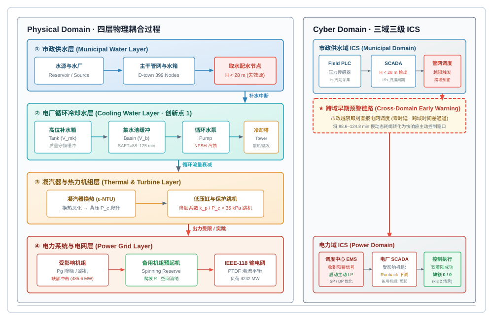
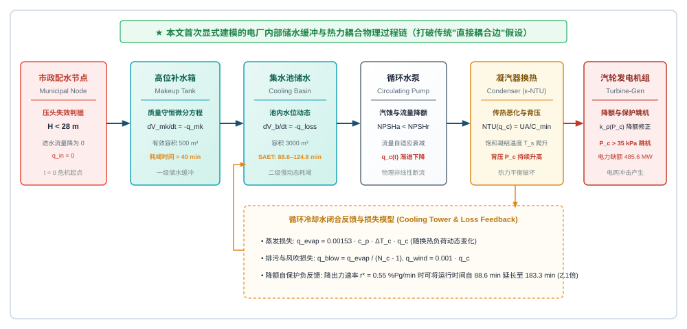
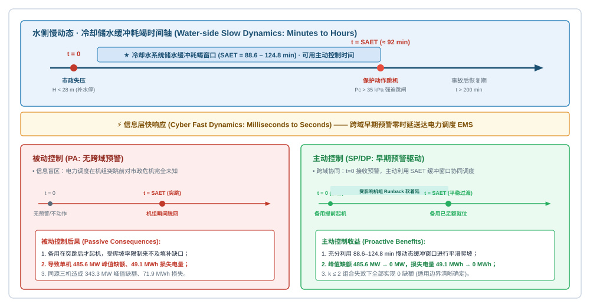

# 2 方法 Methodology

> 正稿章节草稿 v2（2026-09-07，语言润色版：仅优化行文，公式/数字/引注未动）。本章为建模主体，全部公式与实现细节溯源至原始代码，逐条对应：市政边界生成 `src/00_muni_wdn/{boundary_generator,full_coupling_boundary,coupling_map}.py`；冷却水机理链 `src/01_cooling_chain/{params,submodels,simulate}.py`；ICS 事件仿真 `src/02_ics/{db,field_plc,scada,dispatch,ics_simulation}.py`；主动控制 `src/03_proactive_control/{warning_indicators,dc_network,proactive_lp,run_p6,critical_ramp_example}.py`。公式即代码：每条公式后注明实现函数。参数取值的规范出处集中列于第 3 章表 2，本章仅在公式必需处给出数值。参考文献编号沿用第 3 章既定体系 [1]–[14]，本章新增 [15]–[17] 接排（合稿时按全文首次出现顺序统一重排）。

本章建立"市政供水—电厂冷却水—凝汽器与机组—电力系统"四层物理链及其信息层的完整数学模型。建模遵循三条原则：**其一，机理性白箱建模**——每一环节采用该领域的经典物理关系（水力孔口流、ε-NTU 换热、Antoine 饱和蒸汽压、直流潮流），不引入数据驱动黑箱，保证因果链可解释、可审计；**其二，公式与实现一一对应**——下文全部公式在代码中有且仅有一处实现，杜绝"文章一套、代码一套"；**其三，时间尺度分离**——各层主导动态差异达数个量级（秒级机电、分钟级水力热力、小时级市政失压），模型按层分解并显式声明每条仿真链的积分步长（§2.6）。两个创新点在本章的方法落点：创新点 1（§2.3）是对既有文献忽略的"冷却水中间过程"的首次完整建模；创新点 2（§2.4）是把该过程固有的**慢动态（冷却水缓冲，小时级）与快响应（信息系统与电网控制，秒级）之间的时间差**转化为可操作的跨域早期预警窗口。

## 2.1 总体框架：水-电 CPS 四层物理链与信息层

本文将城市水-电信息物理耦合系统（CPS）分解为四层物理链加一层信息层（图 1）：

- **B 层（市政配水管网）**：唯一水源—输配干线—分区储水箱—电厂取水节点。城市侧储水箱构成**一级缓冲**，其耗尽过程为小时级且强烈依赖取水节点位置（§2.2）。本文将其处理为**边界层**：向下游传递取水节点压头轨迹，不接收下游反馈（松耦合语义及其可行性论证见 §3.1）。
- **W 层（电厂冷却水系统，水源侧）**：高位补水箱—集水池—循环水泵—冷却塔（§2.3.1）。厂内储水构成**二级缓冲**，分钟级、由机组自身属性决定、与取水位置无关。
- **A 层（凝汽器—低压缸，热力-机电）**：循环水量衰减经凝汽器换热转化为排汽背压上升，再经背压-出力修正与高背压保护作用于机组（§2.3.2）。
- **C 层（电力系统）**：机组出力变化经直流潮流与备用体系在电网中传播，主动控制以线性规划下发（§2.5）。
- **I 层（信息层）**：按"现场控制—数据采集—调度决策"三级、市政/冷却/电力三域组织的 ICS，跨域早期预警以零时延贯通（§2.4）。

| 层 | 对象 | 理论方法 | 主导动态 | 关键状态量 |
|---|---|---|---|---|
| B 市政配水 | D-town 管网 | 延时水力模拟（EPS）＋压力驱动需水（PDD） | 小时级（水箱缓冲耗尽） | 节点压头 $H_{\mathrm{muni}}$ |
| W 冷却水 | 补水箱/集水池/泵/塔 | 孔口流＋质量守恒 ODE＋NPSH | 分钟级（储水耗尽） | 液位 $H_t,H_p$、流量 |
| A 凝汽器 | 凝汽器/低压缸 | Antoine＋ε-NTU＋背压修正 | 秒—分钟级 | 背压 $p_b$、出力 $P_g$ |
| C 电力系统 | IEEE-118 | 直流潮流（PTDF）＋两级备用＋LP | 秒—分钟级 | 潮流、缺额 |
| I 信息层 | 三域三级 ICS | 阈值检测＋跨域预警 | 秒级以内 | 预警状态、指令 |

（结构性小结表，不占正文表号。）

全章采用统一事件时间轴：$t=0$ 定义为**市政失压时刻**（取水节点压头跌破失效阈值，即危机起点，式 (2.2)），其后泵跳、机跳、备用起机、LP 控制期均相对该零点计量；市政故障自身的发生时刻记 $t_{\mathrm{fault}}$，仅在边界轨迹 (2.1) 中出现。信息层的分层状态采集与跨域数据共享设计对齐文献 [3] 的联邦式基础设施共仿真架构（市政域、冷却域、电力域各有 PLC/SCADA/调度三级），差别在于本文的跨域信息仅一条——**市政压头越限预警**——因此可实现零时延闭环（§2.4）。

**图 1　水-电信息物理耦合系统四层耦合总体框架（§2.1）**：① 市政供水层（唯一水源—分区储水箱缓冲—取水节点，压头 <28 m 即失效源）→ 电厂冷却水层（水力，分钟级）→ 凝汽器/低压缸层（热力-机电，秒—分钟级）→ 电力系统层；右侧信息层为三域（市政/冷却/电力）三级（PLC 采样—SCADA 监测—调度决策）ICS，市政域压头越限经跨域早期预警（零时延）直达电力域调度，构成"慢动态—快响应"时间差的利用通道。

## 2.2 市政水网边界层

### 2.2.1 参数化供水压头轨迹与失效判据

电厂冷却水系统的市政补水由取水节点压头驱动。本文将该压头抽象为如下参数化轨迹（实现 `submodels.muni_head`）：

$$
H_{\mathrm{muni}}(t)=\begin{cases}
H_{\mathrm{muni},0}, & t<t_{\mathrm{fault}},\\[4pt]
H_{\mathrm{muni},0}\Big(1-\dfrac{t-t_{\mathrm{fault}}}{\tau_r}\Big)^{+}, & t\ge t_{\mathrm{fault}},\ \tau_r>0,\\[4pt]
0, & t\ge t_{\mathrm{fault}},\ \tau_r=0,
\end{cases}
\tag{2.1}
$$

其中 $H_{\mathrm{muni},0}=32\ \mathrm{m}$ 为健康供水压头，$(x)^{+}=\max(x,0)$，$\tau_r$ 为失压过渡时长。$\tau_r=0$ 对应**阶跃停供**口径（B-ST），$\tau_r>0$ 对应**渐降失压**口径（B-RT）。失效判据为

$$
t_{\mathrm{fail}}=\inf\bigl\{\,t\ge t_{\mathrm{fault}}:\ H_{\mathrm{muni}}(t)<H_{\min}\,\bigr\},
\qquad H_{\min}=28\ \mathrm{m},
\tag{2.2}
$$

即取水节点压头低于 28 m 时市政补水通道失效（$t\ge t_{\mathrm{fail}}$ 后补水流量恒为零，式 (2.4)），此后冷却系统进入缓冲耗竭过程。$t_{\mathrm{fail}}$ 即 §2.1 的事件时间零点。

### 2.2.2 边界轨迹的生成与松耦合语义

式 (2.1) 中的 $(t_{\mathrm{fault}},\tau_r)$ 与各取水节点的 $t_{\mathrm{fail}}$ 并非假设，而是由真实城市管网水力仿真生成（`boundary_generator.py`、`full_coupling_boundary.py`）：市政侧采用 D-town 基准管网 [4,5]，以 EPANET 2 延时模拟（EPS）与压力驱动需水（PDD）模式求解 [7,8]，步长 15 min、观测窗 72 h，节点需水按管网自带的 140 条日变化模式分配。PDD 采用 Wagner 型压力-流量关系 [15]：

$$
q_n = q_n^{\mathrm{req}}\cdot f(p_n),\qquad
f(p)=\min\Bigl(1,\ \sqrt{\bigl(\tfrac{p-p_{\min}}{p_{\mathrm{req}}-p_{\min}}\bigr)^{+}}\Bigr),
\tag{2.3}
$$

即节点压头 $p$ 低于完全服务所需压头 $p_{\mathrm{req}}$ 时需水按平方根关系部分满足（$p\le p_{\min}$ 时为零），本文 $p_{\min}=0$、$p_{\mathrm{req}}=20\ \mathrm{m}$。唯一水源停供算例将水库边界总水头置零，城市侧仅靠分区水箱缓冲维持压力，节点压头逐区跌破阈值——每个耦合取水节点的压头轨迹中**首次跌破 28 m 的时刻**即该节点的 $t_{\mathrm{fail}}$（锁存，不因后续波动复位）。

本文将市政水网严格限定为边界层的依据是**两级缓冲的位置不对称性**：城市侧水箱缓冲是小时级、强位置依赖的一级缓冲（D-town 全网失压时刻 P10/P50/P90＝3.8/9.8/17.0 h，28% 节点 72 h 不失压），电厂侧冷却缓冲是分钟级、与位置无关的二级缓冲（SAET≈89–125 min，§2.3.3）。危机的时间起点由一级缓冲决定，处置窗口则由二级缓冲决定。因此，模型只需把"压头轨迹"这一标量时间函数从市政层传入冷却层（B→W 单向），即可完整刻画其对电力系统的影响；反向将电厂补水水量反馈回城市水力，则被证明会破坏城市侧自身的缓冲结构（水源出力 245.8 L/s 不足以承载 54 节点 299.7 L/s 的额定补水），定量论证与可供性的事后评估见 §3.1。

## 2.3 冷却水故障机理链【创新点 1】

既有水-电相互依赖研究普遍把"市政停水"直接映射为"机组停机"（图 2 中部标注的"既有工作忽略的中间过程"），跳过了电厂冷却水系统的全部中间物理过程 [2]；本文首次对该链条完整建模（`submodels.py`，163 行）：市政压头衰减 → 补水中断 → 厂内储水耗竭 → 循环水泵汽蚀 → 凝汽器换热恶化 → 背压上升 → 机组降额/保护跳机。以下 W、A 两个子模型的每条公式均按代码原序给出。

**图 2　电厂冷却水系统物理过程链（创新点 1，§2.3）**：取水节点（失效源，压头 <28 m）→ 高位补水箱（质量守恒）→ 集水池（储存缓冲）→ 循环水泵（NPSH/汽蚀）→ 凝汽器（ε-NTU 换热）→ 低压缸（背压→降额 $k_p$）→ 发电机（出力下降/跳机），辅以冷却塔散热与三项循环损失；中部深色环节为既有工作忽略、本文首次建模的中间过程。

### 2.3.1 子模型 W：水源侧水力

系统构成为高位补水箱（截面积 $A_T=30\ \mathrm{m^2}$，目标水位 $H_T^{\mathrm{set}}=4\ \mathrm{m}$）经重力自流阀门向集水池（$A_P=1700\ \mathrm{m^2}$，$H_P^{\mathrm{set}}=3\ \mathrm{m}$，高差 $\Delta z=15\ \mathrm{m}$）补水，市政补水经液位控制阀进入补水箱，循环水泵自集水池取水。各流量均为孔口型（流量系数 $C_v$ 乘阀开度乘驱动压头平方根）。

**市政补水**（`make_flow`）：

$$
Q_{\mathrm{make}}(t)=C_v^{\mathrm{m}}\,u_{\mathrm{make}}(t)\sqrt{\bigl(H_{\mathrm{muni}}(t)-H_t(t)\bigr)^{+}}\cdot\mathbf{1}\bigl[t<t_{\mathrm{fail}}\bigr],
\tag{2.4}
$$

$$
u_{\mathrm{make}}(t)=\max\Bigl(\mathrm{clip}\bigl(K_T\bigl(H_T^{\mathrm{set}}-H_t\bigr),\,0,\,1\bigr),\ \ 0.02\cdot\mathbf{1}\bigl[H_t<H_T^{\mathrm{set}}\bigr]\Bigr),
\tag{2.5}
$$

其中 $C_v^{\mathrm{m}}=0.30\ \mathrm{m^3 s^{-1} m^{-1/2}}$、比例液位控制增益 $K_T=0.5$；0.02 的最小开度防止比例控制在小偏差下将阀门完全关闭（避免"全关死锁"）。市政失效（$t\ge t_{\mathrm{fail}}$，式 (2.2)）后该项恒为零。

**重力自流**（`gravity_flow`）：

$$
Q_{\mathrm{grav}}(t)=C_v^{\mathrm{g}}\,u_{\mathrm{grav}}(t)\sqrt{\bigl(H_t(t)+\Delta z-H_p(t)\bigr)^{+}}\cdot\mathbf{1}\bigl[H_t>H_t^{\min}\bigr],
\tag{2.6}
$$

$$
u_{\mathrm{grav}}(t)=\mathrm{clip}\bigl(K_P\bigl(H_P^{\mathrm{set}}-H_p\bigr),\,0,\,1\bigr),
\tag{2.7}
$$

$C_v^{\mathrm{g}}=0.60$、$K_P=0.8$、$H_t^{\min}=0$（水箱放空即断流）。

**循环水泵**（`pump_flow`）：额定循环水量按机组容量与设计冷却温升标定 [9]：

$$
m_{cw,0}=k_{cw}\,P_{\max},\qquad k_{cw}=0.0295\ \mathrm{m^3 s^{-1} MW^{-1}}
\tag{2.8}
$$

（$k_{cw}$ 为对应设计温升 $\Delta T_d=8\ \mathrm{K}$ 的循环水量定额，bus89 机组 $P_{\max}=707\ \mathrm{MW}$：$m_{cw,0}=20.86\ \mathrm{m^3/s}$）。集水池水位下降首先侵蚀泵吸口淹没深度，流量按分段律降额：

$$
m_{cw}(t)=m_{cw,0}\cdot s\bigl(H_p\bigr),\qquad
s(H)=\begin{cases}
0, & H\le H_s,\\[2pt]
\dfrac{H-H_s}{\Delta H_s}, & H_s<H<H_s+\Delta H_s,\\[6pt]
1, & H\ge H_s+\Delta H_s,
\end{cases}
\tag{2.9}
$$

其中最小淹没深度 $H_s=1.2\ \mathrm{m}$、降额带 $\Delta H_s=0.5\ \mathrm{m}$；水位触及 $H_s$ 时泵跳闸并**锁定**（不可逆，后续即使水位恢复亦不重启——保守假设）。泵的汽蚀安全性以有效汽蚀余量监测（`npsh_available`）：

$$
\mathrm{NPSH}_a=\frac{p_{\mathrm{atm}}-p_{\mathrm{vap}}}{\rho_w g}+H_p-h_{f,0}\Bigl(\frac{m_{cw}}{m_{cw,0}}\Bigr)^{2},
\tag{2.10}
$$

$p_{\mathrm{atm}}=101.325\ \mathrm{kPa}$、吸入管额定摩擦损失 $h_{f,0}=1.0\ \mathrm{m}$、$p_{\mathrm{vap}}=3.0\ \mathrm{kPa}$（常温近似常数）。需求汽蚀余量 $\mathrm{NPSH}_r=8\ \mathrm{m}$；稳态工况下 $H_p=2.77\ \mathrm{m}$ 时 $\mathrm{NPSH}_a\approx11.8\ \mathrm{m}$，裕度充足，故本模型中泵失效的实际主导判据是淹没深度 (2.9) 而非 NPSH（后者作为监测量保留）。

**循环损失**（`loss_flow`）三项构成 [9]：

$$
Q_{\mathrm{evap}}=\frac{Q_{\mathrm{cond}}}{h_{fg}\,\rho_w},\qquad
Q_{\mathrm{bd}}=\beta\,Q_{\mathrm{evap}},\qquad
Q_{\mathrm{drift}}=\alpha_d\,m_{cw},
\tag{2.11}
$$

$$
Q_{\mathrm{loss}}=Q_{\mathrm{evap}}+Q_{\mathrm{bd}}+Q_{\mathrm{drift}},
\tag{2.12}
$$

即蒸发损失正比于凝汽器热负荷（汽化潜热 $h_{fg}=2400\ \mathrm{kJ/kg}$）、排污按浓缩倍率取蒸发量的 $\beta=0.52$ 倍、风吹（飘滴）损失取循环量的 $\alpha_d=0.05\%$；bus89 额定工况合计 $Q_{\mathrm{loss},0}=0.452\ \mathrm{m^3/s}$，占循环量 2.17%，与 GB/T 50102 的 2–3% 经验区间一致。

**质量守恒**（`water_derivs`）：闭式循环中泵取水与冷却塔回水近似抵消，两容器水位方程为

$$
\frac{dH_t}{dt}=\frac{Q_{\mathrm{make}}-Q_{\mathrm{grav}}}{A_T},\qquad
\frac{dH_p}{dt}=\frac{Q_{\mathrm{grav}}-Q_{\mathrm{loss}}}{A_P}.
\tag{2.13}
$$

**水温**（`basin_temp`）：冷却塔出塔水温按冷幅（approach）$\Delta T_{\mathrm{appr}}=5\ \mathrm{K}$ 与湿球温度 $T_{wb}=15\,^\circ\mathrm{C}$ 给定，$T_{\mathrm{to}}=T_{wb}+\Delta T_{\mathrm{appr}}=20\,^\circ\mathrm{C}$；循环水量下降使冷却塔换热不足、出塔水温向回水温度漂移（混合系数 $\chi=0.5$）：

$$
T_{\mathrm{in}}=\begin{cases}
T_{\mathrm{to}}+\chi\Bigl(1-\min\bigl(1,\tfrac{m_{cw}}{m_{cw,0}}\bigr)\Bigr)\bigl(T_{\mathrm{ret}}-T_{\mathrm{to}}\bigr)^{+}, & m_{cw}>0,\\[6pt]
T_{\mathrm{ret}}, & m_{cw}=0\ (\text{池水停滞回温}),
\end{cases}
\tag{2.14}
$$

**初值**（`equilibrate_water`）：无故障条件下自目标水位前向积分至 $\lvert dH/dt\rvert<10^{-7}$（比例控制存在稳态液位下垂），bus89 得 $H_t(0)=3.46\ \mathrm{m}$、$H_p(0)=2.77\ \mathrm{m}$，避免仿真起始的非平衡漂移。集水池容积按 DL/T 5339 的有效停留时间 3–5 min 校验：$A_P\times H_P^{\mathrm{set}}\approx5100\ \mathrm{m^3}$、额定停留 $4.1\ \mathrm{min}$ [10]。

### 2.3.2 子模型 A：凝汽器与低压缸

**饱和蒸汽压**（`params.psat_from_t`）：Antoine 方程（水，1–100 ℃，mmHg，换算 kPa）：

$$
\log_{10} p_{\mathrm{sat}}^{\mathrm{mmHg}}=A-\frac{B}{C+T},\qquad
A=8.07131,\ B=1730.63,\ C=233.426,\ \ p_{\mathrm{sat}}=0.1333224\,p_{\mathrm{sat}}^{\mathrm{mmHg}}\ \mathrm{kPa}.
\tag{2.15}
$$

**凝汽器换热**（`condenser`）：按 ε-NTU 法 [16]，凝汽器为凝结换热（汽侧热容无穷大，热容比 $C_r\to0$）：

$$
C_{cw}=\rho_w c_p\,m_{cw},\qquad
UA=UA_0\Bigl(\frac{m_{cw}}{m_{cw,0}}\Bigr)^{n},\qquad
\varepsilon=1-e^{-\mathrm{NTU}},\qquad
\mathrm{NTU}=\frac{UA}{C_{cw}},
\tag{2.16}
$$

其中传热系数随流量的 0.8 次方标度（Dittus–Boelter 型湍流换热指数 [13]），$n=0.8$。循环水出入口温度与背压为

$$
T_{\mathrm{ret}}=T_{\mathrm{in}}+\frac{Q_{\mathrm{cond}}}{C_{cw}},\qquad
T_{\mathrm{sat}}=T_{\mathrm{in}}+\frac{Q_{\mathrm{cond}}}{\varepsilon C_{cw}},\qquad
p_b=p_{\mathrm{sat}}\bigl(T_{\mathrm{sat}}\bigr).
\tag{2.17}
$$

断流分支（$m_{cw}\to0$）下换热近乎停止，背压取数值兜底值 $3\,p_b^{\mathrm{trip}}$（截于 50 kPa，必大于跳闸值）——保证泵跳后机组随即因高背压跳机，链条不中断。

**UA₀ 反标定**：$UA_0$ 不另行假设，而由额定设计工况自洽反解（`params.__post_init__`）——设计背压 $p_{b,0}=5\ \mathrm{kPa}$、设计进水温度 $T_{\mathrm{in},0}=20\,^\circ\mathrm{C}$（湿球+冷幅）、额定热负荷 $Q_{\mathrm{cond},0}=\lambda_Q P_{g,0}$（$\lambda_Q=1.15$，凝汽器热负荷/电功率近似倍率，含循环热耗）：

$$
\varepsilon_0=\frac{Q_{\mathrm{cond},0}}{C_{cw,0}\bigl(T_{\mathrm{sat}}(p_{b,0})-T_{\mathrm{in},0}\bigr)},\qquad
NTU_0=-\ln\bigl(1-\varepsilon_0\bigr),\qquad
UA_0=NTU_0\,C_{cw,0}.
\tag{2.18}
$$

bus89 数值：$T_{\mathrm{sat}}(5\,\mathrm{kPa})=32.94\,^\circ\mathrm{C}$、$Q_{\mathrm{cond},0}=698\ \mathrm{MW}$、$\varepsilon_0=0.618$、$NTU_0=0.962$、$UA_0=8.4\times10^{4}\ \mathrm{kW/K}$；标定后的额定实际端差 $T_{\mathrm{sat}}-T_{\mathrm{ret}}=4.9\ \mathrm{K}$（名义设计端差参数 4 K 为设计意图记录、不强制施加，实际端差由自洽标定确定），处于 HEI/ASME PTC 12.2 口径表面式凝汽器典型区间 [11,12]。

**背压-出力修正**（`power_derate`）：线性微增降额律

$$
k_p(t)=\Bigl(1-\gamma\bigl(p_b(t)-p_{b,0}\bigr)^{+}\Bigr)^{+},\qquad
\gamma=0.02\ \mathrm{kPa^{-1}},
\tag{2.19}
$$

即背压每升高 1 kPa 出力下降约 2%；机组实际出力 $P_g=P_{g,0}\,k_p$（ICS 链中与 runback 指令取小，见 (2.26)）。

**高背压保护**：$p_b\ge p_b^{\mathrm{trip}}=15\ \mathrm{kPa}$（约 3 倍设计值）**持续** $\tau_d=3\ \mathrm{s}$ 即跳机（锁定）；泵已跳闸且背压达跳闸值时立即跳机。**热负荷更新**：跳机前 $Q_{\mathrm{cond}}=\lambda_Q P_g\times10^{3}\ \mathrm{kW}$（随实际出力，因而随降额自适降低）；跳机后残余排汽散热按 $Q_{\mathrm{cond},0}/20$ 的速率线性衰减至零（约 20 s）。

### 2.3.3 气-水类比早期预警指标

参照文献 [1] 的天然气-电力早期预警指标体系，物理量由天然气替换为冷却水（`warning_indicators.py`）：

| 文献（气）[1] | 本项目（水） | 定义 |
|---|---|---|
| ALP 可用管存 | **ASW 可用储水量** | 跳泵前可用的补水箱+集水池水量 |
| AET 可用逃逸时间 | **AET** | 受影响机组进入高背压/跳泵保护前的剩余时间 |
| SAET 静态 AET | **SAET** | 故障时刻（$t=0$）的初始缓冲窗口 |

（结构性小结表，不占正文表号。）

$$
\mathrm{ASW}(t)=A_T\bigl(H_t-H_t^{\min}\bigr)+A_P\bigl(H_p-H_s\bigr),
\tag{2.20}
$$

$$
\mathrm{AET}(r)=\begin{cases}
t_{\mathrm{trip}}(r), & \text{若前向积分在出力降零前触发保护（强制跳机）},\\[2pt]
1/r, & \text{若机组在触发保护前降至零出力（主动停机成功）},
\end{cases}
\tag{2.21}
$$

$$
\mathrm{SAET}=\mathrm{AET}(0),
\tag{2.22}
$$

其中 (2.21) 的前向积分在"受影响机组按速率 $r$ 线性降出力"假设下联立求解 §2.3.1–§2.3.2 全部方程（步长 1 s），$t_{\mathrm{trip}}$ 为保护判据首次满足时刻。bus89：$\mathrm{ASW}_0=2773\ \mathrm{m^3}$（补水箱 104 + 集水池 2670）、$\mathrm{SAET}=88.6\ \mathrm{min}$；三厂 89/80/10 的 SAET 为 88.6/116.9/124.8 min。

**临界降出力速率（降额自保护负反馈）**：降出力越快，热负荷越低 → 循环损失与背压上升越缓 → 缓冲时间越长，存在临界速率 $r^{*}$ 使运行时间最长（`critical_ramp_example.py`，扫描 $1/r\in[600,24\,000]\ \mathrm{s}$、积分域 40 000 s）：bus89 的 $r^{*}=9.09\times10^{-5}\ \mathrm{s^{-1}}$（0.545%/min，满出力降零约 183 min），最长运行时间 183.3 min——**超过 SAET 的两倍**；低于 $r^{*}$ 时机组在缓冲耗尽后被强制跳机，高于 $r^{*}$ 时可主动停机。该性质是 §2.5 主动控制可行性的物理基础（数值算例见第 4 章图 8）。

## 2.4 信息系统层与慢-快时间差【创新点 2】

### 2.4.1 三域三级 ICS 与检测判据

信息层按三域（市政/冷却/电力）×三级（现场 PLC—SCADA—调度）组织（图 1 右侧，`db.py`/`field_plc.py`/`scada.py`/`dispatch.py`），各域内部为常规分层监控架构（对齐文献 [3] 的联邦式共仿真范式）；本文的关键设计是**跨域早期预警通道**：市政域 SCADA 的压头越限事件经调度级直接推送电力域，不走逐级上报，传递时延记为零（方案论证见 §2.4.2）。检测判据为

$$
t_{\mathrm{warn}}=\inf\bigl\{\,t:\ H_{\mathrm{muni}}(t)<H_{\min}\,\bigr\}=t_{\mathrm{fail}},
\tag{2.23}
$$

即**预警阈值与失效阈值取同一值（28 m）、同一测点（电厂取水节点压头，水司 SCADA 常规量测）、同一时刻**；事件锁存（首次越限后不复位）。预警送达电力域后即可启动 §2.5.2 的 runback 软着陆与备用预起机。

### 2.4.2 触发时刻方案论证与分级预警取舍

"检测即失效时刻"（式 (2.23)）这一设计经过四点论证：**其一（可观测性）**，配水节点压头是市政 SCADA 的既有量测，无需在电厂侧新增传感，跨域预警只复用已有数据；**其二（与失效判据同源）**，28 m 既是补水失效判据 (2.2) 又是预警阈值，二者同源同时，不引入独立的整定自由度，预警语义唯一且保守——预警发出即冷却补水确实中断；**其三（误报/漏报成本不对称）**，阈值上移（早于失效预警）将以误报换取提前量，阈值下移则漏报失效，取失效阈值本身是无可调参数的保守下界；**其四（时间零点自洽）**，$t_{\mathrm{warn}}=t_{\mathrm{fail}}=0$ 使 SAET 窗口、跳机时刻、备用起机、LP 控制期全部相对同一零点计量，第 4 章各场景数值严格可比。

分级预警（如"注意/告警"两级）在本文场景下被有意舍去：本文故障源为确定性单一事件（唯一水源停供），压头轨迹单调下降，两级阈值只会产生同一决策序列的两个冗余触发点，不改变任何控制动作，却引入阈值间距整定问题；SCADA 状态字段保留了分级扩展接口。预警系统的量测/通信时延统一记为零——本文的保守性完全由"预警不早于失效"（式 (2.23)）承担，时延敏感性属扩展工作。

### 2.4.3 慢-快时间差：从预警到影响的因果结构

图 3 概括了本文的核心因果结构：市政失压（$t=0$）后，冷却水缓冲以**分钟级慢动态**耗竭（式 (2.13)），期间背压缓升直至保护动作；而 ICS 检测、跨域预警与电网控制在**秒级快动态**内完成响应。两者的时间差——SAET 窗口——即**可用的主动控制时间**。被动情形下备用在跳机后才起机（受 15 min 级起机速率限制，来不及）；主动情形下同一备用自 $t=0$ 预起机，配合受影响机组在窗口内 runback 软着陆，可消除缺额。表 1 给出两种情形的机制对比（单机定量结果见第 4 章）。

**图 3　慢-快动态时间差与早期预警机制（创新点 2，§2.4）**：上轴为冷却水侧慢动态——市政失压（$t=0$）后水箱+集水池储水逐渐耗竭、背压缓升，SAET 窗口末端保护跳机；ICS 检测市政压头越限并零时延跨域预警（快动态）。下轴为两种下场：被动（无预警）在跳机后才动用备用（来不及）→ 突跳、深缺额；主动（有预警）在窗口内受影响机组 runback 软着陆 + 其余机组预爬坡 → 避免跳机、缺额消除。

**表 1　被动控制 vs 主动（早期预警驱动）控制对比（§2.4，对齐参照文献 Table 1）**

| 属性 | 被动控制（无预警） | 主动控制（早期预警） |
|---|---|---|
| 使用信息 | 仅电力系统自身（跳机后才知情） | 市政供水 + 电力跨域信息（配水节点压头 < 28 m 即预警） |
| 动作时刻 | 机组跳机后（慢响应，受爬坡限制） | 市政失压即刻（零时延，快响应） |
| 控制效果 | 事后动用备用，深度缺额 | SAET 窗口内 runback 软着陆 + 备用预爬坡 |
| 影响（单机 bus89） | 485.6 MW / 49.1 MWh | 0 MW / 0 MWh（避免跳机） |

## 2.5 电力系统层与主动控制

### 2.5.1 直流潮流与线路限值

电侧采用 IEEE 118 母线标准算例 [6] 与直流潮流（DC-PF）口径 [14,17]：以基态运行点（机组出力/负荷取算例数据）的相角为基准，线路有功潮流为节点净注入的线性函数（`dc_network.py`，PTDF 由 PYPOWER 移植的 `makePTDF` 计算 [14]）：

$$
P_{f,\ell,t}=\sum_n \Pi_{\ell n}\bigl(\bigl[A_g P_{g,t}\bigr]_n-P_{d,n}\bigr),\qquad \ell=1,\dots,L,
\tag{2.24}
$$

其中 $\Pi$ 为 PTDF 矩阵、$A_g$ 为机组-母线关联阵。线路限值不取算例额定值，而由基态潮流派生（保留 1.5 倍事故过载能力、设下限防零限值）：

$$
\overline{F}_{\ell}=\max\bigl(\kappa_r\,\bigl|P_{f,\ell}^{\mathrm{base}}\bigr|,\ F_{\min}\bigr),\qquad
\kappa_r=1.5,\quad F_{\min}=50\ \mathrm{MW}.
\tag{2.25}
$$

### 2.5.2 两级备用与 runback（ICS 事件仿真口径）

单机事件仿真（`ics_simulation.py`）中，受影响机组出力为

$$
P_{\mathrm{aff}}(t)=P_{\mathrm{aff},0}\cdot\min\bigl(u_{\mathrm{cmd}}(t),\,k_p(t)\bigr)\quad(\text{跳机前}),\qquad
\frac{du_{\mathrm{cmd}}}{dt}=-\min\bigl(\rho_{rb},\ \tfrac{r_{\mathrm{slow}}}{P_{\mathrm{aff},0}}\bigr)\quad(\text{预警后}),
\tag{2.26}
$$

即 runback 指令与背压降额律 (2.19) 取小（先到先控）；指令速率上限 $\rho_{rb}=0.0015\ \mathrm{s^{-1}}$，且不超过慢起机速率份额 $r_{\mathrm{slow}}/P_{\mathrm{aff},0}=1/900\ \mathrm{s^{-1}}$（即 runback 全程最快 15 min）。无预警时 $u_{\mathrm{cmd}}\equiv1$（机组被动运行直至保护动作）。其余机组提供两级备用：

$$
R_{\mathrm{spin}}=\rho_r\,P_{\mathrm{aff},0},\qquad
C_{\mathrm{slow}}=P_{\mathrm{aff},0},\qquad
r_{\mathrm{slow}}=\frac{P_{\mathrm{aff},0}}{T_{\mathrm{slow}}},
\qquad \rho_r=0.20,\ T_{\mathrm{slow}}=900\ \mathrm{s},
\tag{2.27}
$$

即旋转备用 $0.20P_{\mathrm{aff},0}$ 立即可用，慢起机备用总量 $P_{\mathrm{aff},0}$ 以 $r_{\mathrm{slow}}$ 速率爬升（约 15 min 全上）。备用起机的计时参考点 $t_{\mathrm{ref}}$ 是有无预警的分水岭：

$$
t_{\mathrm{ref}}=\begin{cases}t_{\mathrm{warn}}=0, & \text{有预警（提前起机）},\\ t_{\mathrm{trip}}, & \text{无预警（跳机后才起机）},\end{cases}
\qquad
\mathrm{deficit}(t)=\Bigl(P_{\mathrm{aff},0}-P_{\mathrm{aff}}(t)-R_{\mathrm{spin}}-\min\bigl(C_{\mathrm{slow}},\,r_{\mathrm{slow}}(t-t_{\mathrm{ref}})\bigr)\Bigr)^{+}.
\tag{2.28}
$$

两级备用总量 $1.2P_{\mathrm{aff},0}$ 足以覆盖最大损失 $P_{\mathrm{aff},0}$，故缺额**完全来自时序**：被动情形下 15 min 级起机延迟暴露于缺额峰值，主动情形下同一备用自 $t=0$ 预爬坡即可对冲——这正是"跨域信息价值"的定量化解耦设计。

### 2.5.3 主动控制线性规划（LP）

全网主动控制为滚动单次线性规划（`proactive_lp.py`，`scipy.optimize.linprog`/HiGHS 求解）。决策变量为各机组各时步出力 $P_g[i,t]$、功率缺额松弛 $d_t\ge0$、线路过载松弛 $o_{\ell,t}\ge0$（$t=0,\dots,T$，$\Delta t=5\ \mathrm{min}$，时域 200 min）。目标为最小化控制期能量缺额并惩罚过载：

$$
\min\ \sum_t d_t\,\Delta t\ +\ w\sum_{\ell,t} o_{\ell,t},\qquad w=5.
\tag{2.29}
$$

约束五类：

$$
\text{(平衡)}\quad \sum_i P_g[i,t]+d_t=P_L,\qquad\forall t;
\tag{2.30}
$$

$$
\text{(容量)}\quad 0\le P_g[i,t]\le
\begin{cases}
P_{\mathrm{avail},i}(t), & i\in S_{\mathrm{aff}},\\[2pt]
\min\bigl(P_{g0,i}+\rho_{\mathrm{res}}(P_{\max,i}-P_{g0,i}),\ P_{\max,i}\bigr), & i\notin S_{\mathrm{aff}},
\end{cases}
\tag{2.31}
$$

（备用比例 $\rho_{\mathrm{res}}=1.0$：其余机组可用满物理余量，备用时序由爬坡约束体现）；

$$
\text{(爬坡)}\quad \bigl|P_g[i,t]-P_g[i,t-1]\bigr|\le R_i\,\Delta t,\qquad
R_i=\rho_{\mathrm{ramp}}P_{\max,i},\ \ \rho_{\mathrm{ramp}}=0.01\ \mathrm{min^{-1}},\quad i\notin S_{\mathrm{aff}}
\tag{2.32}
$$

（$t=0$ 相对基态 $P_{g0,i}$；本文各主动控制链取 $\rho_{\mathrm{ramp}}=0.01\ \mathrm{min^{-1}}$，N-k 扫描取脚本类默认 $0.02\ \mathrm{min^{-1}}$（第 4 章表 4 注）；爬坡仅约束其余机组，受影响机组由可用轨迹 (2.35) 主导）；

$$
\text{(直流潮流)}\quad \bigl|P_{f,\ell,t}\bigr|\le\overline{F}_{\ell}+o_{\ell,t},\qquad \forall \ell,t
\tag{2.33}
$$

（软约束默认；$o\equiv0$ 的硬约束模式下 $d_t$ 退化为最小切负荷）；

$$
\text{(被动因果)}\quad P_g[i,t]\le P_{g0,i},\qquad i\notin S_{\mathrm{aff}},\ \ t<t_{\mathrm{ft}},
\tag{2.34}
$$

其中 $t_{\mathrm{ft}}=\min_{i\in S_{\mathrm{aff}}}\bigl(\tau_i+t_{\mathrm{trip},i}\bigr)$ 为首台受影响机组跳机时刻——被动（PA）模式下其余机组在缺额真实出现前不得预升出力，主动模式则自 $t=0$ 即可爬坡，此即被动/主动的本质区别。受影响机组 $i\in S_{\mathrm{aff}}$（默认母线 89/80/10）的可用出力轨迹为

$$
P_{\mathrm{avail},i}(t)=\begin{cases}
P_{g0,i}\Bigl(1-\dfrac{(t-\tau_i)^{+}}{T_i}\Bigr)^{+}, & \text{SP/DP（线性软着陆）},\\[8pt]
P_{g0,i}\cdot\mathbf{1}\bigl[t<\tau_i+t_{\mathrm{trip},i}\bigr], & \text{PA（按水力轨迹突降）},
\end{cases}
\tag{2.35}
$$

其中 $\tau_i$ 为节点 $i$ 的市政失压偏移（其取水节点 $t_{\mathrm{fail}}$，默认 0 即同源同位置），$t_{\mathrm{trip},i}$ 为前向积分 (2.21)（$r=0$）所得跳机时刻。控制时间

$$
T_i^{\mathrm{SP}}=\mathrm{SAET}_i,\qquad T_i^{\mathrm{DP}}=\alpha\cdot\mathrm{SAET}_i,\qquad \alpha=1.5.
\tag{2.36}
$$

**DP 单步近似声明**：文献 [1] 的动态主动控制为迭代延长控制时间（在延长设定点重算 AET）；本文实现为固定倍率单步延长（$T_i=\alpha\,\mathrm{SAET}_i$，不做迭代），其保守性与局限在第 5 章适用性讨论中声明。影响量化指标为

$$
P_{\mathrm{def}}^{\max}=\max_t d_t,\qquad
E_{\mathrm{def}}=\sum_t d_t\,\Delta t,
\tag{2.37}
$$

即少发功率峰值与损失电量（ICS 链同口径，(2.28) 的时间聚合）。市政偏移 $\tau_i$ 的引入使取水位置敏感性（危机起点平移）与冷却缓冲（处置窗口长度）解耦，其系统分析（同源同位置 vs 分散取水两布置）见第 4 章；该方法论接口同时避免了分散布置下 25 h 级长时域巨型 LP（危机时间隔离时等价为独立单机 LP，峰值取 max、能量取和）。

## 2.6 数值求解与模型间耦合

各仿真链均为"显式步进＋事件锁存"结构：每步按 市政压头 (2.1) → 阀/泵流量 (2.4)–(2.9) → 液位 ODE (2.13) → 水温 (2.14) → ε-NTU 凝汽器 (2.16)–(2.17) → 背压降额与保护 (2.19) → 电网响应 (2.26)–(2.37) 的固定顺序求解代数与常微分方程；泵跳、机跳、预警、保护延时计时器（3 s）均为锁存事件。步长按各链主导动态选取：

| 仿真链 | 代码 | 步长 | 说明 |
|---|---|---|---|
| 市政边界生成（EPS/PDD） | `boundary_generator.py` 等 | 15 min×72 h | WNTR 水力解算 [8] |
| P1 机理链 | `simulate.py` | 默认 0.05 s（长时域算例 4 s，输出按 1 s 抽稀） | 显式欧拉；3 s 保护延时为真实延时 |
| 预警指标前向积分 | `warning_indicators.py` | 1 s（临界速率算例积分域 40 000 s） | SAET/AET/ASW |
| ICS 事件仿真 | `ics_simulation.py` | 宏观 8 s；PLC 采样 1 s | 3 s 延时在宏观步下按"越限累计一步"实现 |
| 主动控制 LP | `run_p6.py` | $\Delta t=5$ min，时域 200 min | HiGHS；`ProactiveLP` 类默认 40 min/2 min/0.02 min⁻¹ |

（结构性小结表，不占正文表号。）初值由无故障稳态平衡给出（§2.3.1 末，`equilibrate_water`）；LP 决策变量数为 $(N_g+1+L)\times(T+1)$（IEEE-118：$N_g=54$、$L=186$、$T=40$ 时约 1 万量级），HiGHS 秒级求解。全部代码、数据与结果文件的对应关系见第 3 章与附录。

## 本章参考文献

[1] Yu F, Guo Q, Wu J, Qiao Z, Sun H. Early warning and proactive control strategies for power blackouts caused by gas network malfunctions. *Nature Communications*, 2024, 15: 4714. DOI: 10.1038/s41467-024-48964-0.

[2] Li Y, Zhang M. Cascading failure analysis of interdependent water-power networks based on functional coupling. *Reliability Engineering and System Safety*, 2025, 259: 110950.

[3] Wang F, Magoua J J, Li N. Modeling cascading failure of interdependent critical infrastructure systems using HLA-based co-simulation. *Automation in Construction*, 2022, 133: 104008.

[4] Marchi A, Salomons E, Ostfeld A, Kapelan Z, Simpson A R, Zecchin A C, Maier H R, Wu Z Y, Elsayed S M, Song Y, Walski T, Stokes C, Wu W, Dandy G C, Alvisi S, Creaco E, Franchini M, Monteiro A J. Battle of the Water Networks II. *Journal of Water Resources Planning and Management*, 2014, 140(7): 04014009. DOI: 10.1061/(ASCE)WR.1943-5452.0000378.

[5] Ostfeld A. "05 Long Term Improvement" (D-town). Battle of the Water Network Models. University of Kentucky Libraries, 2016. https://uknowledge.uky.edu/wdst_models/5（CC BY-NC 4.0）.

[6] University of Washington. Power Systems Test Case Archive: 118-Bus System. https://www.ee.washington.edu/research/pstca/.

[7] Rossman L A. EPANET 2 Users Manual. Cincinnati: U.S. Environmental Protection Agency, 2000.

[8] Klise K A, Bynum M, Murray R, Haxton T. Water Network Tool for Resilience (WNTR), version 1.5.0. Sandia National Laboratories. https://github.com/wntr/wntr.

[9] 中华人民共和国国家标准. GB/T 50102《工业循环水冷却设计规范》. 北京: 中国计划出版社.

[10] 中华人民共和国电力行业标准. DL/T 5339《火力发电厂水工设计规范》. 北京: 中国电力出版社.

[11] Heat Exchange Institute. Standards for Steam Surface Condensers. Cleveland, OH: HEI.

[12] ASME. ASME PTC 12.2, Steam Surface Condensers (Performance Test Code). New York: ASME.

[13] Dittus F W, Boelter L M K. Heat transfer in automobile radiators of the tubular type. *University of California Publications in Engineering*, 1930, 2(13): 443–461.

[14] Zimmerman R D, Murillo-Sánchez C E, Thomas R J. MATPOWER: Steady-state operations, planning, and analysis tools for power systems research and education. *IEEE Transactions on Power Systems*, 2011, 26(1): 12–19.（本文直流潮流/PTDF 由其 Python 移植版 PYPOWER 实现）

[15] Wagner J M, Shamir U, Marks D H. Water distribution reliability: Simulation methods. *Journal of Water Resources Planning and Management*, 1988, 114(3): 276–294. DOI: 10.1061/(ASCE)0733-9496(1988)114:3(276).

[16] Incropera F P, DeWitt D P, Bergman T L, Lavine A S. Fundamentals of Heat and Mass Transfer. 6th ed. Hoboken: John Wiley & Sons, 2007.

[17] Wood A J, Wollenberg B F, Sheblé G B. Power Generation, Operation and Control. 3rd ed. Hoboken: John Wiley & Sons, 2013.
