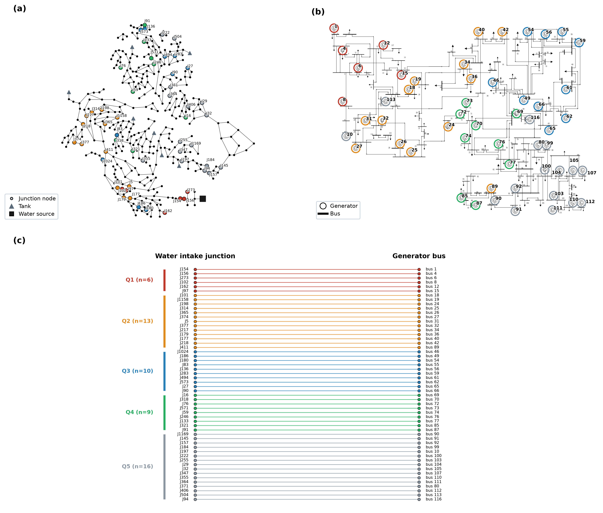

# 3 案例与参数 Case Study and Setup

> 正稿章节草稿 v2（2026-09-07，语言润色版：仅优化行文，数字/引注/事实性表述未动）。全部数值与事实溯源至原始代码与数据文件：IEEE-118 取自 `ieee118_dc/{bus,branch,gen}.csv`；D-town 取自 `src/00_muni_wdn/data/DTOWN.inp`；耦合配对取自 `results/muni/coupling_map.json`；边界与可供性取自 `results/muni/{muni_boundary,full_coupling_boundary,coupling_rule_verification}.json`；参数取自 `src/01_cooling_chain/params.py`、`src/03_proactive_control/{dc_network,proactive_lp,warning_indicators}.py`；场景取自 `docs/scenario_matrix.csv`。参考文献按文中首次引用顺序编号，文末列出。

本章介绍本文的测试系统、水-电耦合配对方法、参数标定及其规范出处，以及场景矩阵。案例设计的总原则是：**水侧取真实城市管网以获得可信的失压时空动态，电侧取公开标准测试系统以保证可审计性，二者以确定性规则全耦合配对，使城市级结论不依赖人为挑点。**

## 3.1 测试系统与耦合配对

**市政供水侧**采用 D-town 基准配水管网。该管网源自"Battle of the Water Networks II"（BWN-II）管网设计与调度竞赛[4]，本文使用 University of Kentucky Libraries 的公开存档版本[5]（CC BY-NC 4.0，已在致谢中署名）。按输入文件 `DTOWN.inp` 登记：管网含 **399 个配水节点（junction）、1 座水库（R1，总水头 80 m）、7 座分区储水箱（T1–T7）、443 条管段、11 台水泵和 5 个阀门**；节点基础需水合计 **422.3 L/s**，并按 **140 条日变化模式**（pattern）分配至各节点——即管网自带真实城市需水量及其昼夜波动，这是本文选取 D-town 而非需水为零的 C-town 导出版的原因[5]。市政水力仿真采用 EPANET 2.2 延时模拟（EPS）与压力驱动需水（PDD）模式[7,8]，步长 15 min，观测窗 72 h。D-town 单水库结构决定了本文故障烈度的上限——唯一水源 R1 全停为确定性极端事件（§3.3）。

**电力侧**采用 IEEE 118 母线标准测试系统[6]。按 `ieee118_dc/bus.csv`、`branch.csv`、`gen.csv` 登记：**118 个母线、186 条支路、54 台机组（含平衡机），总负荷 4242 MW**；54 台机组中 **19 台有出力（ΣPg＝4377 MW）、35 台为 Pg＝0 的调度点**，其中最大机组为母线 89 处机组（bus89，Pg/Pmax＝607/707 MW）。机组出力与容量直接取自算例数据，不另行假设。

**水-电耦合配对**采用"全耦合"策略：作为一套城市水-电耦合系统，全部 54 台发电机（含平衡机）均应挂接一个取水节点——该节点的供水压头决定补水能否维持（<28 m 即失效），同时该节点也是市政供水 ICS 的预警监测点（失效＝预警，同一阈值）。配对规则分四步（`src/00_muni_wdn/coupling_map.py`，结果登记于 `results/muni/coupling_map.json`）：

1. **保留既有校验三对**：bus89–J411、bus80–J371、bus10–J197（服务于机理链揭示与对齐参照文献[1]的两级案例叙事，全部既有结果不变）；
2. **基线健康筛选**：在无故障 24 h EPS 中全程最小压头 > 32 m 的节点方可作为电厂取水点（保证故障前供水健康，与代表节点选取判据一致）；
3. **分层比例抽样**：按唯一水源停供后的失压时刻四分位（q25/q50/q75＝3.75/9.75/13.19 h）划分 Q1（快）–Q4（慢）与 never（72 h 不失压）五层，51 个新增名额按各层节点数占全网比例以最大余数法分配（Q1＝6、Q2＝12、Q3＝10、Q4＝9、never＝14），层内按失压时刻等间距抽取；
4. **确定性配对**：其余 51 台机组按母线号升序、节点按（失压时刻、节点名）升序一一配对，不隐含"容量–位置"人为相关性。

所得 54 对耦合集合（含保留三对）的分层计数为 **Q1＝6 / Q2＝13 / Q3＝10 / Q4＝9 / never＝16**，耦合节点失压时刻 min/中位/max＝0/9.4/67 h，never 比例 29.6%——与全网分布（72 h 不失压占 27.6%）吻合良好——**耦合集合的失压分布近似复现全网分布**，城市级结论不依赖抽样偶然性。空间上各层呈分区聚集（图 4）：快失压点位于近水源弱缓冲分区，never 点位于强水箱缓冲高区[4,5]。

**补水需求与边界语义。** 每台机组的额定补水需求按容量缩放：makeup＝clip(0.03·Pmax, 2, 20) L/s（保留对取 20 L/s），54 节点合计 **299.7 L/s**。将该需求反馈进城市水力被证明不可行：D-town 水源出力仅 **245.8 L/s**，299.7 L/s 额定补水并网使基线耦合节点最小压头跌至 **−12 m**（saet 口径分层一致率仅 14.8%）；逐节点按分区容量分配虽个体可行，联合施加亦不可行（−10.9 m）；引入昼间模式（06:00–22:00 系数 1.0、夜间 0.05）叠加总量预算可维持基线健康（32.5 m），但任何非零反馈都会加速消耗水箱缓冲、使 never 层约 24 h 内失压（分层一致率 70.4%–81.5%），与既有的全网失压分布矛盾。因此本文采用**边界不反馈（松耦合）语义**：城市水力保持无补水口径，额定补水作为"被评估需求"按 PDD 份额 f＝√(clip(p/20, 0, 1)) 事后评估可供性——72 h 观测窗内 54 节点额定需求合计 **77 682 m³，PDD 可供 71 478 m³（92.0%）**，分层可供率自 Q1 的 55.1% 单调升至 never 的 100%：**失压越快的层，其市政备用补水的丧失也越早**，与分层物理自洽。该松耦合接口的保守性由闭合水量账检验（§5.4）。

**耦合规律全节点验证。** 对"城市侧仅反馈压头（不核对水量）、压头 <28 m 此刻即失效（补水归零、不能为高位补水箱补水）、SAET 自该时刻起算"三条规律，验证脚本 `verify_coupling_rule.py` 对 54 个耦合节点逐项独立重算，**54/54 全部通过**（`results/muni/coupling_rule_verification.json`；其中 38 节点在 72 h 内触发失效、16 个 never 节点不触发亦符合规律）。验证同时如实登记一项附带发现：54 台机组中 **35 台 Pg＝0**（case 调度点，热负荷近零）——38 个触发节点中 24 台 Pg＝0 机组的 SAET 均大于 24 h（另有 3 台 Pg≤19 MW 的小出力机组亦然），即冷却级联不会在研究时域内发生，这些机组的耦合仅具拓扑与预警意义；因此电侧组合失效场景（§4.5）的机组总体取 19 台有出力耦合机组。

**配对任意性的处理。** 功能规则＋确定性抽样的"真实水网 × 标准电网"合成配对在相互依赖基础设施研究中有明确先例——Li 与 Zhang[2]同样以真实城市供水网与 IEEE 标准电力系统做合成配对，Wang 等[3]则以 HLA 联邦架构连接多基础设施系统实现共仿真。本文以两项设计主动回应其任意性：分层比例抽样使耦合集合复现全网失压分布（上述），以及 §5.1–§5.2 对取水节点位置的系统性敏感性分析。

**图 4　IEEE-118 × D-town 水-电耦合拓扑与耦合对（§3.1）：(a) D-town 水网（真实坐标）与 54 个耦合取水节点，按唯一水源停供后的失压时刻分层着色；(b) IEEE-118 单线图与 54 台耦合发电机（同分层着色圆环）；(c) 54 对确定性配对（左＝取水节点按失压时刻排序，右＝发电机母线与左侧耦合节点逐行对齐、连线水平）。分层定义：Q1–Q4＝失压时刻四分位（快→慢），Q5＝72 h 内不失压；各层计数 Q1 (n=6) / Q2 (n=13) / Q3 (n=10) / Q4 (n=9) / Q5 (n=16)，共 54 对**

## 3.2 参数标定与规范出处

本文无现场数据，仅有 IEEE 118 稳态算例。动态、热力与水力参数按四条原则标定：①**容量分档**——按机组额定容量 Pmax（`gen.csv`）分档赋予典型参数；②**出力标定**——可缩放参数（热负荷、循环水量等）按实际出力 Pg 与额定 Pmax 之比标定；③**额定工况自洽**——设计背压、设计循环水量与凝汽器传热系数（UA）在额定出力下相互自洽（UA 由额定工况设计端差经 ε-NTU 关系反标定）；④**来源可追溯**——每个参数注明标准号、文献或参数库，统一登记于 `docs/parameter_fitting.md` 并带出处注释硬编码于 `src/01_cooling_chain/params.py`。主要参数按子系统分组列于表 2。

**水源侧缓冲参数**依据国家与电力行业两部设计规范标定：集水池（吸水井）有效容积按 DL/T 5339《火力发电厂水工设计规范》"有效停留时间 3–5 min"[10]取 1700 m²×3 m≈5100 m³（对应额定循环水量下停留 **4.1 min**）；额定循环水量系数 0.0295 m³/(s·MW)（≈106 m³/(h·MW)）对应设计温升 8 K，位于 GB/T 50102《工业循环水冷却设计规范》"设计温升 8–10 K"[9]区间内——bus89 机组额定循环水量 ≈21 m³/s。循环水总损失取 ≈2.2%（规范 2–3%[9]），其中蒸发损失按经验式 0.0016×ΔT（ΔT＝8 K 时 ≈1.3%）、排污/蒸发比 0.52（浓缩倍率约 3）、风吹损失 0.05%（现代收水器水平）；冷却塔冷幅（approach）取 5 K（规范 3–5 K[9]）；设计湿球温度 15 ℃，与 5 kPa 设计背压的额定工况自洽。

**凝汽器与保护参数**参照 HEI/ASME PTC 12.2 凝汽器性能体系[11,12]与汽轮机低真空保护规程设定：设计背压 5 kPa、设计端差（TTD）4 K；传热系数随循环水流量的指数 UA∝m_cw^0.8（Dittus–Boelter 类比[13]）；背压-出力修正采用线性微增出力率 0.02/kPa；高背压保护定值 15 kPa（约 3 倍设计值）、保护延时 3 s；循环水泵最小淹没深度 1.2 m、淹没不足线性降额带 0.5 m、需求汽蚀余量（NPSH_r）8 m。市政侧失效判据为配水节点压头 <28 m（正常供水压头 32 m）。

**电力侧与主动控制参数**：机组 Pg/Pmax 直接取自 `gen.csv`；直流潮流以 PTDF 灵敏度矩阵实现（PYPOWER/MATPOWER[14]），支路限值取基准潮流的 1.5 倍且设 50 MW 下限（避免零限值支路约束失效）；主动控制 LP 的时域 200 min、时步 5 min，备用上限为其余机组的物理余量（Pg0＋1.0×(Pmax−Pg0)，上限 Pmax），响应速度由爬坡率 0.01·Pmax/min 约束（run_p6/取水敏感性/全序级联链；N-k 扫描脚本取类默认 0.02/min，见第 4 章表 4 注）——即"旋转备用＝在线物理余量、慢起机备用由爬坡约束体现"的两级备用语义（§2.5）。

**SAET 代表值与口径登记。** 以恒定额定出力对水力-热力链前向积分（`warning_indicators.py`）得三厂冷却缓冲窗口：**bus89/80/10 的 SAET＝88.6/116.9/124.8 min**（登记于 `results/proactive_control/p6_node_sensitivity.json`）；闭合水量账登记口径为 92.4 min（`closed_water_balance`，§5.4）；冷却链与 ICS 链积分所得跳机绝对时刻 93.4 min（图 7）与 93.6 min（图 9）为两模块积分步长与事件采样差异，机理与保护判据一致。以上均为 B-ST 合成阶跃边界下的保守下界，口径差异在正文首次出现处逐一标注。

**表 2　参数总表（代表机组 bus89：Pg＝607 / Pmax＝707 MW；完整出处登记见 docs/parameter_fitting.md，硬编码见 src/01_cooling_chain/params.py）**

| 分组 | 参数（符号） | 取值 | 出处/规范 |
|---|---|---|---|
| 机组与市政边界 | 额定/实际出力 P_max / P_g | 707 / 607 MW | IEEE-118 gen.csv |
| | 市政正常压头 / 最小供水阈值 H_muni,0 / H_muni,min | 32 / 28 m | 供水管网服务压力（失效源） |
| 缓冲设施 | 高位补水箱底面积×水位（A_tank×H） | 30 m²×4 m＝120 m³ | 循环水事故补水缓冲 |
| | 集水池底面积×水位（A_pool×H，停留 4.1 min） | 1700 m²×3 m≈5100 m³ | **DL/T 5339**（3–5 min）[10] |
| 循环水与冷却塔 | 额定循环水量系数 m_cw0/P_max | 0.0295 m³/(s·MW)（≈21 m³/s，温升 8 K） | **GB/T 50102**（8–10 K）[9] |
| | 循环总损失率（蒸发＋排污＋风吹） | ≈2.2%（1.3%＋0.52×蒸发＋0.05%） | **GB/T 50102**（2–3%；经验式 0.0016×ΔT）[9] |
| | 冷却塔冷幅 / 设计湿球温度 | 5 K / 15 ℃ | **GB/T 50102**（3–5 K）[9] |
| 泵与汽蚀 | 最小淹没深度 / 不足降额带 / NPSH_r | 1.2 / 0.5 m / 8 m | 泵样本＋循环水泵保护规程 |
| 凝汽器与保护 | 设计背压 p_b0 / 设计端差 TTD | 5 kPa / 4 K | 额定工况自洽（ε-NTU 反标定 UA） |
| | 传热-流量指数 n（UA∝m_cw^n） | 0.8 | Dittus–Boelter 类比[13] |
| | 背压出力率 γ | 0.02 kPa⁻¹ | 汽轮机微增出力率近似 |
| | 高背压跳机定值 p_b,trip / 保护延时 τ | 15 kPa（≈3×设计）/ 3 s | 低真空保护规程 |
| 电力侧 LP 与潮流 | LP 时域 / 时步 / 爬坡率 | 200 min / 5 min / 0.01·P_max·min⁻¹（N-k 扫描为 0.02） | 典型值（两级备用语义见 §2.5） |
| | 备用上限 | Pg0＋1.0×(P_max−Pg0)（物理余量用满） | 同上 |
| | 支路限值倍率 / 下限 κ / rate_floor | 1.5 / 50 MW | 由基准潮流派生 |

## 3.3 场景矩阵

场景按"**故障烈度（阶跃/渐降）× 故障范围（单机/同源多机/全网停供）× 应对（有无预警 × PA/SP/DP 三策略）**"三个维度组织（表 3）。该分档组织的范式参照 Li 与 Zhang[2] 的地震 PGA 分档场景设计（以灾害烈度分档驱动功能耦合级联），并覆盖参照文献[1]的两级案例结构（同源共因讲机制、多源错峰讲规模效应）。烈度上限取唯一水源 R1 全停——D-town 单水库结构下无需假设多重故障的确定性极端事件；"渐降"档用于失压速率敏感性（S03，市政压头 600 s 线性降零）；多源错峰结构由管网仿真自然生成，不人为指定。

**表 3　场景矩阵（S00–S08；边界口径除注明外均为 B-ST 合成阶跃）**

| 场景 | 市政故障 | 范围 | 预警 | 策略 | 研究定位 |
|---|---|---|---|---|---|
| S00 | 无故障 | — | — | 正常运行 | 稳态基线 |
| S01 | 阶跃断水 | 单机 bus89 | NOWARN | 被动 | 核心-被动基准 |
| S02 | 阶跃断水 | 单机 bus89 | WARN | 主动 runback | 核心-预警价值 |
| S03 | 渐降 600 s | 单机 bus89 | WARN vs NOWARN | 主动 vs 被动 | 失压速率敏感性（§5.3） |
| S04–S06 | 断水 | 同源 3 机 89/80/10 | NOWARN / WARN | PA / SP / DP | 三策略对比（对齐文献 Fig.5–6）[1] |
| S07 | N-k 组合跳闸 | 19 台有出力耦合机组 | WARN | PA / SP | 稳健性边界（k=1–12，最坏＋随机） |
| S08 | 按失压顺序级联（72 h） | 19 台有出力耦合机组 | WARN | PA / SP | 全序级联规模标度 |

*注：S07/S08 边界取自全耦合映射（B-ST 口径 t_fault_i＋各机 SAET_i）；扩展自 docs/scenario_matrix.csv。*

**边界口径与错峰结构。** 主结果（S01–S06）采用 B-ST 合成阶跃边界（市政压头 t＝0 瞬时跌零，SAET 保守下界）。下游边界链 B-RT（R1 于 t＝6 h 起在 3 h 内线性降压）用于失压速率敏感性与闭合水量账（§5.4）；在该口径下三厂取水节点错峰失压（`results/muni/muni_boundary.json`）：J411（bus89，低区、标高 9 m、弱缓冲）于 t＝32 h（故障后 26 h）、J371（bus80，中区、标高 69 m）于 t＝34 h（故障后 28 h）、J197（bus10，高区、标高 42 m、T3 水箱强缓冲）于 t＝67 h（故障后 61 h）跌破 28 m——同一水源失效经不同分区缓冲形成的错峰失压前锋，即文献[1]省级多端源案例"SAET 随距离而异"的水侧对应。同源多机场景 S04–S06 采用同源同位置布置（三机同时危机），以对齐文献[1]城市级同源共因案例；分散取水布置（DISP，三厂分别取 P10/P50/P90 代表节点）在 §5.2 单独研究。

**仿真环境与复现性。** 全部仿真基于开源工具链：Python 3.13、numpy 2.3.5、WNTR 1.5.0（EPANET 2.2 引擎）[7,8]、scipy 1.17.1（HiGHS 线性规划）与 PYPOWER[14]。16 个计算脚本与 9 个绘图脚本已按依赖顺序全流程复跑，与存档结果逐项比对一致（实质数值差异为 0），复现验证报告见 `docs/verification/report.md`。

---

## 本章参考文献

[1] Yu F, Guo Q, Wu J, Qiao Z, Sun H. Early warning and proactive control strategies for power blackouts caused by gas network malfunctions. *Nature Communications*, 2024, 15: 4714. DOI: 10.1038/s41467-024-48964-0.

[2] Li Y, Zhang M. Cascading failure analysis of interdependent water-power networks based on functional coupling. *Reliability Engineering and System Safety*, 2025, 259: 110950.

[3] Wang F, Magoua J J, Li N. Modeling cascading failure of interdependent critical infrastructure systems using HLA-based co-simulation. *Automation in Construction*, 2022, 133: 104008.

[4] Marchi A, Salomons E, Ostfeld A, Kapelan Z, Simpson A R, Zecchin A C, Maier H R, Wu Z Y, Elsayed S M, Song Y, Walski T, Stokes C, Wu W, Dandy G C, Alvisi S, Creaco E, Franchini M, Monteiro A J. Battle of the Water Networks II. *Journal of Water Resources Planning and Management*, 2014, 140(7): 04014009. DOI: 10.1061/(ASCE)WR.1943-5452.0000378.

[5] Ostfeld A. "05 Long Term Improvement" (D-town). Battle of the Water Network Models. University of Kentucky Libraries, 2016. https://uknowledge.uky.edu/wdst_models/5（CC BY-NC 4.0）.

[6] University of Washington. Power Systems Test Case Archive: 118-Bus System. https://www.ee.washington.edu/research/pstca/.

[7] Rossman L A. EPANET 2 Users Manual. Cincinnati: U.S. Environmental Protection Agency, 2000.

[8] Klise K A, Bynum M, Murray R, Haxton T. Water Network Tool for Resilience (WNTR), version 1.5.0. Sandia National Laboratories. https://github.com/wntr/wntr.

[9] 中华人民共和国国家标准. GB/T 50102《工业循环水冷却设计规范》. 北京: 中国计划出版社.

[10] 中华人民共和国电力行业标准. DL/T 5339《火力发电厂水工设计规范》. 北京: 中国电力出版社.

[11] Heat Exchange Institute. Standards for Steam Surface Condensers. Cleveland, OH: HEI.

[12] ASME. ASME PTC 12.2, Steam Surface Condensers (Performance Test Code). New York: ASME.

[13] Dittus F W, Boelter L M K. Heat transfer in automobile radiators of the tubular type. *University of California Publications in Engineering*, 1930, 2(13): 443–461.

[14] Zimmerman R D, Murillo-Sánchez C E, Thomas R J. MATPOWER: Steady-state operations, planning, and analysis tools for power systems research and education. *IEEE Transactions on Power Systems*, 2011, 26(1): 12–19.（本文直流潮流/PTDF 由其 Python 移植版 PYPOWER 实现）
