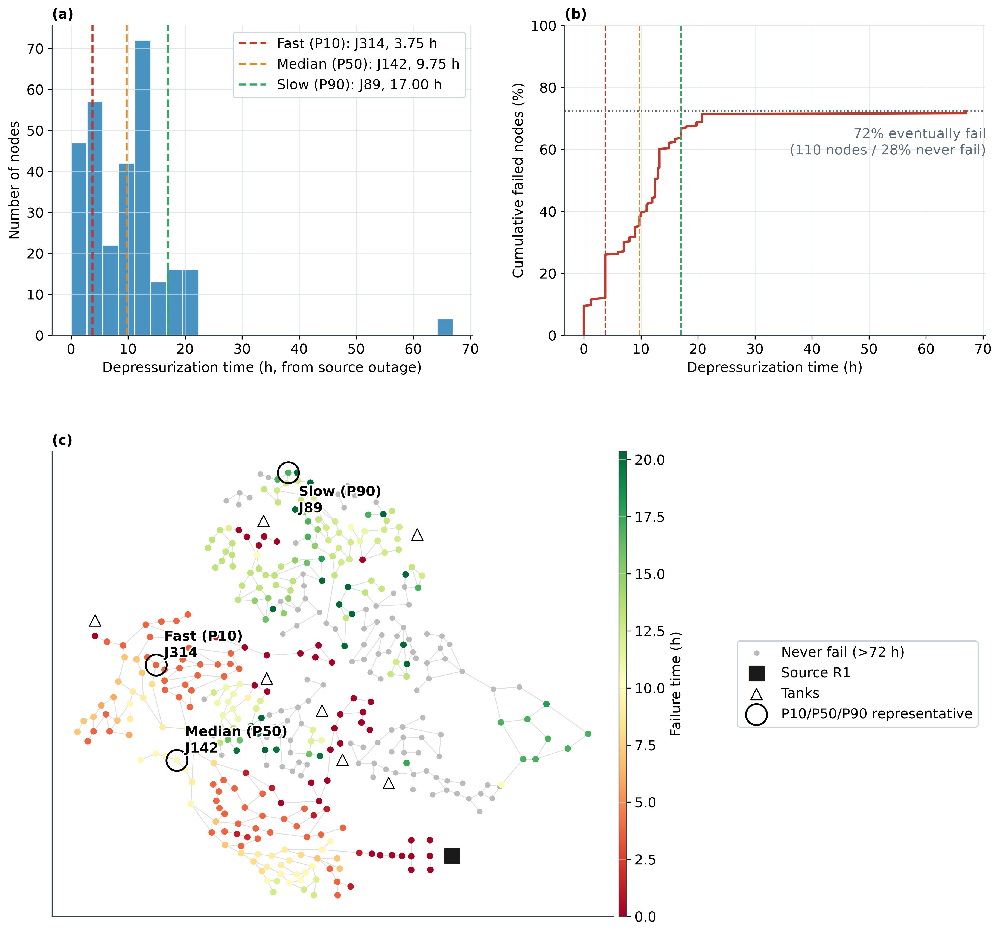
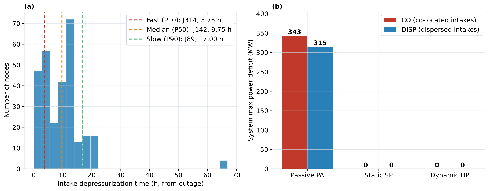
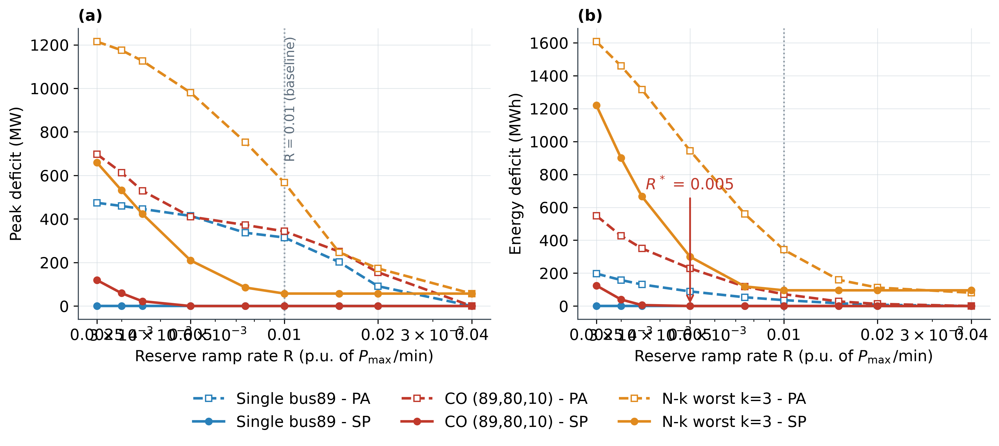

# 5 敏感性分析 Sensitivity Analysis

> 正稿章节草稿 v2（2026-09-07，语言润色版：仅优化行文，数字/引注/事实性表述未动）。本章数值溯源至 `results/muni/{saet_distribution,closed_water_balance,full_coupling_boundary}.json`、`results/proactive_control/p6_node_sensitivity.json`、`results/cooling_chain/p1_smib_bus89_tf60_ramp600.csv`，全部经 `docs/verification/report.md` 全流程复算验证。参考文献编号沿用既定体系。

本章对**取水节点位置**（§5.1–5.2）、**失压速率**（§5.3）、**水量口径与热负荷口径**（§5.4）做系统敏感性分析，诚实呈现主结论的适用条件与稳健性；电侧**失效规模**轴的敏感性（N-k/级联）已在 §4.5 呈现，本章与之互补。

## 5.1 取水节点位置 → 失压时刻分布

危机的时间起点由一级缓冲（城市侧水箱）决定，而一级缓冲的耗尽时刻强烈依赖取水节点位置。图 12 给出 B-ST 口径下唯一水源停供后 D-town 全网 [4,5] 失压时刻的完整分布（WNTR 延时水力仿真 [8]）：399 个配水节点中 **289 个（72.4%）于 72 h 内失压、110 个（27.6%）不失压**；失压时刻 0–67 h，P10/中位/P90＝0/9.75/17.0 h（P95＝20.3 h，图 12(c) 色标截顶以防 67 h 离群压缩色域）。分布呈"快失压—渐失压—不失压平台"三段结构：近水源弱缓冲分区数小时内失压（P10＝0），水箱缓冲分区 10–20 h 陆续失压，27.6% 节点依托强缓冲高区 72 h 不失压。

为下游敏感性分析选取三个代表节点：在"故障前健康（无故障 24 h 全程最小压头 >32 m，§3.1 同一筛选判据）且会失压"的候选中按分位数就近选取——**J314（3.75 h，P10）、J142（9.75 h，P50）、J89（17.0 h，P90）**（`saet_distribution.json` representatives 字段）。同一故障下，取水位置的差异使危机起点自 0 h 铺开至 17 h 以上——这是 §5.2 敏感性实验的物理输入。

**图 12　唯一水源停供后全网失压时刻分布（§5.1，B-ST 合成阶跃口径：R1 于 t=0 断供，72 h / 15 min 延时水力仿真，失压判据 H<28 m）：399 个配水节点中 289 个（72.4%）于 72 h 内失压、110 个（27.6%）不失压；失压时刻 0–67 h，P10/中位/P90＝0/9.75/17.0 h。(a) 失压时刻直方图；(b) 累计失压节点比例（72% 平台＝72 h 观测窗内不再新增）；(c) 失压时刻空间分布（RdYlGn 色，色标截顶 P95＝20.3 h 以防 67 h 离群压缩色域；灰＝不失压节点；■＝唯一水源 R1；△＝水箱；○＝代表节点——取故障前健康且会失压节点中 P10/P50/P90 就近者，供 §5.2 取水位置敏感性分析：J314 3.75 h／J142 9.75 h／J89 17.0 h）**

## 5.2 取水位置 → 电力韧性影响

以三厂（bus 89/80/10）为对象、图 12 的代表节点为取水点，对比两种取水布置（`p6_node_sensitivity.json`，LP 优化＋DC 潮流；本场景对齐参照文献 [1] 的省级多端源案例 Fig.7——各机组危机时刻因取水位置而异）：

- **CO 同源同位置**（三厂取水同/邻节点，τ＝[0,0,0]，同时危机）：联合 LP 求解——PA 峰值 **343.3 MW**、损失电量 **71.9 MWh**、最大过载 **163.4 MW**；SP/DP 均 0/0（过载 36.8 MW）。
- **DISP 分散取水**（三厂分别取 P10/P50/P90 代表节点，τ＝[3.75, 9.75, 17.0] h，危机错峰）：因市政失压偏移（小时级）远大于冷却窗口（~2 h），三机危机**时间完全隔离**、互不重叠，系统等价于三个独立单机事件依次发生——各单机 LP 求解后**峰值取 max、能量取 sum**（物理正确且避免 25 h 长时域巨型 LP）。结果：PA 峰值降为 **314.9 MW（＝最严重单机 bus89 的单机 LP 峰值 315.0 MW）**、损失电量 **52.5 MWh**、最大过载 **151.3 MW**；SP/DP 仍 0/0（过载 23.7 MW）。

**机理结论**：其一，取水位置显著影响**被动**峰值缺额——分散取水使缺额脉冲时间分离、峰值不叠加（343.3→314.9 MW），且损失电量大幅下降（71.9→52.5 MWh：危机时间隔离使备用在各事件之间充分恢复，而 CO 布置下三次跳机集中于约 36 min 内、备用尚未回补即遭下一次冲击）；其二，**主动控制对取水位置稳健**——各机组在自身冷却 SAET 窗口内软着陆，窗口长度是电厂内部属性、与取水节点无关（两级缓冲位置不对称，§2.2），市政失压先后仅把危机在时间轴上平移/错开。该结果与 §4.1 的错峰失压前锋（0–67 h）共同表明：城市侧的时间错峰是被动情形的天然削峰器，而主动情形的韧性不依赖它。

**图 13　取水节点位置对电力影响的敏感性（§5.2，三厂 bus 89/80/10；LP 优化＋DC 潮流）：(a) 市政失压时刻分布与 P10/P50/P90 代表节点（J314 3.75 h／J142 9.75 h／J89 17.0 h，选取口径见图 12）；(b) 取水布置 × 控制策略的系统峰值功率缺额——CO＝同源同位置（三机同时危机，联合 LP）：PA 峰值 343 MW、损失电量 71.9 MWh、最大过载 163.4 MW；DISP＝分散取水（三厂分别取 P10/P50/P90 代表节点，市政失压错峰 3.75/9.75/17.0 h ≫ 冷却窗口 ~2 h → 三机危机时间完全隔离，各单机 LP 求解、峰值不叠加、能量守恒）：PA 峰值降为 315 MW（＝最严重单机）、损失电量 52.5 MWh、最大过载 151.3 MW——取水位置显著影响【被动】峰值缺额；SP/DP 在两种布置下均 0/0（各机在自身冷却 SAET 窗口内软着陆，与取水节点无关）——主动控制对取水位置稳健**

## 5.3 失压速率与参数敏感性

**失压速率（S03，已有数据）。** 市政渐降失压（参数化 ramp＝600 s，即 10 min 线性压降）相对阶跃断水延长缓冲窗口：bus89 的机组跳机时刻由市政失压后 92.4 min 延至 **93.6 min**（`p1_smib_bus89_tf60_ramp{0,600}.csv`）——主动控制的处置窗口随失压放缓而更宽裕。真实 B-RT 口径下城市侧失压过程为小时级（耦合节点失压时刻 32–67 h、中位 35.25 h，§4.1），远慢于 600 s 渐降，故阶跃口径（B-ST）构成主动控制时间裕度的保守下界（§5.4 进一步闭合水量账验证）。

**爬坡率扫描（R-scan，补测实验）。** 对"SP 可行"的头号敏感参数——其余机组备用爬坡率 R——做系统扫描：R∈{0.0025, 0.003, 0.0035, 0.005, 0.0075, 0.01, 0.015, 0.02, 0.04}·P_max/min 共 9 点（覆盖既定值 0.01＝§4.4/§5.2 口径与 0.02＝§4.5 口径，并在 0.005 以下加密以定位相变点），严格复用 §4.4 的 LP 链（200 min 时域、5 min 时步、DC-PTDF 潮流约束、备用上限＝其余机组全部物理余量、PA 因果约束与 SP＝SAET 窗口软着陆），仅 R 为变量；三场景＝单机 bus89（607 MW）、同源三机 CO 89/80/10（1534 MW）、N-k 最坏 k＝3 子集 69/80/89（1600.4 MW，用于鉴别 §4.5 中 k≥3 残留缺额的驱动因素）。R＝0.01/0.02 处共 11 项锚点与 §4.4/§4.5/§5.2 既定结果逐位一致（含 CO 的 PA 343.3 MW/71.9 MWh、k＝3 的 SP 57.1 MW/95.6 MWh），扫描结果见表 5 与图 14。在同一链路上另补两组扫描：**DP 模式**沿同一 R 网格（T_ctrl＝1.5×SAET，α＝1.5 与 §4.4 口径一致，检验困难场景下 DP 与 SP 的差异化）与**备用容量轴** reserve_frac∈{1.0, 0.5, 0.35, 0.25}（固定 R＝0.01，LP 备用上限 rest_cap＝Pg0＋rf×(Pmax−Pg0)），分别见表 5 的 DP 列/图 14 的 DP 曲线与表 6；DP@0.01 对齐 §4.4 既定 DP 结果与 rf＝1.0 自洽校验（共 8 项）亦逐位通过。

**表 5　备用爬坡率 R 扫描——各场景×策略（PA/SP/DP）的能量缺额（MWh，200 min 时域）（§5.3；R 单位 p.u. P_max/min，DP 窗口＝1.5×SAET；单机＝bus89 607 MW、CO＝89/80/10 1534 MW、k＝3＝N-k 最坏子集 69/80/89 1600.4 MW；加粗＝SP/DP 零缺额；R＝0.01/0.02 列与 §4.4/§4.5 既定结果一致——19 项锚点回归校验逐位通过；k＝3 行末时步残留缺额 57.12 MW（R≥0.0075 时恒定）为网络约束稳态地板，能量为 200 min 有限时域口径）**

| R (p.u. P_max/min) | 单机 PA | 单机 SP | 单机 DP | CO PA | CO SP | CO DP | k=3 PA | k=3 SP | k=3 DP |
|---|---|---|---|---|---|---|---|---|---|
| 0.0025 | 196.8 | **0.0** | **0.0** | 549.2 | 124.8 | 3.1 | 1607.1 | 1219.7 | 568.4 |
| 0.003 | 157.9 | **0.0** | **0.0** | 426.8 | 39.7 | **0.0** | 1459.2 | 899.6 | 350.2 |
| 0.0035 | 131.1 | **0.0** | **0.0** | 350.2 | 5.9 | **0.0** | 1315.9 | 666.6 | 263.3 |
| 0.005 | 88.8 | **0.0** | **0.0** | 228.7 | **0.0** | **0.0** | 943.9 | 299.5 | 86.4 |
| 0.0075 | 53.3 | **0.0** | **0.0** | 117.9 | **0.0** | **0.0** | 558.9 | 118.8 | 47.3 |
| 0.01 | 35.9 | **0.0** | **0.0** | 71.9 | **0.0** | **0.0** | 341.9 | 95.7 | 47.0 |
| 0.015 | 16.8 | **0.0** | **0.0** | 28.1 | **0.0** | **0.0** | 159.3 | 95.6 | 46.8 |
| 0.02 | 7.6 | **0.0** | **0.0** | 12.9 | **0.0** | **0.0** | 112.0 | 95.6 | 46.8 |
| 0.04 | 0.0 | **0.0** | **0.0** | 0.0 | **0.0** | **0.0** | 80.9 | 95.5 | 46.8 |

**结果一（单机：SP 对 R 完全稳健）**：R 低至 0.0025/min（既定值 0.01 的 1/4，对应其余 53 台总爬坡能力仅 23.1 MW/min）SP 仍全程零缺额——88.6 min 的 SAET 窗口对单机 607 MW 的补偿需求足够宽裕，R 减半乃至降至 1/4 均不威胁单机 SP 可行性。PA 则随 R 单调改善（R 自 0.0025 升至 0.01：能量 196.8→35.9 MWh、峰值 474.2→315.0 MW），R＝0.04 时 PA 亦归零。

**结果二（CO 三机：SP 相变点 R\*∈(0.0035, 0.005]）**：R＝0.005（既定值减半）时 SP 仍零缺额；R 降至 0.0035/0.003/0.0025 时缺额转正并急剧放大（5.9→39.7→124.8 MWh，0.0035→0.003 一个网格步内放大 6.7 倍）——三机共因（1534 MW）下 SP 可行要求 R 不低于约 0.004/min（相变区间 (0.0035, 0.005]，约为既定值 0.01 的 2/5–1/2）。PA 对 R 更敏感：0.0025 时能量 549.2 MWh（0.01 值 71.9 的 7.6 倍）、峰值 697.6 MW；R≥0.04 时 PA 亦归零——爬坡能力充裕时被动响应本身即可覆盖三机共因失效。

**结果三（k＝3：SP 残留缺额与 R 无关——网络输送约束驱动）**：SP 缺额在 R≥0.0075 后饱和（峰值恒 57.12 MW、能量 95.5–95.7 MWh），R 升至 0.04（其余 51 台总爬坡 315.1 MW/min）仍不归零，且此时 PA（57.12 MW）与 SP 收敛至同一地板——该地板既非备用容量不足（其余机组物理余量远大于缺额）亦非爬坡不足，而是 LP 在"缺额（权重 1）vs 线路过载（权重 5）"权衡下宁可保留的稳态缺额，即网络输送约束所致。这把 §4.5 对 k≥3 残留的"备用/爬坡物理限制"粗粒度归因细化为：**网络输送约束主导（R 不敏感的 57.12 MW 地板）、爬坡退化进一步放大低 R 端缺额**（SP 能量 1219.7 MWh @0.0025）。

**结果四（DP 的差异化价值恰在爬坡受限区）**：同一 R 网格上的 DP（窗口 1.5×SAET）显示：CO 场景 SP 相变点由 R\*∈(0.0035, 0.005] 下移至 **R\*\_DP∈(0.0025, 0.003]**——区间中点 0.0043→0.0028（比值 0.65≈1/α），与"更长窗口→备用爬坡积累更多"的机理一致；低 R 区 DP 残差远小于 SP（R＝0.0025：3.1 vs 124.8 MWh，削减 97.5%；R＝0.003：0 vs 39.7）。k＝3 场景 DP 峰值与 SP 同收敛于 57.12 MW 网络地板（窗口延长不改变网络输送约束），但末机着陆由 124.8 推迟至 175.4 min，有限时域能量缺额由 95.6 降至 46.8 MWh（瞬态节省约 48.8 MWh），低 R 区亦全面占优（R＝0.0025：568.4 vs 1219.7 MWh）；单机场景 DP＝SP＝0（与 §4.4 一致）。即 DP 的价值边界与缺额机制对应：**爬坡受限时相变点按 ≈1/α 下移（近乎完全化解），网络受限时只能推迟地板到达、不能消除**——这为 §4.4"窗口宽裕故 DP 与 SP 重合"补上了条件边界：一旦爬坡受限（R≲0.003），DP 即与 SP 分离。

**结果五（备用容量轴 rf\*：k≥3 边界是网络×备用的联合约束）**：固定 R＝0.01 扫 LP 备用上限比例 reserve_frac∈{1.0, 0.5, 0.35, 0.25}（表 6；rf＝1.0 行与表 5 的 R＝0.01 列逐位一致）：单机 SP 零缺额直至 rf＝0.25（PA 能量仅由 35.9 缓增至 44.1 MWh）；CO 场景**备用容量相变点 rf\*∈(0.35, 0.5]**——rf＝0.5 仍 0/0，0.35 起转正（50.5 MW/76.6 MWh），0.25 时系统可用容量已低于总负荷 4242 MW，容量型缺额与网络受限叠加达 345.1 MW/638.7 MWh；k＝3 场景对备用收缩最敏感——rf＝0.5 即把残留由 57.4 MW/95.7 MWh 放大至 328.7 MW/602.2 MWh（稳态缺额 57.1→324.9 MW）：收缩可用备用同时压缩了 LP 绕开网络约束的调度自由度。即 **k≥3 边界是网络输送与备用容量的联合约束**（结果三的 57.12 MW 网络地板系满备用 rf＝1.0 下的表现）。

**表 6　备用容量轴扫描——reserve_frac 下各场景×策略的能量缺额（MWh，200 min 时域，固定 R＝0.01）（§5.3；LP 备用上限 rest_cap＝Pg0＋rf×(Pmax−Pg0)，其余机组全部 54 台；加粗＝SP 零缺额；rf＝1.0 行与表 5 的 R＝0.01 列逐位一致；rf＝0.25 时 CO/k＝3 的系统可用容量已低于总负荷 4242 MW——容量型缺额与网络受限叠加）**

| reserve_frac | 单机 PA | 单机 SP | CO PA | CO SP | k=3 PA | k=3 SP |
|---|---|---|---|---|---|---|
| 1.0 | 35.9 | **0.0** | 71.9 | **0.0** | 341.9 | 95.7 |
| 0.5 | 38.3 | **0.0** | 75.5 | **0.0** | 595.3 | 602.2 |
| 0.35 | 36.8 | **0.0** | 141.1 | 76.6 | 1029.6 | 1305.9 |
| 0.25 | 44.1 | **0.0** | 532.6 | 638.7 | 1367.7 | 1864.3 |

**图 14　其余机组备用爬坡率 R 扫描（§5.3；三场景×PA/SP/DP 各 9 个 R，LP＋DC 潮流，仅 R 为变量、其余口径与 §4.4 一致，DP 窗口＝1.5×SAET；点线＝既定值 R＝0.01；R\*＝CO 场景 SP 相变点、R\*\_DP＝DP 相变点）：(a) 峰值功率缺额、(b) 损失电量（横轴对数）。单机（bus89，607 MW）：SP/DP 全程零缺额（R 低至 0.0025/min），PA 单调下降并于 R＝0.04 归零。CO 三机（89/80/10，1534 MW）：SP 于 R\*∈(0.0035, 0.005] 由零转正并急剧放大，DP 把相变点下移至 R\*\_DP∈(0.0025, 0.003]（≈1/α）；PA 随 R 单调（0.0025 时峰值 697.6 MW）。k＝3 最坏（69/80/89，1600.4 MW）：SP 缺额在 R≥0.0075 饱和于 57.12 MW/95.5 MWh，DP 峰值同收敛于 57.12 MW 地板而能量减半（46.8 vs 95.6 MWh @0.02）——k≥3 残留系网络输送约束驱动、与爬坡速率无关，DP 只能推迟不能消除**

**其余参数扫描（既定后续工作，如实声明）。** ICS 事件仿真链的两级备用参数（旋转备用比例 ρ_r、慢速备用容量 C_slow 与到位时间 T_slow）与 DP 时间比 α 的扫描仍列入后续补充实验（与预警时延/漏报扫描同属既定后续工作，§6.4）。至此，主动控制适用边界沿四条轴定量刻画：失效规模 k\*＝3（§4.5）、爬坡速率 R\*∈(0.0035, 0.005] 与备用容量 rf\*∈(0.35, 0.5]（CO 场景，本节）、取水位置（§5.2，SP 对其稳健）；k≥3 残留缺额定性为网络输送×备用容量的联合约束，DP 差异化的条件（爬坡受限而非网络受限）亦已界定（表 5、表 6）。

## 5.4 闭合水量账与热负荷鲁棒性

主结果采用 B-ST 合成阶跃边界（市政压头瞬时跌零），此处以**闭合水量账**检验该口径的保守性（`closed_water_balance.json`）：以城市 B-RT 实际压头轨迹驱动电厂补水阀——驱动压头＝p−28 m（补水阀充填压头阈值，即失效判据 28 m 的物理来源；低于阈值补水归零、之上连续衰减），补水流量另乘 PDD 可供份额 f(p)＝√(clip(p/20, 0, 1)) [15]，从而把 §3.1 的松耦合接口在水量维度闭合。物理补水需求按额定损失缩放（q_phys＝0.453 m³/s @707 MW，按 Pmax 线性缩放）。

**结果一（口径保守性）**：闭合 SAET 对全部 54 台机组 **100% 不小于** B-ST 合成阶跃口径值。以 bus89 为例：合成阶跃口径 SAET＝92.4 min，而闭合轨迹口径下 SAET＝**1809 min（≈30.2 h，Pg 热负荷口径）/1794 min（≈29.9 h，Pmax 口径）**——差近 20 倍。即主结果的"92 min 窗口"是应力测试下界，现实市政衰减轨迹下时间差普遍为数小时至数十小时，主动控制的裕度更充裕。

**结果二（热负荷鲁棒变体）**：Pg 口径下 54 台中仅 10 台在 72 h 内跳机（24 台 Pg＝0 机组热负荷近零、天然不跳机——调度点退化）；改用 Pmax 口径（额定热负荷，消除 Pg＝0 退化）后 **29/54 台在 72 h 内跳机**（即触发层 38 台中的 29 台），其闭合 SAET 中位 **37.7 h**（Pg 口径 10 台的中位 38.7 h）。即在最不利热负荷假设下，触发层机组的现实缓冲窗口仍以**数十小时**计——进一步支撑"分钟级合成阶跃口径为保守下界"的结论。

综上，§4.3–§4.5 的全部主动控制结论在更现实的口径下只会更宽裕，不会反转；主结论的真正边界在电侧（k\*=3 的备用/爬坡物理限制，§4.5）而非水侧时间裕度。

## 本章参考文献

[1] Yu F, Guo Q, Wu J, Qiao Z, Sun H. Early warning and proactive control strategies for power blackouts caused by gas network malfunctions. *Nature Communications*, 2024, 15: 4714. DOI: 10.1038/s41467-024-48964-0.

[4] Marchi A, Salomons E, Ostfeld A, Kapelan Z, Simpson A R, Zecchin A C, Maier H R, Wu Z Y, Elsayed S M, Song Y, Walski T, Stokes C, Wu W, Dandy G C, Alvisi S, Creaco E, Franchini M, Monteiro A J. Battle of the Water Networks II. *Journal of Water Resources Planning and Management*, 2014, 140(7): 04014009. DOI: 10.1061/(ASCE)WR.1943-5452.0000378.

[5] Ostfeld A. "05 Long Term Improvement" (D-town). Battle of the Water Network Models. University of Kentucky Libraries, 2016. https://uknowledge.uky.edu/wdst_models/5（CC BY-NC 4.0）.

[8] Klise K A, Bynum M, Murray R, Haxton T. Water Network Tool for Resilience (WNTR), version 1.5.0. Sandia National Laboratories. https://github.com/wntr/wntr.

[15] Wagner J M, Shamir U, Marks D H. Water distribution reliability: Simulation methods. *Journal of Water Resources Planning and Management*, 1988, 114(3): 276–294. DOI: 10.1061/(ASCE)0733-9496(1988)114:3(276).

（编号沿用既定体系；[4,5]（D-town 来源）已在 §3.1 详引，[8]（WNTR）与 [15]（PDD）已在 §2.2 详引，此处列本章正文直接引用条目。）
