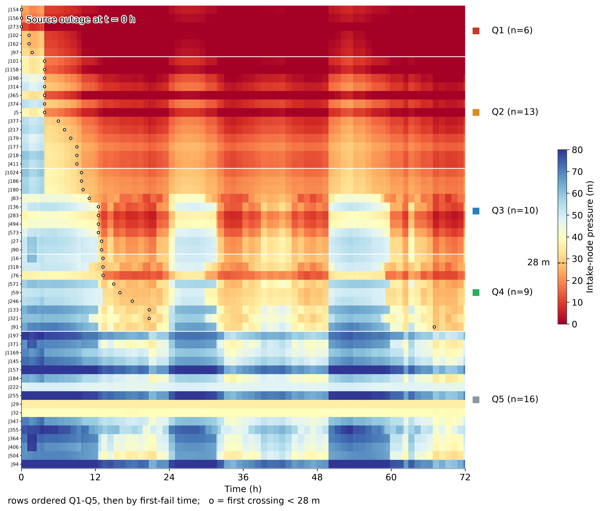
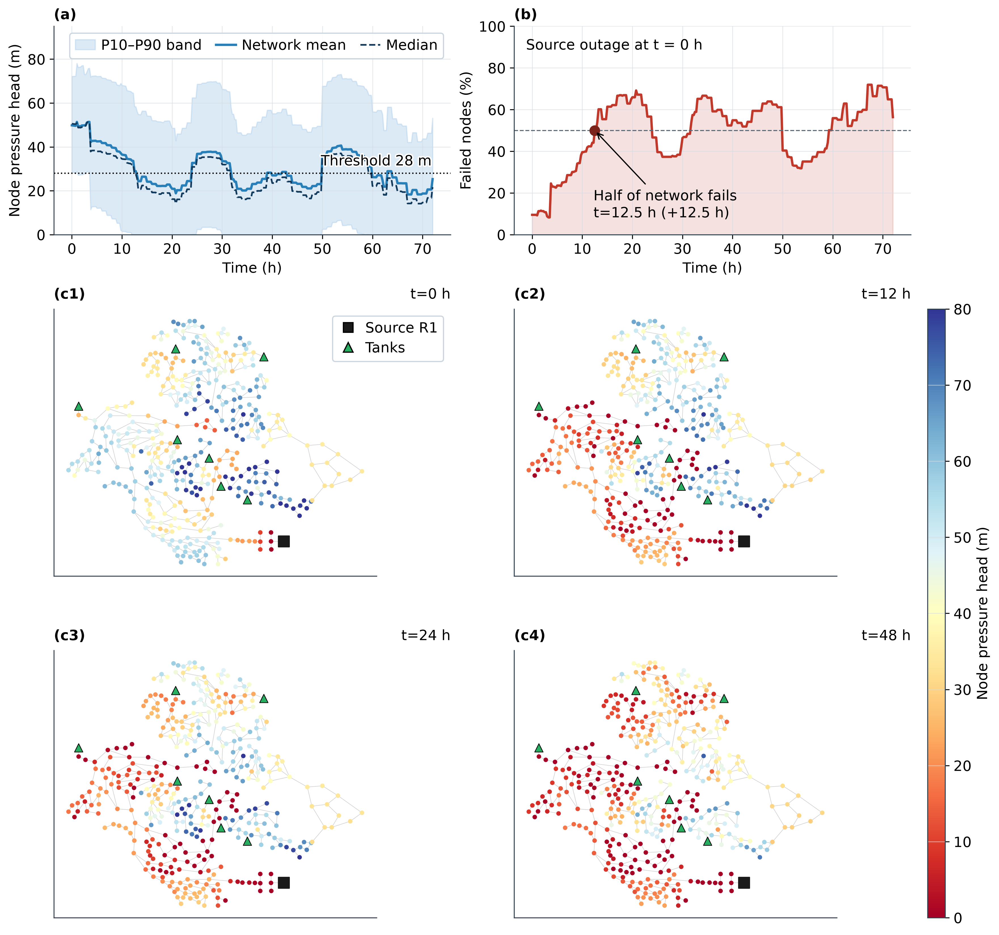
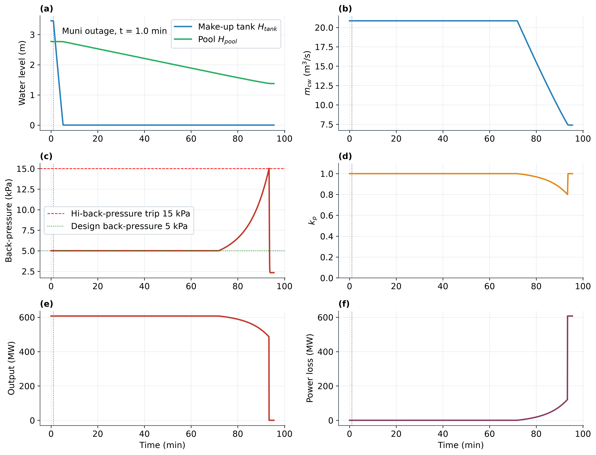
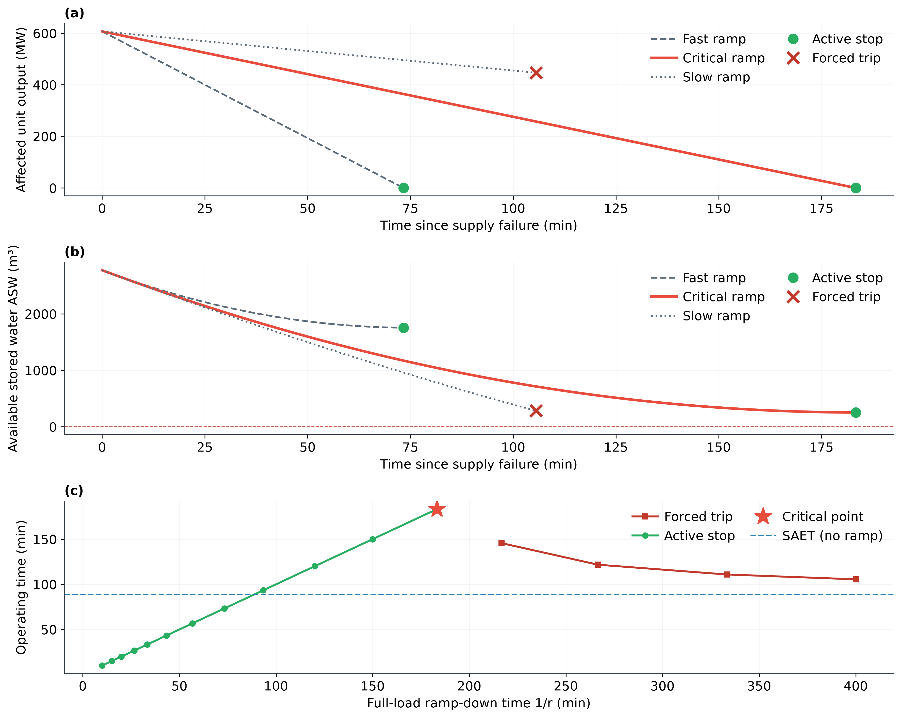
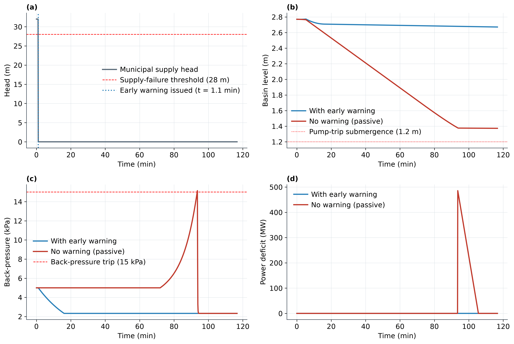
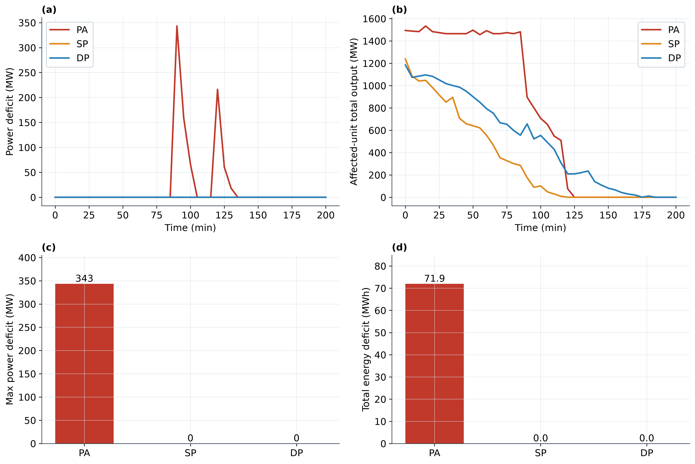
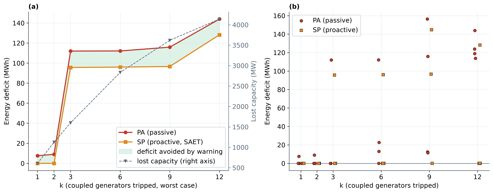

# 基于早期预警的冷却水耦合水-电信息物理系统韧性提升

*Early-warning-based resilience enhancement of cooling-water-coupled water–power cyber-physical systems*

> 合稿版 v2（语言润色，2026-09-07）：本文档由 `docs/paper_chapters/` 八件正稿经 `docs/merge_manuscript.py` 程序化合并生成，正文逐字保真，仅做三类机械变换——去除各章头部编辑说明、图片路径改写为 `figures/` 相对路径、参考文献编号按全文首次出现顺序统一重排（旧→新映射见 `docs/renumber_map.json`）；图 1–14 已随图注嵌入正文。投稿前待办（英文化、Nomenclature、Highlights、Zenodo 归档等）见 `docs/paper_chapters/front_back_matter.md`。

---

# 摘要 Abstract

**摘要：** 电厂循环冷却水取自市政供水管网，两套基础设施由此物理经冷却水、信息经工控系统（ICS）双重耦合，构成水-电信息物理耦合系统（CPS）。既有相互依赖基础设施研究多以一条直接耦合边代替冷却水中间过程，忽略了"市政失压"与"机组跳机"之间可资利用的缓冲时间。本文据我们所知首次在相互依赖水-电系统的早期预警韧性分析中显式建模"市政配水节点→高位补水箱→集水池→循环水泵→凝汽器→低压缸→发电机"的冷却水全过程，并利用供水慢动态与电力快动态之间的时间差，经三域三级 ICS 跨域预警将其转化为主动控制窗口以提升韧性。在 IEEE-118（54 机、总负荷 4242 MW）× D-town（399 节点真实管网）全耦合配对案例上的直流潮流线性规划仿真表明：无预警时单机跳机造成 485.6 MW 少发、49.1 MWh 损失，而早期预警配合主动控制可将其降为 0/0；冷却缓冲窗口 SAET 为 88.6–124.8 min（合成阶跃保守下界），且存在临界降出力速率 0.55 %Pg/min，使运行时间延长至 183 min（SAET 的 2.1 倍，"降额自保护"负反馈）。结论具有明确边界：同时失效机组数 k≤2 时缺额完全消除，k≥3 受备用与爬坡物理限制残留 95.6–128.2 MWh；唯一水源停供下全网失压时刻呈 0–67 h 分布（72.4% 节点失压），分散取水使被动峰值缺额由 343 降至 315 MW（危机时间隔离、峰值不叠加），而主动控制对取水位置稳健。跨域发现：冷却水储水缓冲天然长于燃气管存气，水-电场景的韧性瓶颈自"信息速度"转移至"多机共因下的备用充足性与爬坡能力"。

**关键词：** 相互依赖基础设施；水-电耦合；冷却水故障级联；早期预警；主动控制；韧性；时间尺度分离

**Keywords:** interdependent infrastructure; water–power coupling; cooling-water failure cascade; early warning; proactive control; resilience; timescale separation

---

# 1 引言 Introduction

## 1.1 背景：水-电信息物理双重耦合

电厂循环冷却水系统是城市供水管网与电力系统之间一条长期被简化的物理纽带：常规燃煤汽轮机组的循环冷却水需持续补水以弥补蒸发、排污与风吹损失，该补水通常取自市政配水管网；与此同时，电厂冷却水系统与市政管网又各自处于工控系统（ICS/SCADA）的监控之下。两套基础设施由此构成**物理经冷却水、信息经 ICS 的双重耦合**的水-电信息物理耦合系统（CPS）。

这一耦合在极端条件下已被反复激活。近年来，欧美已多次出现火电/核电机组因冷却水温度升高、河流流量下降而减产或临时停机 [1]；van Vliet 等 [1] 的评估进一步预测，2031–2060 年欧美火电容量将因冷却水缺乏平均下降 4%–19%（直流冷却机组最脆弱）；Macknick 等 [2] 系统梳理了各发电技术的取水与耗水系数，Bartos 与 Chester [3] 则量化了气候变化下美国西部电网的供水-供电联合脆弱性。

另一侧，城市供水系统自身的水源/管网事故（爆管、水厂故障、停电反噬）亦可能同时切断多台机组的冷却补水，形成**共因失效**。然而，既有相互依赖研究多以一条直接耦合边（"停水→停机"）代替冷却水中间过程 [4–6]，忽略了"市政失压"与"机组跳机"之间**可资利用的缓冲时间**。由此引出本文的核心科学问题：**市政供水失效经电厂冷却链传导为电力缺额的过程有多慢？这一时间差能否在机组跳机之前被跨域信息与主动控制所利用？该利用的物理边界又何在？**

## 1.2 相关工作与研究缺口

与本文相关的研究可归为四条线索：

**（i）相互依赖基础设施与水-电级联建模。** Ouyang [6] 将该领域方法学分为经验、代理、系统动力学、经济理论与网络化六类；Li 与 Zhang [4] 以功能耦合边连接真实城市供水网与 IEEE 标准电力系统做级联失效分析；Wang 等 [5] 以 HLA 联邦架构实现跨域共仿真。**共同局限**：耦合边普遍为"供水失效→机组停运"的直接映射（拓扑/概率/仿真细节各异），电厂侧冷却水过程本身未被建模。

**（ii）火电冷却水依赖与热浪降额。** van Vliet 等 [1]、Macknick 等 [2]、Bartos 与 Chester [3] 系统研究了气候-水文驱动下的冷却水温度/流量约束对出力的影响。**共同局限**：关注**气候慢变量**（热浪、干旱、水温）驱动的取水条件恶化，服务于选址与容量规划；未建模**故障快事件**下厂内储水动态，亦未接入"市政管网故障→预警→主动控制"闭环。

**（iii）冷却水-凝汽器热力工程。** 表面式凝汽器的 ε-NTU 换热、端差与背压特性有成熟的行业标准体系（HEI、ASME PTC 12.2 [7,8]；Dittus–Boelter 类传热关联 [9]）。**共同局限**：停留在部件级设计与试验方法层面，未作为系统级失效链的环节进入电网韧性分析。

**（iv）能源系统早期预警与主动控制。** Yu 等 [10] 针对气-电耦合系统提出 ALP/AET/SAET 早期预警指标与 PA/SP/DP 主动控制线性规划，实现缺额消除。**共同局限**：该范式止于气-电场景；水-电冷却水场景的缓冲物理（水储存于厂内集总容器，燃气管存则分布于管网之内）根本不同，该范式能否迁移、迁移后结论如何变化，尚无研究。

**缺口凝练**：既有工作**建模了冷却水的"结果"（停机）、跳过了冷却水的"过程"（储水-水力-换热-背压）；建模了气候"慢"驱动的降额、未建模故障"快"事件的级联；预警-主动控制范式止于气-电**。上述三条局限的交叠空白正是本文的切入点。

## 1.3 本文思想与贡献

本文的核心思想是：**冷却水缓冲使"市政失压"与"机组跳机"之间存在分钟-小时级时间差，而信息系统与电网控制的响应为秒级——若把这一慢-快时间差经跨域早期预警转化为主动控制窗口，即可在水侧故障演变为电力缺额之前完成对冲。** 主要贡献为：

1. **冷却水全过程的显式建模（据我们所知首次）**：在相互依赖水-电系统的早期预警韧性分析中，显式建模"市政配水节点→高位补水箱→集水池→循环水泵→凝汽器→低压缸→发电机"的冷却水全过程链（孔口-质量守恒-汽蚀-ε-NTU-背压降额-延时保护），超越既有"直接耦合边"范式（第 2、4.2 章）。
2. **慢-快时间差的定量化与利用**：提出气-水类比的 ASW/AET/SAET 指标体系与三域三级 ICS 跨域预警链路，以 LP 主动控制（PA/SP/DP）将时间差转化为韧性；发现临界降出力速率（0.55 %Pg/min）及其"降额自保护"负反馈——缓冲窗口可主动延长至 SAET 的 2.07 倍（第 2.3.3、4.2、4.3 章）。
3. **真实管网边界与可审计性**：以 D-town 真实城市管网生成失压边界，54 台机组全耦合确定性配对并 54/54 独立复验耦合规律；以两级缓冲位置不对称论证"市政侧只作边界"的方法论，并以取水位置敏感性（CO/DISP）与闭合水量账主动回应配对任意性与口径保守性（第 3、5.1、5.2、5.4 章）。
4. **有边界的结论**：以电侧 N-k 扫描与全序级联划定主动控制的适用边界——同时失效机组数 k≤2 时缺额完全消除，k≥3 受备用与爬坡物理限制残留 95.6–128.2 MWh（临界失效规模 k\*=3）；由此提出跨域发现：水-电场景的韧性瓶颈自"信息速度"转移至"多机共因下的备用充足性与爬坡能力"（第 4.5、6.3 章）。

案例组织对齐参照文献 [10] 的两级递进：同源共因场景（三厂同时危机，CO）对应其城市级同源案例（Fig.5–6），多源错峰场景（54 节点全耦合、全序级联）对应其省级多端源案例（Fig.7）。

## 1.4 论文组织

本文余下部分组织如下：第 2 章建立四层物理链与信息层的完整数学模型（两个创新点的方法主体）；第 3 章介绍 IEEE-118 × D-town 测试系统、全耦合配对、参数标定及其规范出处；第 4 章沿"市政侧失压→冷却链时间差→预警价值→三策略→稳健性边界"主线呈现结果；第 5 章给出取水位置、失压速率、水量口径的系统敏感性分析；第 6 章讨论机理洞见、工程启示、与文献对比及局限；第 7 章结论。

# 2 方法 Methodology

本章建立"市政供水—电厂冷却水—凝汽器与机组—电力系统"四层物理链及其信息层的完整数学模型。建模遵循三条原则：**其一，机理性白箱建模**——每一环节采用该领域的经典物理关系（水力孔口流、ε-NTU 换热、Antoine 饱和蒸汽压、直流潮流），不引入数据驱动黑箱，保证因果链可解释、可审计；**其二，公式与实现一一对应**——下文全部公式在代码中有且仅有一处实现，杜绝"文章一套、代码一套"；**其三，时间尺度分离**——各层主导动态差异达数个量级（秒级机电、分钟级水力热力、小时级市政失压），模型按层分解并显式声明每条仿真链的积分步长（§2.6）。两个创新点在本章的方法落点：创新点 1（§2.3）是对既有文献忽略的"冷却水中间过程"的首次完整建模；创新点 2（§2.4）是把该过程固有的**慢动态（冷却水缓冲，小时级）与快响应（信息系统与电网控制，秒级）之间的时间差**转化为可操作的跨域早期预警窗口。

## 2.1 总体框架：水-电 CPS 四层物理链与信息层

本文将城市水-电信息物理耦合系统（CPS）分解为四层物理链加一层信息层（图 1）：

- **B 层（市政配水管网）**：唯一水源—输配干线—分区储水箱—电厂取水节点。城市侧储水箱构成**一级缓冲**，其耗尽过程为小时级且强烈依赖取水节点位置（§2.2）。本文将其处理为**边界层**：向下游传递取水节点压头轨迹，不接收下游反馈（松耦合语义及其可行性论证见 §3.1）。
- **W 层（电厂冷却水系统，水源侧）**：高位补水箱—集水池—循环水泵—冷却塔（§2.3.1）。厂内储水构成**二级缓冲**，分钟级、由机组自身属性决定、与取水位置无关。
- **A 层（凝汽器—低压缸，热力-机电）**：循环水量衰减经凝汽器换热转化为排汽背压上升，再经背压-出力修正与高背压保护作用于机组（§2.3.2）。
- **C 层（电力系统）**：机组出力变化经直流潮流与备用体系在电网中传播，主动控制以线性规划下发（§2.5）。
- **I 层（信息层）**：按"现场控制—数据采集—调度决策"三级、市政/冷却/电力三域组织的 ICS，跨域早期预警以零时延贯通（§2.4）。

| 层 | 对象 | 理论方法 | 主导动态 | 关键状态量 |
|---|---|---|---|---|
| B 市政配水 | D-town 管网 | 延时水力模拟（EPS）＋压力驱动需水（PDD） | 小时级（水箱缓冲耗尽） | 节点压头 $H_{\mathrm{muni}}$ |
| W 冷却水 | 补水箱/集水池/泵/塔 | 孔口流＋质量守恒 ODE＋NPSH | 分钟级（储水耗尽） | 液位 $H_t,H_p$、流量 |
| A 凝汽器 | 凝汽器/低压缸 | Antoine＋ε-NTU＋背压修正 | 秒—分钟级 | 背压 $p_b$、出力 $P_g$ |
| C 电力系统 | IEEE-118 | 直流潮流（PTDF）＋两级备用＋LP | 秒—分钟级 | 潮流、缺额 |
| I 信息层 | 三域三级 ICS | 阈值检测＋跨域预警 | 秒级以内 | 预警状态、指令 |

（结构性小结表，不占正文表号。）

全章采用统一事件时间轴：$t=0$ 定义为**市政失压时刻**（取水节点压头跌破失效阈值，即危机起点，式 (2.2)），其后泵跳、机跳、备用起机、LP 控制期均相对该零点计量；市政故障自身的发生时刻记 $t_{\mathrm{fault}}$，仅在边界轨迹 (2.1) 中出现。信息层的分层状态采集与跨域数据共享设计对齐文献 [5] 的联邦式基础设施共仿真架构（市政域、冷却域、电力域各有 PLC/SCADA/调度三级），差别在于本文的跨域信息仅一条——**市政压头越限预警**——因此可实现零时延闭环（§2.4）。

**图 1　水-电信息物理耦合系统四层耦合总体框架（§2.1）**：① 市政供水层（唯一水源—分区储水箱缓冲—取水节点，压头 <28 m 即失效源）→ 电厂冷却水层（水力，分钟级）→ 凝汽器/低压缸层（热力-机电，秒—分钟级）→ 电力系统层；右侧信息层为三域（市政/冷却/电力）三级（PLC 采样—SCADA 监测—调度决策）ICS，市政域压头越限经跨域早期预警（零时延）直达电力域调度，构成"慢动态—快响应"时间差的利用通道。

## 2.2 市政水网边界层

### 2.2.1 参数化供水压头轨迹与失效判据

电厂冷却水系统的市政补水由取水节点压头驱动。本文将该压头抽象为如下参数化轨迹（实现 `submodels.muni_head`）：

$$
H_{\mathrm{muni}}(t)=\begin{cases}
H_{\mathrm{muni},0}, & t<t_{\mathrm{fault}},\\[4pt]
H_{\mathrm{muni},0}\Big(1-\dfrac{t-t_{\mathrm{fault}}}{\tau_r}\Big)^{+}, & t\ge t_{\mathrm{fault}},\ \tau_r>0,\\[4pt]
0, & t\ge t_{\mathrm{fault}},\ \tau_r=0,
\end{cases}
\tag{2.1}
$$

其中 $H_{\mathrm{muni},0}=32\ \mathrm{m}$ 为健康供水压头，$(x)^{+}=\max(x,0)$，$\tau_r$ 为失压过渡时长。$\tau_r=0$ 对应**阶跃停供**口径（B-ST），$\tau_r>0$ 对应**渐降失压**口径（B-RT）。失效判据为

$$
t_{\mathrm{fail}}=\inf\bigl\{\,t\ge t_{\mathrm{fault}}:\ H_{\mathrm{muni}}(t)<H_{\min}\,\bigr\},
\qquad H_{\min}=28\ \mathrm{m},
\tag{2.2}
$$

即取水节点压头低于 28 m 时市政补水通道失效（$t\ge t_{\mathrm{fail}}$ 后补水流量恒为零，式 (2.4)），此后冷却系统进入缓冲耗竭过程。$t_{\mathrm{fail}}$ 即 §2.1 的事件时间零点。

### 2.2.2 边界轨迹的生成与松耦合语义

式 (2.1) 中的 $(t_{\mathrm{fault}},\tau_r)$ 与各取水节点的 $t_{\mathrm{fail}}$ 并非假设，而是由真实城市管网水力仿真生成（`boundary_generator.py`、`full_coupling_boundary.py`）：市政侧采用 D-town 基准管网 [11,12]，以 EPANET 2 延时模拟（EPS）与压力驱动需水（PDD）模式求解 [13,14]，步长 15 min、观测窗 72 h，节点需水按管网自带的 140 条日变化模式分配。PDD 采用 Wagner 型压力-流量关系 [15]：

$$
q_n = q_n^{\mathrm{req}}\cdot f(p_n),\qquad
f(p)=\min\Bigl(1,\ \sqrt{\bigl(\tfrac{p-p_{\min}}{p_{\mathrm{req}}-p_{\min}}\bigr)^{+}}\Bigr),
\tag{2.3}
$$

即节点压头 $p$ 低于完全服务所需压头 $p_{\mathrm{req}}$ 时需水按平方根关系部分满足（$p\le p_{\min}$ 时为零），本文 $p_{\min}=0$、$p_{\mathrm{req}}=20\ \mathrm{m}$。唯一水源停供算例将水库边界总水头置零，城市侧仅靠分区水箱缓冲维持压力，节点压头逐区跌破阈值——每个耦合取水节点的压头轨迹中**首次跌破 28 m 的时刻**即该节点的 $t_{\mathrm{fail}}$（锁存，不因后续波动复位）。

本文将市政水网严格限定为边界层的依据是**两级缓冲的位置不对称性**：城市侧水箱缓冲是小时级、强位置依赖的一级缓冲（D-town 全网失压时刻 P10/P50/P90＝3.8/9.8/17.0 h，28% 节点 72 h 不失压），电厂侧冷却缓冲是分钟级、与位置无关的二级缓冲（SAET≈89–125 min，§2.3.3）。危机的时间起点由一级缓冲决定，处置窗口则由二级缓冲决定。因此，模型只需把"压头轨迹"这一标量时间函数从市政层传入冷却层（B→W 单向），即可完整刻画其对电力系统的影响；反向将电厂补水水量反馈回城市水力，则被证明会破坏城市侧自身的缓冲结构（水源出力 245.8 L/s 不足以承载 54 节点 299.7 L/s 的额定补水），定量论证与可供性的事后评估见 §3.1。

## 2.3 冷却水故障机理链【创新点 1】

既有水-电相互依赖研究普遍把"市政停水"直接映射为"机组停机"（图 2 中部标注的"既有工作忽略的中间过程"），跳过了电厂冷却水系统的全部中间物理过程 [4]；本文首次对该链条完整建模（`submodels.py`，163 行）：市政压头衰减 → 补水中断 → 厂内储水耗竭 → 循环水泵汽蚀 → 凝汽器换热恶化 → 背压上升 → 机组降额/保护跳机。以下 W、A 两个子模型的每条公式均按代码原序给出。

**图 2　电厂冷却水系统物理过程链（创新点 1，§2.3）**：取水节点（失效源，压头 <28 m）→ 高位补水箱（质量守恒）→ 集水池（储存缓冲）→ 循环水泵（NPSH/汽蚀）→ 凝汽器（ε-NTU 换热）→ 低压缸（背压→降额 $k_p$）→ 发电机（出力下降/跳机），辅以冷却塔散热与三项循环损失；中部深色环节为既有工作忽略、本文首次建模的中间过程。

### 2.3.1 子模型 W：水源侧水力

系统构成为高位补水箱（截面积 $A_T=30\ \mathrm{m^2}$，目标水位 $H_T^{\mathrm{set}}=4\ \mathrm{m}$）经重力自流阀门向集水池（$A_P=1700\ \mathrm{m^2}$，$H_P^{\mathrm{set}}=3\ \mathrm{m}$，高差 $\Delta z=15\ \mathrm{m}$）补水，市政补水经液位控制阀进入补水箱，循环水泵自集水池取水。各流量均为孔口型（流量系数 $C_v$ 乘阀开度乘驱动压头平方根）。

**市政补水**（`make_flow`）：

$$
Q_{\mathrm{make}}(t)=C_v^{\mathrm{m}}\,u_{\mathrm{make}}(t)\sqrt{\bigl(H_{\mathrm{muni}}(t)-H_t(t)\bigr)^{+}}\cdot\mathbf{1}\bigl[t<t_{\mathrm{fail}}\bigr],
\tag{2.4}
$$

$$
u_{\mathrm{make}}(t)=\max\Bigl(\mathrm{clip}\bigl(K_T\bigl(H_T^{\mathrm{set}}-H_t\bigr),\,0,\,1\bigr),\ \ 0.02\cdot\mathbf{1}\bigl[H_t<H_T^{\mathrm{set}}\bigr]\Bigr),
\tag{2.5}
$$

其中 $C_v^{\mathrm{m}}=0.30\ \mathrm{m^3 s^{-1} m^{-1/2}}$、比例液位控制增益 $K_T=0.5$；0.02 的最小开度防止比例控制在小偏差下将阀门完全关闭（避免"全关死锁"）。市政失效（$t\ge t_{\mathrm{fail}}$，式 (2.2)）后该项恒为零。

**重力自流**（`gravity_flow`）：

$$
Q_{\mathrm{grav}}(t)=C_v^{\mathrm{g}}\,u_{\mathrm{grav}}(t)\sqrt{\bigl(H_t(t)+\Delta z-H_p(t)\bigr)^{+}}\cdot\mathbf{1}\bigl[H_t>H_t^{\min}\bigr],
\tag{2.6}
$$

$$
u_{\mathrm{grav}}(t)=\mathrm{clip}\bigl(K_P\bigl(H_P^{\mathrm{set}}-H_p\bigr),\,0,\,1\bigr),
\tag{2.7}
$$

$C_v^{\mathrm{g}}=0.60$、$K_P=0.8$、$H_t^{\min}=0$（水箱放空即断流）。

**循环水泵**（`pump_flow`）：额定循环水量按机组容量与设计冷却温升标定 [16]：

$$
m_{cw,0}=k_{cw}\,P_{\max},\qquad k_{cw}=0.0295\ \mathrm{m^3 s^{-1} MW^{-1}}
\tag{2.8}
$$

（$k_{cw}$ 为对应设计温升 $\Delta T_d=8\ \mathrm{K}$ 的循环水量定额，bus89 机组 $P_{\max}=707\ \mathrm{MW}$：$m_{cw,0}=20.86\ \mathrm{m^3/s}$）。集水池水位下降首先侵蚀泵吸口淹没深度，流量按分段律降额：

$$
m_{cw}(t)=m_{cw,0}\cdot s\bigl(H_p\bigr),\qquad
s(H)=\begin{cases}
0, & H\le H_s,\\[2pt]
\dfrac{H-H_s}{\Delta H_s}, & H_s<H<H_s+\Delta H_s,\\[6pt]
1, & H\ge H_s+\Delta H_s,
\end{cases}
\tag{2.9}
$$

其中最小淹没深度 $H_s=1.2\ \mathrm{m}$、降额带 $\Delta H_s=0.5\ \mathrm{m}$；水位触及 $H_s$ 时泵跳闸并**锁定**（不可逆，后续即使水位恢复亦不重启——保守假设）。泵的汽蚀安全性以有效汽蚀余量监测（`npsh_available`）：

$$
\mathrm{NPSH}_a=\frac{p_{\mathrm{atm}}-p_{\mathrm{vap}}}{\rho_w g}+H_p-h_{f,0}\Bigl(\frac{m_{cw}}{m_{cw,0}}\Bigr)^{2},
\tag{2.10}
$$

$p_{\mathrm{atm}}=101.325\ \mathrm{kPa}$、吸入管额定摩擦损失 $h_{f,0}=1.0\ \mathrm{m}$、$p_{\mathrm{vap}}=3.0\ \mathrm{kPa}$（常温近似常数）。需求汽蚀余量 $\mathrm{NPSH}_r=8\ \mathrm{m}$；稳态工况下 $H_p=2.77\ \mathrm{m}$ 时 $\mathrm{NPSH}_a\approx11.8\ \mathrm{m}$，裕度充足，故本模型中泵失效的实际主导判据是淹没深度 (2.9) 而非 NPSH（后者作为监测量保留）。

**循环损失**（`loss_flow`）三项构成 [16]：

$$
Q_{\mathrm{evap}}=\frac{Q_{\mathrm{cond}}}{h_{fg}\,\rho_w},\qquad
Q_{\mathrm{bd}}=\beta\,Q_{\mathrm{evap}},\qquad
Q_{\mathrm{drift}}=\alpha_d\,m_{cw},
\tag{2.11}
$$

$$
Q_{\mathrm{loss}}=Q_{\mathrm{evap}}+Q_{\mathrm{bd}}+Q_{\mathrm{drift}},
\tag{2.12}
$$

即蒸发损失正比于凝汽器热负荷（汽化潜热 $h_{fg}=2400\ \mathrm{kJ/kg}$）、排污按浓缩倍率取蒸发量的 $\beta=0.52$ 倍、风吹（飘滴）损失取循环量的 $\alpha_d=0.05\%$；bus89 额定工况合计 $Q_{\mathrm{loss},0}=0.452\ \mathrm{m^3/s}$，占循环量 2.17%，与 GB/T 50102 的 2–3% 经验区间一致。

**质量守恒**（`water_derivs`）：闭式循环中泵取水与冷却塔回水近似抵消，两容器水位方程为

$$
\frac{dH_t}{dt}=\frac{Q_{\mathrm{make}}-Q_{\mathrm{grav}}}{A_T},\qquad
\frac{dH_p}{dt}=\frac{Q_{\mathrm{grav}}-Q_{\mathrm{loss}}}{A_P}.
\tag{2.13}
$$

**水温**（`basin_temp`）：冷却塔出塔水温按冷幅（approach）$\Delta T_{\mathrm{appr}}=5\ \mathrm{K}$ 与湿球温度 $T_{wb}=15\,^\circ\mathrm{C}$ 给定，$T_{\mathrm{to}}=T_{wb}+\Delta T_{\mathrm{appr}}=20\,^\circ\mathrm{C}$；循环水量下降使冷却塔换热不足、出塔水温向回水温度漂移（混合系数 $\chi=0.5$）：

$$
T_{\mathrm{in}}=\begin{cases}
T_{\mathrm{to}}+\chi\Bigl(1-\min\bigl(1,\tfrac{m_{cw}}{m_{cw,0}}\bigr)\Bigr)\bigl(T_{\mathrm{ret}}-T_{\mathrm{to}}\bigr)^{+}, & m_{cw}>0,\\[6pt]
T_{\mathrm{ret}}, & m_{cw}=0\ (\text{池水停滞回温}),
\end{cases}
\tag{2.14}
$$

**初值**（`equilibrate_water`）：无故障条件下自目标水位前向积分至 $\lvert dH/dt\rvert<10^{-7}$（比例控制存在稳态液位下垂），bus89 得 $H_t(0)=3.46\ \mathrm{m}$、$H_p(0)=2.77\ \mathrm{m}$，避免仿真起始的非平衡漂移。集水池容积按 DL/T 5339 的有效停留时间 3–5 min 校验：$A_P\times H_P^{\mathrm{set}}\approx5100\ \mathrm{m^3}$、额定停留 $4.1\ \mathrm{min}$ [17]。

### 2.3.2 子模型 A：凝汽器与低压缸

**饱和蒸汽压**（`params.psat_from_t`）：Antoine 方程（水，1–100 ℃，mmHg，换算 kPa）：

$$
\log_{10} p_{\mathrm{sat}}^{\mathrm{mmHg}}=A-\frac{B}{C+T},\qquad
A=8.07131,\ B=1730.63,\ C=233.426,\ \ p_{\mathrm{sat}}=0.1333224\,p_{\mathrm{sat}}^{\mathrm{mmHg}}\ \mathrm{kPa}.
\tag{2.15}
$$

**凝汽器换热**（`condenser`）：按 ε-NTU 法 [18]，凝汽器为凝结换热（汽侧热容无穷大，热容比 $C_r\to0$）：

$$
C_{cw}=\rho_w c_p\,m_{cw},\qquad
UA=UA_0\Bigl(\frac{m_{cw}}{m_{cw,0}}\Bigr)^{n},\qquad
\varepsilon=1-e^{-\mathrm{NTU}},\qquad
\mathrm{NTU}=\frac{UA}{C_{cw}},
\tag{2.16}
$$

其中传热系数随流量的 0.8 次方标度（Dittus–Boelter 型湍流换热指数 [9]），$n=0.8$。循环水出入口温度与背压为

$$
T_{\mathrm{ret}}=T_{\mathrm{in}}+\frac{Q_{\mathrm{cond}}}{C_{cw}},\qquad
T_{\mathrm{sat}}=T_{\mathrm{in}}+\frac{Q_{\mathrm{cond}}}{\varepsilon C_{cw}},\qquad
p_b=p_{\mathrm{sat}}\bigl(T_{\mathrm{sat}}\bigr).
\tag{2.17}
$$

断流分支（$m_{cw}\to0$）下换热近乎停止，背压取数值兜底值 $3\,p_b^{\mathrm{trip}}$（截于 50 kPa，必大于跳闸值）——保证泵跳后机组随即因高背压跳机，链条不中断。

**UA₀ 反标定**：$UA_0$ 不另行假设，而由额定设计工况自洽反解（`params.__post_init__`）——设计背压 $p_{b,0}=5\ \mathrm{kPa}$、设计进水温度 $T_{\mathrm{in},0}=20\,^\circ\mathrm{C}$（湿球+冷幅）、额定热负荷 $Q_{\mathrm{cond},0}=\lambda_Q P_{g,0}$（$\lambda_Q=1.15$，凝汽器热负荷/电功率近似倍率，含循环热耗）：

$$
\varepsilon_0=\frac{Q_{\mathrm{cond},0}}{C_{cw,0}\bigl(T_{\mathrm{sat}}(p_{b,0})-T_{\mathrm{in},0}\bigr)},\qquad
NTU_0=-\ln\bigl(1-\varepsilon_0\bigr),\qquad
UA_0=NTU_0\,C_{cw,0}.
\tag{2.18}
$$

bus89 数值：$T_{\mathrm{sat}}(5\,\mathrm{kPa})=32.94\,^\circ\mathrm{C}$、$Q_{\mathrm{cond},0}=698\ \mathrm{MW}$、$\varepsilon_0=0.618$、$NTU_0=0.962$、$UA_0=8.4\times10^{4}\ \mathrm{kW/K}$；标定后的额定实际端差 $T_{\mathrm{sat}}-T_{\mathrm{ret}}=4.9\ \mathrm{K}$（名义设计端差参数 4 K 为设计意图记录、不强制施加，实际端差由自洽标定确定），处于 HEI/ASME PTC 12.2 口径表面式凝汽器典型区间 [7,8]。

**背压-出力修正**（`power_derate`）：线性微增降额律

$$
k_p(t)=\Bigl(1-\gamma\bigl(p_b(t)-p_{b,0}\bigr)^{+}\Bigr)^{+},\qquad
\gamma=0.02\ \mathrm{kPa^{-1}},
\tag{2.19}
$$

即背压每升高 1 kPa 出力下降约 2%；机组实际出力 $P_g=P_{g,0}\,k_p$（ICS 链中与 runback 指令取小，见 (2.26)）。

**高背压保护**：$p_b\ge p_b^{\mathrm{trip}}=15\ \mathrm{kPa}$（约 3 倍设计值）**持续** $\tau_d=3\ \mathrm{s}$ 即跳机（锁定）；泵已跳闸且背压达跳闸值时立即跳机。**热负荷更新**：跳机前 $Q_{\mathrm{cond}}=\lambda_Q P_g\times10^{3}\ \mathrm{kW}$（随实际出力，因而随降额自适降低）；跳机后残余排汽散热按 $Q_{\mathrm{cond},0}/20$ 的速率线性衰减至零（约 20 s）。

### 2.3.3 气-水类比早期预警指标

参照文献 [10] 的天然气-电力早期预警指标体系，物理量由天然气替换为冷却水（`warning_indicators.py`）：

| 文献（气）[10] | 本项目（水） | 定义 |
|---|---|---|
| ALP 可用管存 | **ASW 可用储水量** | 跳泵前可用的补水箱+集水池水量 |
| AET 可用逃逸时间 | **AET** | 受影响机组进入高背压/跳泵保护前的剩余时间 |
| SAET 静态 AET | **SAET** | 故障时刻（$t=0$）的初始缓冲窗口 |

（结构性小结表，不占正文表号。）

$$
\mathrm{ASW}(t)=A_T\bigl(H_t-H_t^{\min}\bigr)+A_P\bigl(H_p-H_s\bigr),
\tag{2.20}
$$

$$
\mathrm{AET}(r)=\begin{cases}
t_{\mathrm{trip}}(r), & \text{若前向积分在出力降零前触发保护（强制跳机）},\\[2pt]
1/r, & \text{若机组在触发保护前降至零出力（主动停机成功）},
\end{cases}
\tag{2.21}
$$

$$
\mathrm{SAET}=\mathrm{AET}(0),
\tag{2.22}
$$

其中 (2.21) 的前向积分在"受影响机组按速率 $r$ 线性降出力"假设下联立求解 §2.3.1–§2.3.2 全部方程（步长 1 s），$t_{\mathrm{trip}}$ 为保护判据首次满足时刻。bus89：$\mathrm{ASW}_0=2773\ \mathrm{m^3}$（补水箱 104 + 集水池 2670）、$\mathrm{SAET}=88.6\ \mathrm{min}$；三厂 89/80/10 的 SAET 为 88.6/116.9/124.8 min。

**临界降出力速率（降额自保护负反馈）**：降出力越快，热负荷越低 → 循环损失与背压上升越缓 → 缓冲时间越长，存在临界速率 $r^{*}$ 使运行时间最长（`critical_ramp_example.py`，扫描 $1/r\in[600,24\,000]\ \mathrm{s}$、积分域 40 000 s）：bus89 的 $r^{*}=9.09\times10^{-5}\ \mathrm{s^{-1}}$（0.545%/min，满出力降零约 183 min），最长运行时间 183.3 min——**超过 SAET 的两倍**；低于 $r^{*}$ 时机组在缓冲耗尽后被强制跳机，高于 $r^{*}$ 时可主动停机。该性质是 §2.5 主动控制可行性的物理基础（数值算例见第 4 章图 8）。

## 2.4 信息系统层与慢-快时间差【创新点 2】

### 2.4.1 三域三级 ICS 与检测判据

信息层按三域（市政/冷却/电力）×三级（现场 PLC—SCADA—调度）组织（图 1 右侧，`db.py`/`field_plc.py`/`scada.py`/`dispatch.py`），各域内部为常规分层监控架构（对齐文献 [5] 的联邦式共仿真范式）；本文的关键设计是**跨域早期预警通道**：市政域 SCADA 的压头越限事件经调度级直接推送电力域，不走逐级上报，传递时延记为零（方案论证见 §2.4.2）。检测判据为

$$
t_{\mathrm{warn}}=\inf\bigl\{\,t:\ H_{\mathrm{muni}}(t)<H_{\min}\,\bigr\}=t_{\mathrm{fail}},
\tag{2.23}
$$

即**预警阈值与失效阈值取同一值（28 m）、同一测点（电厂取水节点压头，水司 SCADA 常规量测）、同一时刻**；事件锁存（首次越限后不复位）。预警送达电力域后即可启动 §2.5.2 的 runback 软着陆与备用预起机。

### 2.4.2 触发时刻方案论证与分级预警取舍

"检测即失效时刻"（式 (2.23)）这一设计经过四点论证：**其一（可观测性）**，配水节点压头是市政 SCADA 的既有量测，无需在电厂侧新增传感，跨域预警只复用已有数据；**其二（与失效判据同源）**，28 m 既是补水失效判据 (2.2) 又是预警阈值，二者同源同时，不引入独立的整定自由度，预警语义唯一且保守——预警发出即冷却补水确实中断；**其三（误报/漏报成本不对称）**，阈值上移（早于失效预警）将以误报换取提前量，阈值下移则漏报失效，取失效阈值本身是无可调参数的保守下界；**其四（时间零点自洽）**，$t_{\mathrm{warn}}=t_{\mathrm{fail}}=0$ 使 SAET 窗口、跳机时刻、备用起机、LP 控制期全部相对同一零点计量，第 4 章各场景数值严格可比。

分级预警（如"注意/告警"两级）在本文场景下被有意舍去：本文故障源为确定性单一事件（唯一水源停供），压头轨迹单调下降，两级阈值只会产生同一决策序列的两个冗余触发点，不改变任何控制动作，却引入阈值间距整定问题；SCADA 状态字段保留了分级扩展接口。预警系统的量测/通信时延统一记为零，漏报/丢包不予考虑——本文的保守性完全由"预警不早于失效"（式 (2.23)）承担；信息/控制系统本身的动力学不在本文仿真范围（§6.4 局限 8），预警时延敏感性亦不在本文范围。

### 2.4.3 慢-快时间差：从预警到影响的因果结构

图 3 概括了本文的核心因果结构：市政失压（$t=0$）后，冷却水缓冲以**分钟级慢动态**耗竭（式 (2.13)），期间背压缓升直至保护动作；而 ICS 检测、跨域预警与电网控制在**秒级快动态**内完成响应。两者的时间差——SAET 窗口——即**可用的主动控制时间**。被动情形下备用在跳机后才起机（受 15 min 级起机速率限制，来不及）；主动情形下同一备用自 $t=0$ 预起机，配合受影响机组在窗口内 runback 软着陆，可消除缺额。表 1 给出两种情形的机制对比（单机定量结果见第 4 章）。

**图 3　慢-快动态时间差与早期预警机制（创新点 2，§2.4）**：上轴为冷却水侧慢动态——市政失压（$t=0$）后水箱+集水池储水逐渐耗竭、背压缓升，SAET 窗口末端保护跳机；ICS 检测市政压头越限并零时延跨域预警（快动态）。下轴为两种下场：被动（无预警）在跳机后才动用备用（来不及）→ 突跳、深缺额；主动（有预警）在窗口内受影响机组 runback 软着陆 + 其余机组预爬坡 → 避免跳机、缺额消除。

**表 1　被动控制 vs 主动（早期预警驱动）控制对比（§2.4，对齐参照文献 Table 1）**

| 属性 | 被动控制（无预警） | 主动控制（早期预警） |
|---|---|---|
| 使用信息 | 仅电力系统自身（跳机后才知情） | 市政供水 + 电力跨域信息（配水节点压头 < 28 m 即预警） |
| 动作时刻 | 机组跳机后（慢响应，受爬坡限制） | 市政失压即刻（零时延，快响应） |
| 控制效果 | 事后动用备用，深度缺额 | SAET 窗口内 runback 软着陆 + 备用预爬坡 |
| 影响（单机 bus89） | 485.6 MW / 49.1 MWh | 0 MW / 0 MWh（避免跳机） |

## 2.5 电力系统层与主动控制

### 2.5.1 直流潮流与线路限值

电侧采用 IEEE 118 母线标准算例 [19] 与直流潮流（DC-PF）口径 [20,21]：以基态运行点（机组出力/负荷取算例数据）的相角为基准，线路有功潮流为节点净注入的线性函数（`dc_network.py`，PTDF 由 PYPOWER 移植的 `makePTDF` 计算 [20]）：

$$
P_{f,\ell,t}=\sum_n \Pi_{\ell n}\bigl(\bigl[A_g P_{g,t}\bigr]_n-P_{d,n}\bigr),\qquad \ell=1,\dots,L,
\tag{2.24}
$$

其中 $\Pi$ 为 PTDF 矩阵、$A_g$ 为机组-母线关联阵。线路限值不取算例额定值，而由基态潮流派生（保留 1.5 倍事故过载能力、设下限防零限值）：

$$
\overline{F}_{\ell}=\max\bigl(\kappa_r\,\bigl|P_{f,\ell}^{\mathrm{base}}\bigr|,\ F_{\min}\bigr),\qquad
\kappa_r=1.5,\quad F_{\min}=50\ \mathrm{MW}.
\tag{2.25}
$$

### 2.5.2 两级备用与 runback（ICS 事件仿真口径）

单机事件仿真（`ics_simulation.py`）中，受影响机组出力为

$$
P_{\mathrm{aff}}(t)=P_{\mathrm{aff},0}\cdot\min\bigl(u_{\mathrm{cmd}}(t),\,k_p(t)\bigr)\quad(\text{跳机前}),\qquad
\frac{du_{\mathrm{cmd}}}{dt}=-\min\bigl(\rho_{rb},\ \tfrac{r_{\mathrm{slow}}}{P_{\mathrm{aff},0}}\bigr)\quad(\text{预警后}),
\tag{2.26}
$$

即 runback 指令与背压降额律 (2.19) 取小（先到先控）；指令速率上限 $\rho_{rb}=0.0015\ \mathrm{s^{-1}}$，且不超过慢起机速率份额 $r_{\mathrm{slow}}/P_{\mathrm{aff},0}=1/900\ \mathrm{s^{-1}}$（即 runback 全程最快 15 min）。无预警时 $u_{\mathrm{cmd}}\equiv1$（机组被动运行直至保护动作）。其余机组提供两级备用：

$$
R_{\mathrm{spin}}=\rho_r\,P_{\mathrm{aff},0},\qquad
C_{\mathrm{slow}}=P_{\mathrm{aff},0},\qquad
r_{\mathrm{slow}}=\frac{P_{\mathrm{aff},0}}{T_{\mathrm{slow}}},
\qquad \rho_r=0.20,\ T_{\mathrm{slow}}=900\ \mathrm{s},
\tag{2.27}
$$

即旋转备用 $0.20P_{\mathrm{aff},0}$ 立即可用，慢起机备用总量 $P_{\mathrm{aff},0}$ 以 $r_{\mathrm{slow}}$ 速率爬升（约 15 min 全上）。备用起机的计时参考点 $t_{\mathrm{ref}}$ 是有无预警的分水岭：

$$
t_{\mathrm{ref}}=\begin{cases}t_{\mathrm{warn}}=0, & \text{有预警（提前起机）},\\ t_{\mathrm{trip}}, & \text{无预警（跳机后才起机）},\end{cases}
\qquad
\mathrm{deficit}(t)=\Bigl(P_{\mathrm{aff},0}-P_{\mathrm{aff}}(t)-R_{\mathrm{spin}}-\min\bigl(C_{\mathrm{slow}},\,r_{\mathrm{slow}}(t-t_{\mathrm{ref}})\bigr)\Bigr)^{+}.
\tag{2.28}
$$

两级备用总量 $1.2P_{\mathrm{aff},0}$ 足以覆盖最大损失 $P_{\mathrm{aff},0}$，故缺额**完全来自时序**：被动情形下 15 min 级起机延迟暴露于缺额峰值，主动情形下同一备用自 $t=0$ 预爬坡即可对冲——这正是"跨域信息价值"的定量化解耦设计。

### 2.5.3 主动控制线性规划（LP）

全网主动控制为滚动单次线性规划（`proactive_lp.py`，`scipy.optimize.linprog`/HiGHS 求解）。决策变量为各机组各时步出力 $P_g[i,t]$、功率缺额松弛 $d_t\ge0$、线路过载松弛 $o_{\ell,t}\ge0$（$t=0,\dots,T$，$\Delta t=5\ \mathrm{min}$，时域 200 min）。目标为最小化控制期能量缺额并惩罚过载：

$$
\min\ \sum_t d_t\,\Delta t\ +\ w\sum_{\ell,t} o_{\ell,t},\qquad w=5.
\tag{2.29}
$$

约束五类：

$$
\text{(平衡)}\quad \sum_i P_g[i,t]+d_t=P_L,\qquad\forall t;
\tag{2.30}
$$

$$
\text{(容量)}\quad 0\le P_g[i,t]\le
\begin{cases}
P_{\mathrm{avail},i}(t), & i\in S_{\mathrm{aff}},\\[2pt]
\min\bigl(P_{g0,i}+\rho_{\mathrm{res}}(P_{\max,i}-P_{g0,i}),\ P_{\max,i}\bigr), & i\notin S_{\mathrm{aff}},
\end{cases}
\tag{2.31}
$$

（备用比例 $\rho_{\mathrm{res}}=1.0$：其余机组可用满物理余量，备用时序由爬坡约束体现）；

$$
\text{(爬坡)}\quad \bigl|P_g[i,t]-P_g[i,t-1]\bigr|\le R_i\,\Delta t,\qquad
R_i=\rho_{\mathrm{ramp}}P_{\max,i},\ \ \rho_{\mathrm{ramp}}=0.01\ \mathrm{min^{-1}},\quad i\notin S_{\mathrm{aff}}
\tag{2.32}
$$

（$t=0$ 相对基态 $P_{g0,i}$；本文各主动控制链取 $\rho_{\mathrm{ramp}}=0.01\ \mathrm{min^{-1}}$，N-k 扫描取脚本类默认 $0.02\ \mathrm{min^{-1}}$（第 4 章表 5 注）；爬坡仅约束其余机组，受影响机组由可用轨迹 (2.35) 主导）；

$$
\text{(直流潮流)}\quad \bigl|P_{f,\ell,t}\bigr|\le\overline{F}_{\ell}+o_{\ell,t},\qquad \forall \ell,t
\tag{2.33}
$$

（软约束默认；$o\equiv0$ 的硬约束模式下 $d_t$ 退化为最小切负荷）；

$$
\text{(被动因果)}\quad P_g[i,t]\le P_{g0,i},\qquad i\notin S_{\mathrm{aff}},\ \ t<t_{\mathrm{ft}},
\tag{2.34}
$$

其中 $t_{\mathrm{ft}}=\min_{i\in S_{\mathrm{aff}}}\bigl(\tau_i+t_{\mathrm{trip},i}\bigr)$ 为首台受影响机组跳机时刻——被动（PA）模式下其余机组在缺额真实出现前不得预升出力，主动模式则自 $t=0$ 即可爬坡，此即被动/主动的本质区别。受影响机组 $i\in S_{\mathrm{aff}}$（默认母线 89/80/10）的可用出力轨迹为

$$
P_{\mathrm{avail},i}(t)=\begin{cases}
P_{g0,i}\Bigl(1-\dfrac{(t-\tau_i)^{+}}{T_i}\Bigr)^{+}, & \text{SP/DP（线性软着陆）},\\[8pt]
P_{g0,i}\cdot\mathbf{1}\bigl[t<\tau_i+t_{\mathrm{trip},i}\bigr], & \text{PA（按水力轨迹突降）},
\end{cases}
\tag{2.35}
$$

其中 $\tau_i$ 为节点 $i$ 的市政失压偏移（其取水节点 $t_{\mathrm{fail}}$，默认 0 即同源同位置），$t_{\mathrm{trip},i}$ 为前向积分 (2.21)（$r=0$）所得跳机时刻。控制时间

$$
T_i^{\mathrm{SP}}=\mathrm{SAET}_i,\qquad T_i^{\mathrm{DP}}=\alpha\cdot\mathrm{SAET}_i,\qquad \alpha=1.5.
\tag{2.36}
$$

**DP 单步近似声明**：文献 [10] 的动态主动控制为迭代延长控制时间（在延长设定点重算 AET）；本文实现为固定倍率单步延长（$T_i=\alpha\,\mathrm{SAET}_i$，不做迭代），其保守性与局限在第 5 章适用性讨论中声明。影响量化指标为

$$
P_{\mathrm{def}}^{\max}=\max_t d_t,\qquad
E_{\mathrm{def}}=\sum_t d_t\,\Delta t,
\tag{2.37}
$$

即少发功率峰值与损失电量（ICS 链同口径，(2.28) 的时间聚合）。市政偏移 $\tau_i$ 的引入使取水位置敏感性（危机起点平移）与冷却缓冲（处置窗口长度）解耦，其系统分析（同源同位置 vs 分散取水两布置）见第 4 章；该方法论接口同时避免了分散布置下 25 h 级长时域巨型 LP（危机时间隔离时等价为独立单机 LP，峰值取 max、能量取和）。

## 2.6 数值求解与模型间耦合

各仿真链均为"显式步进＋事件锁存"结构：每步按 市政压头 (2.1) → 阀/泵流量 (2.4)–(2.9) → 液位 ODE (2.13) → 水温 (2.14) → ε-NTU 凝汽器 (2.16)–(2.17) → 背压降额与保护 (2.19) → 电网响应 (2.26)–(2.37) 的固定顺序求解代数与常微分方程；泵跳、机跳、预警、保护延时计时器（3 s）均为锁存事件。步长按各链主导动态选取：

| 仿真链 | 代码 | 步长 | 说明 |
|---|---|---|---|
| 市政边界生成（EPS/PDD） | `boundary_generator.py` 等 | 15 min×72 h | WNTR 水力解算 [14] |
| P1 机理链 | `simulate.py` | 默认 0.05 s（长时域算例 4 s，输出按 1 s 抽稀） | 显式欧拉；3 s 保护延时为真实延时 |
| 预警指标前向积分 | `warning_indicators.py` | 1 s（临界速率算例积分域 40 000 s） | SAET/AET/ASW |
| ICS 事件仿真 | `ics_simulation.py` | 宏观 8 s；PLC 采样 1 s | 3 s 延时在宏观步下按"越限累计一步"实现 |
| 主动控制 LP | `run_p6.py` | $\Delta t=5$ min，时域 200 min | HiGHS；`ProactiveLP` 类默认 40 min/2 min/0.02 min⁻¹ |

（结构性小结表，不占正文表号。）初值由无故障稳态平衡给出（§2.3.1 末，`equilibrate_water`）；LP 决策变量数为 $(N_g+1+L)\times(T+1)$（IEEE-118：$N_g=54$、$L=186$、$T=40$ 时约 1 万量级），HiGHS 秒级求解。全部代码、数据与结果文件的对应关系见第 3 章与附录。

# 3 案例与参数 Case Study and Setup

本章介绍本文的测试系统、水-电耦合配对方法、参数标定及其规范出处，以及场景矩阵。案例设计的总原则是：**水侧取真实城市管网以获得可信的失压时空动态，电侧取公开标准测试系统以保证可审计性，二者以确定性规则全耦合配对，使城市级结论不依赖人为挑点。**

## 3.1 测试系统与耦合配对

**市政供水侧**采用 D-town 基准配水管网。该管网源自"Battle of the Water Networks II"（BWN-II）管网设计与调度竞赛[11]，本文使用 University of Kentucky Libraries 的公开存档版本[12]（CC BY-NC 4.0，已在致谢中署名）。按输入文件 `DTOWN.inp` 登记：管网含 **399 个配水节点（junction）、1 座水库（R1，总水头 80 m）、7 座分区储水箱（T1–T7）、443 条管段、11 台水泵和 5 个阀门**；节点基础需水合计 **422.3 L/s**，并按 **140 条日变化模式**（pattern）分配至各节点——即管网自带真实城市需水量及其昼夜波动，这是本文选取 D-town 而非需水为零的 C-town 导出版的原因[12]。市政水力仿真采用 EPANET 2.2 延时模拟（EPS）与压力驱动需水（PDD）模式[13,14]，步长 15 min，观测窗 72 h。D-town 单水库结构决定了本文故障烈度的上限——唯一水源 R1 全停为确定性极端事件（§3.3）。

**电力侧**采用 IEEE 118 母线标准测试系统[19]。按 `ieee118_dc/bus.csv`、`branch.csv`、`gen.csv` 登记：**118 个母线、186 条支路、54 台机组（含平衡机），总负荷 4242 MW**；54 台机组中 **19 台有出力（ΣPg＝4377 MW）、35 台为 Pg＝0 的调度点**，其中最大机组为母线 89 处机组（bus89，Pg/Pmax＝607/707 MW）。机组出力与容量直接取自算例数据，不另行假设。

**水-电耦合配对**采用"全耦合"策略：作为一套城市水-电耦合系统，全部 54 台发电机（含平衡机）均应挂接一个取水节点——该节点的供水压头决定补水能否维持（<28 m 即失效），同时该节点也是市政供水 ICS 的预警监测点（失效＝预警，同一阈值）。配对规则分四步（`src/00_muni_wdn/coupling_map.py`，结果登记于 `results/muni/coupling_map.json`）：

1. **保留既有校验三对**：bus89–J411、bus80–J371、bus10–J197（服务于机理链揭示与对齐参照文献[10]的两级案例叙事，全部既有结果不变）；
2. **基线健康筛选**：在无故障 24 h EPS 中全程最小压头 > 32 m 的节点方可作为电厂取水点（保证故障前供水健康，与代表节点选取判据一致）；
3. **分层比例抽样**：按唯一水源停供后的失压时刻四分位（q25/q50/q75＝3.75/9.75/13.19 h）划分 Q1（快）–Q4（慢）与 never（72 h 不失压）五层，51 个新增名额按各层节点数占全网比例以最大余数法分配（Q1＝6、Q2＝12、Q3＝10、Q4＝9、never＝14），层内按失压时刻等间距抽取；
4. **确定性配对**：其余 51 台机组按母线号升序、节点按（失压时刻、节点名）升序一一配对，不隐含"容量–位置"人为相关性。

所得 54 对耦合集合（含保留三对）的分层计数为 **Q1＝6 / Q2＝13 / Q3＝10 / Q4＝9 / never＝16**，耦合节点失压时刻 min/中位/max＝0/9.4/67 h，never 比例 29.6%——与全网分布（72 h 不失压占 27.6%）吻合良好——**耦合集合的失压分布近似复现全网分布**，城市级结论不依赖抽样偶然性。空间上各层呈分区聚集（图 4）：快失压点位于近水源弱缓冲分区，never 点位于强水箱缓冲高区[11,12]。

**补水需求与边界语义。** 每台机组的额定补水需求按容量缩放：makeup＝clip(0.03·Pmax, 2, 20) L/s（保留对取 20 L/s），54 节点合计 **299.7 L/s**。将该需求反馈进城市水力被证明不可行：D-town 水源出力仅 **245.8 L/s**，299.7 L/s 额定补水并网使基线耦合节点最小压头跌至 **−12 m**（saet 口径分层一致率仅 14.8%）；逐节点按分区容量分配虽个体可行，联合施加亦不可行（−10.9 m）；引入昼间模式（06:00–22:00 系数 1.0、夜间 0.05）叠加总量预算可维持基线健康（32.5 m），但任何非零反馈都会加速消耗水箱缓冲、使 never 层约 24 h 内失压（分层一致率 70.4%–81.5%），与既有的全网失压分布矛盾。因此本文采用**边界不反馈（松耦合）语义**：城市水力保持无补水口径，额定补水作为"被评估需求"按 PDD 份额 f＝√(clip(p/20, 0, 1)) 事后评估可供性——72 h 观测窗内 54 节点额定需求合计 **77 682 m³，PDD 可供 71 478 m³（92.0%）**，分层可供率自 Q1 的 55.1% 单调升至 never 的 100%：**失压越快的层，其市政备用补水的丧失也越早**，与分层物理自洽。该松耦合接口的保守性由闭合水量账检验（§5.4）。

**耦合规律全节点验证。** 对"城市侧仅反馈压头（不核对水量）、压头 <28 m 此刻即失效（补水归零、不能为高位补水箱补水）、SAET 自该时刻起算"三条规律，验证脚本 `verify_coupling_rule.py` 对 54 个耦合节点逐项独立重算，**54/54 全部通过**（`results/muni/coupling_rule_verification.json`；其中 38 节点在 72 h 内触发失效、16 个 never 节点不触发亦符合规律）。验证同时如实登记一项附带发现：54 台机组中 **35 台 Pg＝0**（case 调度点，热负荷近零）——38 个触发节点中 24 台 Pg＝0 机组的 SAET 均大于 24 h（另有 3 台 Pg≤19 MW 的小出力机组亦然），即冷却级联不会在研究时域内发生，这些机组的耦合仅具拓扑与预警意义；因此电侧组合失效场景（§4.5）的机组总体取 19 台有出力耦合机组。

**配对任意性的处理。** 功能规则＋确定性抽样的"真实水网 × 标准电网"合成配对在相互依赖基础设施研究中有明确先例——Li 与 Zhang[4]同样以真实城市供水网与 IEEE 标准电力系统做合成配对，Wang 等[5]则以 HLA 联邦架构连接多基础设施系统实现共仿真。本文以两项设计主动回应其任意性：分层比例抽样使耦合集合复现全网失压分布（上述），以及 §5.1–§5.2 对取水节点位置的系统性敏感性分析。

**图 4　IEEE-118 × D-town 水-电耦合拓扑与耦合对（§3.1）：(a) D-town 水网（真实坐标）与 54 个耦合取水节点，按唯一水源停供后的失压时刻分层着色；(b) IEEE-118 单线图与 54 台耦合发电机（同分层着色圆环）；(c) 54 对确定性配对（左＝取水节点按失压时刻排序，右＝发电机母线与左侧耦合节点逐行对齐、连线水平）。分层定义：Q1–Q4＝失压时刻四分位（快→慢），Q5＝72 h 内不失压；各层计数 Q1 (n=6) / Q2 (n=13) / Q3 (n=10) / Q4 (n=9) / Q5 (n=16)，共 54 对**

## 3.2 参数标定与规范出处

本文无现场数据，仅有 IEEE 118 稳态算例。动态、热力与水力参数按四条原则标定：①**容量分档**——按机组额定容量 Pmax（`gen.csv`）分档赋予典型参数；②**出力标定**——可缩放参数（热负荷、循环水量等）按实际出力 Pg 与额定 Pmax 之比标定；③**额定工况自洽**——设计背压、设计循环水量与凝汽器传热系数（UA）在额定出力下相互自洽（UA 由额定工况设计端差经 ε-NTU 关系反标定）；④**来源可追溯**——每个参数注明标准号、文献或参数库，统一登记于 `docs/parameter_fitting.md` 并带出处注释硬编码于 `src/01_cooling_chain/params.py`。主要参数按子系统分组列于表 2。

**水源侧缓冲参数**依据国家与电力行业两部设计规范标定：集水池（吸水井）有效容积按 DL/T 5339《火力发电厂水工设计规范》"有效停留时间 3–5 min"[17]取 1700 m²×3 m≈5100 m³（对应额定循环水量下停留 **4.1 min**）；额定循环水量系数 0.0295 m³/(s·MW)（≈106 m³/(h·MW)）对应设计温升 8 K，位于 GB/T 50102《工业循环水冷却设计规范》"设计温升 8–10 K"[16]区间内——bus89 机组额定循环水量 ≈21 m³/s。循环水总损失取 ≈2.2%（规范 2–3%[16]），其中蒸发损失按经验式 0.0016×ΔT（ΔT＝8 K 时 ≈1.3%）、排污/蒸发比 0.52（浓缩倍率约 3）、风吹损失 0.05%（现代收水器水平）；冷却塔冷幅（approach）取 5 K（规范 3–5 K[16]）；设计湿球温度 15 ℃，与 5 kPa 设计背压的额定工况自洽。

**凝汽器与保护参数**参照 HEI/ASME PTC 12.2 凝汽器性能体系[7,8]与汽轮机低真空保护规程设定：设计背压 5 kPa、设计端差（TTD）4 K；传热系数随循环水流量的指数 UA∝m_cw^0.8（Dittus–Boelter 类比[9]）；背压-出力修正采用线性微增出力率 0.02/kPa；高背压保护定值 15 kPa（约 3 倍设计值）、保护延时 3 s；循环水泵最小淹没深度 1.2 m、淹没不足线性降额带 0.5 m、需求汽蚀余量（NPSH_r）8 m。市政侧失效判据为配水节点压头 <28 m（正常供水压头 32 m）。

**电力侧与主动控制参数**：机组 Pg/Pmax 直接取自 `gen.csv`；直流潮流以 PTDF 灵敏度矩阵实现（PYPOWER/MATPOWER[20]），支路限值取基准潮流的 1.5 倍且设 50 MW 下限（避免零限值支路约束失效）；主动控制 LP 的时域 200 min、时步 5 min，备用上限为其余机组的物理余量（Pg0＋1.0×(Pmax−Pg0)，上限 Pmax），响应速度由爬坡率 0.01·Pmax/min 约束（run_p6/取水敏感性/全序级联链；N-k 扫描脚本取类默认 0.02/min，见第 4 章表 5 注）——即"旋转备用＝在线物理余量、慢起机备用由爬坡约束体现"的两级备用语义（§2.5）。此外，本文在 §3.4 引入并构建了真实同址 Shelby County 水-电基准系统，表 4 详细列出了主测试系统与 Shelby 基准系统的多维度特征对比。

**SAET 代表值与口径登记。** 以恒定额定出力对水力-热力链前向积分（`warning_indicators.py`）得三厂冷却缓冲窗口：**bus89/80/10 的 SAET＝88.6/116.9/124.8 min**（登记于 `results/proactive_control/p6_node_sensitivity.json`）；闭合水量账登记口径为 92.4 min（`closed_water_balance`，§5.4）；冷却链与 ICS 链积分所得跳机绝对时刻 93.4 min（图 7）与 93.6 min（图 9）为两模块积分步长与事件采样差异，机理与保护判据一致。以上均为 B-ST 合成阶跃边界下的保守下界，口径差异在正文首次出现处逐一标注。

**表 2　参数总表（代表机组 bus89：Pg＝607 / Pmax＝707 MW；完整出处登记见 docs/parameter_fitting.md，硬编码见 src/01_cooling_chain/params.py）**

| 分组 | 参数（符号） | 取值 | 出处/规范 |
|---|---|---|---|
| 机组与市政边界 | 额定/实际出力 P_max / P_g | 707 / 607 MW | IEEE-118 gen.csv |
| | 市政正常压头 / 最小供水阈值 H_muni,0 / H_muni,min | 32 / 28 m | 供水管网服务压力（失效源） |
| 缓冲设施 | 高位补水箱底面积×水位（A_tank×H） | 30 m²×4 m＝120 m³ | 循环水事故补水缓冲 |
| | 集水池底面积×水位（A_pool×H，停留 4.1 min） | 1700 m²×3 m≈5100 m³ | **DL/T 5339**（3–5 min）[17] |
| 循环水与冷却塔 | 额定循环水量系数 m_cw0/P_max | 0.0295 m³/(s·MW)（≈21 m³/s，温升 8 K） | **GB/T 50102**（8–10 K）[16] |
| | 循环总损失率（蒸发＋排污＋风吹） | ≈2.2%（1.3%＋0.52×蒸发＋0.05%） | **GB/T 50102**（2–3%；经验式 0.0016×ΔT）[16] |
| | 冷却塔冷幅 / 设计湿球温度 | 5 K / 15 ℃ | **GB/T 50102**（3–5 K）[16] |
| 泵与汽蚀 | 最小淹没深度 / 不足降额带 / NPSH_r | 1.2 / 0.5 m / 8 m | 泵样本＋循环水泵保护规程 |
| 凝汽器与保护 | 设计背压 p_b0 / 设计端差 TTD | 5 kPa / 4 K | 额定工况自洽（ε-NTU 反标定 UA） |
| | 传热-流量指数 n（UA∝m_cw^n） | 0.8 | Dittus–Boelter 类比[9] |
| | 背压出力率 γ | 0.02 kPa⁻¹ | 汽轮机微增出力率近似 |
| | 高背压跳机定值 p_b,trip / 保护延时 τ | 15 kPa（≈3×设计）/ 3 s | 低真空保护规程 |
| 电力侧 LP 与潮流 | LP 时域 / 时步 / 爬坡率 | 200 min / 5 min / 0.01·P_max·min⁻¹（N-k 扫描为 0.02） | 典型值（两级备用语义见 §2.5） |
| | 备用上限 | Pg0＋1.0×(P_max−Pg0)（物理余量用满） | 同上 |
| | 支路限值倍率 / 下限 κ / rate_floor | 1.5 / 50 MW | 由基准潮流派生 |

## 3.3 场景矩阵

场景按"**故障烈度（阶跃/渐降）× 故障范围（单机/同源多机/全网停供）× 应对（有无预警 × PA/SP/DP 三策略）**"三个维度组织（表 3）。该分档组织的范式参照 Li 与 Zhang[4] 的地震 PGA 分档场景设计（以灾害烈度分档驱动功能耦合级联），并覆盖参照文献[10]的两级案例结构（同源共因讲机制、多源错峰讲规模效应）。烈度上限取唯一水源 R1 全停——D-town 单水库结构下无需假设多重故障的确定性极端事件；"渐降"档用于失压速率敏感性（S03，市政压头 600 s 线性降零）；多源错峰结构由管网仿真自然生成，不人为指定。

**表 3　场景矩阵（S00–S08；边界口径除注明外均为 B-ST 合成阶跃）**

| 场景 | 市政故障 | 范围 | 预警 | 策略 | 研究定位 |
|---|---|---|---|---|---|
| S00 | 无故障 | — | — | 正常运行 | 稳态基线 |
| S01 | 阶跃断水 | 单机 bus89 | NOWARN | 被动 | 核心-被动基准 |
| S02 | 阶跃断水 | 单机 bus89 | WARN | 主动 runback | 核心-预警价值 |
| S03 | 渐降 600 s | 单机 bus89 | WARN vs NOWARN | 主动 vs 被动 | 失压速率敏感性（§5.3） |
| S04–S06 | 断水 | 同源 3 机 89/80/10 | NOWARN / WARN | PA / SP / DP | 三策略对比（对齐文献 Fig.5–6）[10] |
| S07 | N-k 组合跳闸 | 19 台有出力耦合机组 | WARN | PA / SP | 稳健性边界（k=1–12，最坏＋随机） |
| S08 | 按失压顺序级联（72 h） | 19 台有出力耦合机组 | WARN | PA / SP | 全序级联规模标度 |

*注：S07/S08 边界取自全耦合映射（B-ST 口径 t_fault_i＋各机 SAET_i）；扩展自 docs/scenario_matrix.csv。*

**边界口径与错峰结构。** 主结果（S01–S06）采用 B-ST 合成阶跃边界（市政压头 t＝0 瞬时跌零，SAET 保守下界）。下游边界链 B-RT（R1 于 t＝6 h 起在 3 h 内线性降压）用于失压速率敏感性与闭合水量账（§5.4）；在该口径下三厂取水节点错峰失压（`results/muni/muni_boundary.json`）：J411（bus89，低区、标高 9 m、弱缓冲）于 t＝32 h（故障后 26 h）、J371（bus80，中区、标高 69 m）于 t＝34 h（故障后 28 h）、J197（bus10，高区、标高 42 m、T3 水箱强缓冲）于 t＝67 h（故障后 61 h）跌破 28 m——同一水源失效经不同分区缓冲形成的错峰失压前锋，即文献[10]省级多端源案例"SAET 随距离而异"的水侧对应。同源多机场景 S04–S06 采用同源同位置布置（三机同时危机），以对齐文献[10]城市级同源共因案例；分散取水布置（DISP，三厂分别取 P10/P50/P90 代表节点）在 §5.2 单独研究。

**仿真环境与复现性。** 全部仿真基于开源工具链：Python 3.13、numpy 2.3.5、WNTR 1.5.0（EPANET 2.2 引擎）[13,14]、scipy 1.17.1（HiGHS 线性规划）与 PYPOWER[20]。16 个计算脚本与 9 个绘图脚本已按依赖顺序全流程复跑，与存档结果逐项比对一致（实质数值差异为 0），复现验证报告见 `docs/verification/report.md`。

## 3.4 真实同址案例拓展与外部基准：Shelby County 水-电相互依赖系统

为检验本文合成测试系统（IEEE-118 输电网 ＋ D-town 供水网）在网络尺度、拓扑异质性与相互依赖配对结构上的代表性，并为未来多系统双向共仿真提供同址基准，本文进一步检索并标准化了国际关键基础设施相互依赖领域的经典真实同址基准系统——**美国田纳西州谢尔比县（Shelby County, TN，孟菲斯大都会区）水-电相互依赖网络**（文献 [5] 案例系统；拓扑与地理源自 MCEER 报告、Adachi & Ellingwood 及 Rice University SISSRA 数据库）。

**系统拓扑与工程背景。** 该系统真实对应于孟菲斯轻工水电局（MLGW）与田纳西河流域管理局（TVA）管辖的公用事业网络：
1. **供水系统**：包含 49 个节点（9 个抽取深层自流含水层的泵站水源 P1–P9、6 个高位重力调节水箱 T1–T6、34 个综合配水节点 D1–D34）及 71 条主干输水管线（管径 16–122 cm，长度 1.5–19.3 km），总设计日供水量约 1.2–1.5 亿加仑；
2. **电力系统**：包含 75 个母线节点（9 个门站发电机节点 G1–G9、17 个 23-kV 工业变电站、25 个 12-kV 居民变电站、24 个输电线路交叉/连接点）及 93 条高压输电线路，总发电装机容量 1000 MW，总基准用电负荷 1000 MW；
3. **真实相互依赖配对**：
   - **电 $\rightarrow$ 水方向**：9 座供水泵站直接受特定 23-kV/12-kV 变电站供电（如变电站 13 供泵站 P1、变电站 2 供泵站 P2、变电站 12 供泵站 P3 等），变电站失电将导致对应水源抽水中断；
   - **水 $\rightarrow$ 电方向**：8 台门站发电机组依赖邻近水网节点的冷却水供应（如配水节点 19 供发电机 G1、节点 27 供 G2、节点 31 供 G3、节点 44 供 G4、节点 32 供 G5、节点 36 供 G6、节点 42 供 G7、节点 39 供 G8）[5]。

**表 4　测试系统（IEEE-118 + D-town）与真实同址基准系统（Shelby County）对比**

| 维度 / 特征 | 本文主测试系统（IEEE-118 ＋ D-town） | 真实同址基准系统（Shelby County, TN） |
|---|---|---|
| **地理与物理属性** | 经典国际基准合成配对（同城假设） | 真实同址地理分布（孟菲斯大都会区真实经纬度） |
| **电网规模与类型** | 118 母线 / 186 支路 / 54 发电机（4242 MW，大型输电网） | 75 母线 / 93 支路 / 9 发电机（1000 MW，区域输配电网） |
| **水网规模与类型** | 399 节点 / 443 管道 / 1 水库 / 7 水箱（城市级配水网） | 49 节点 / 71 管道 / 9 泵站 / 6 水箱（区域级输水骨干网） |
| **水 $\rightarrow$ 电冷却耦合** | 54 机组 ↔ 54 水节点全域配对（按高/中/低水压与缓冲分层） | 8 门站机组 ↔ 8 配水节点同址物理供水[5] |
| **电 $\rightarrow$ 水动力耦合** | 暂未包含（本文范围限定为单向水 $\rightarrow$ 电，§6.4 局限 9） | 9 变电站 ↔ 9 泵站物理供电依赖[5] |
| **仿真就绪性** | WNTR (EPANET 2.2) ＋ PYPOWER (DC-PF/LP) 全流程计算完成 | 已构建标准算例（`case_shelby.py` 与 `shelby_water_wntr.py`），计算校验通过 |

**外部验证价值与数据归档。** Shelby County 真实基准的引入确认了三点核心事实：
1. **水 $\rightarrow$ 电冷却依赖的客观普遍性**：真实大都会区域电网中的发电机组同样依赖市政/区域供水管网维持循环与补水，水头跌落导致机组降额/停运具有确凿的物理工程映射；
2. **缓冲机制的尺度同构性**：Shelby 系统中的 6 座高位重力水箱与 9 座泵站同样构成了显著的空间水力缓冲梯度，使不同机组在面临水源危机时表现出数十分钟至数小时的错峰失压特性；
3. **开源数据与模型标准化**：完整原始属性、拓扑与相互依赖关系已归档至本项目 `data/shelby_county/` 目录，并已生成标准的 PYPOWER 潮流算例与 WNTR 水力仿真模型，通过了一致性验算（`verify_shelby_simulation.py`），为未来拓展水-电双向耦合提供了即取即用的高保真算例支撑。

---

# 4 结果 Results

本章沿"市政侧失压 → 冷却链时间差 → 预警价值 → 三策略对比 → 稳健性边界"的主线递进呈现结果。**口径总说明**（全章适用，各处按所属链路引用）：①市政故障两个口径——B-ST 阶跃停供（R1 于 t=0 置零，图 5/6 与分层定义）与 B-RT 渐降失压（t=6 h 起 3 h 线性压降，§4.5 级联与 §5.4 闭合账输入）；②SAET 三个口径——预警指标前向积分 88.6 min（不计背压降额对热负荷的反馈，保守下界，LP 链采用）、P1 机理链 92.4 min（计入反馈）、ICS 链 92.6 min（计入反馈），相互差 <5%；③缺额两条链——单机行为来自 ICS 事件仿真（两级备用＋runback，§2.5.2），多机/N-k/级联来自主动控制 LP（§2.5.3），两链备用语义不同、数值不直接互比。

## 4.1 市政侧：多源错峰失压与全网压力时空崩溃

**全网失压时空演化（B-ST）。** 唯一水源 R1 [11,12] 于 t=0 阶跃停供后，城市侧仅靠 7 座分区水箱缓冲维持压力：399 个配水节点中 **289 个（72.4%）在 72 h 内跌破 28 m 阈值、110 个（27.6%）长期不失压**；失压时刻 min/P10/中位/P90/max＝0/0/9.75/17.0/67 h（`saet_distribution.json`，WNTR 延时水力仿真 [14]）。图 6 给出全网压力的时空崩溃：t=0 的瞬时初始解即有 **9.5%** 节点低于阈值（阶跃停供引起的即时水力重分布），**+12.5 h 过半节点失效**（50.1%）；此后失压占比随日内需水波动**非单调**演化——三个模拟日的日间峰值分别为 69.2%/66.7%/71.9%（全程峰值 71.9% 出现在 67 h），夜间低谷回落至 8.3%–37.3%，72 h 末为 56.4%。压头分位数同步下探：P10 分位数于 +1.25 h 跌破 28 m，中位数于 +12.5 h。即水箱缓冲把"停供"转化为历时三天的渐进压力崩溃，且日内波动使其非单调。

**耦合取水节点的错峰失压（图 5）。** 54 个耦合取水节点在同一故障下的失压时刻高度分散：**38 个节点于 0–67 h 依次跌破阈值**（中位 9.4 h；Q1 层含 3 个 t=0 瞬时初始解即失效节点），**16 个（29.6%）全程不失压**——失压时刻分布近似复现全网分布（§3.1），构成图 5 的错峰失压前锋。同一时刻启动的危机在不同电厂处以小时级时差展开，这是后文 DISP 布置（§5.2）与级联场景（§4.5）的物理基础。B-RT 渐降口径下触发计数不变（38/16），耦合节点失压时刻 32–67 h、中位 35.25 h（bus89–J411 为 34.75 h；bus80/10 的节点属 never 层）。

**图 5　唯一水源 R1 阶跃停供（t=0，B-ST 合成阶跃口径，与图 6 及 Q1–Q5 分层定义同一故障模型）后全部 54 个耦合取水节点的压力热力图（行＝取水节点并标注节点名，按失压分层 Q1–Q5、层内按首破阈值时刻排序，白线分层；色＝节点压力，与图 6 同色标 RdYlBu 0–80 m、失压呈红色；○ 为首破 28 m 阈值时刻，构成错峰失压前锋——38 节点于 0–67 h 依次跌破（Q1 含 3 个 t=0 瞬时初始解即失效节点），Q5 全程高于阈值，§4.1）。口径注：B-RT 渐降失压口径（t=6 h 起 3 h 线性压降）为 §4.5 级联与 §5.4 闭合账的输入口径，不在本图展示**

**图 6　唯一水源 R1 阶跃停供（t=0，理想化最烈情形）→ 全网 399 节点压力时空崩溃（§4.1）：(a) 节点压力 P10–P90 带、均值与中位数（黑点线＝28 m 阈值）；(b) 低于阈值节点占比——t=0 瞬时初始解即有 9.5% 节点低于阈值（阶跃的即时水力重分布），+12.5 h 过半（50.1%）；占比随日内需水波动非单调（三个模拟日日峰 69%/67%/72%、夜谷 8%–37%），72 h 末 56.4%；(c1)–(c4) 空间快照 2×2（t=0/12/24/48 h，色＝节点压力，与图 5 同色标 RdYlBu 0–80 m；灰线＝管段，■＝水源 R1，▲＝水箱）**

**市政备用补水的可供性（物理补水口径）。** 以各节点 PDD 物理补水能力 [15] 为需求的口径下，54 个耦合节点 72 h 需求合计 **165.5 万 m³、实际可供 152.2 万 m³（92.0%）**；分层可供率自 Q1 的 **54.9%** 单调升至 never 层的 **100%**（Q2/Q3/Q4 分别为 81.7%/98.3%/99.8%）——失压越快的层，其市政备用补水的丧失也越早，与分层物理自洽（额定补水口径的对应数值 77 682/71 478 m³、92.0% 见 §3.1，两口径结论一致）。

## 4.2 冷却水故障机理链结果【创新点 1 结果】

**单机时序（B-ST，bus89）。** 图 7 给出阶跃断水下冷却链的完整时序（t_fault＝60 s，dt＝4 s）。关键事件（1 s 网格输出核实）：① 市政失压 t＝1.0 min → ② **t＝5.2 min 补水箱排空**（此后集水池成为唯一缓冲）→ ③ **t＝71.9 min 集水池进入淹没不足降额带**（<1.7 m），循环流量自额定线性降额 → ④ **t＝93.4 min 凝汽器背压越限 15 kPa**（此时 m_cw 已降至 **35.9%**，集水池水位 1.38 m——**全程未触及 1.2 m 跳泵水位，流量降额先于水泵跳闸触发保护**）→ ⑤ 高背压保护跳机 t＝93.4 min（延时定值 3 s，4 s 步长下一越限步即动作；市政失压后 **92.4 min**，即闭合账口径 SAET）→ ⑥ 出力 607 MW→0、少发功率 607 MW。即：**"市政停水"并不立即等于"机组停机"——厂内储水缓冲把断水延迟约 92 min 才传导为机组跳机**（渐降失压口径更长：600 s 渐降下 93.6 min，见 §5.3–§5.4）。这段被既有"停水＝停机"直接映射 [4] 忽略的中间过程，正是跨域早期预警可利用的时间差的物理来源。

**SAET 口径说明。** 三条链路对"热负荷是否跟随背压降额"的处理不同：P1/ICS 事件链计入该反馈（Q_cond 随 k_p 下降 → 储水消耗放缓），得 92.4/92.6 min；预警指标与 LP 链按指令出力计热负荷（不计反馈，保守），得 88.6 min。三者相差 <5%，本文各处按所属链路口径引用（LP/预警用 88.6，事件链时序用 92.4/92.6）。

**图 7　冷却水故障机理链时序（创新点 1 结果，§4.2；bus89 阶跃断水 B-ST 口径。六面板：(a) 补水箱/集水池水位、(b) 循环流量、(c) 凝汽器背压、(d) 出力降额系数 k_p、(e) 机组出力、(f) 少发功率；竖虚线＝市政失压 t＝1.0 min）。关键事件时刻（1 s 网格数据核实）：① 市政失压 t＝1.0 min → ② 补水箱排空 t＝5.2 min（此后集水池成为唯一缓冲）→ ③ t＝71.9 min 集水池进入淹没不足降额带（<1.7 m），循环流量自额定线性降额 → ④ t＝93.4 min 凝汽器背压越限 15 kPa（m_cw 已降至 36%，全程未触及 1.2 m 跳泵水位——流量降额先于水泵跳闸触发保护）→ ⑤ 高背压保护跳机 t＝93.4 min（延时定值 3 s；市政失压后 92.4 min，即闭合账口径 SAET）→ ⑥ 出力 607 MW→0、少发功率 607 MW**

**临界降出力速率数值算例。** 对 bus89 扫描降出力速率 r（满出力降零时长 1/r∈[600, 24 000] s，积分域 40 000 s，`critical_ramp_example.json`）：恰为临界速率 **r\*＝0.545 %Pg/min**（1/r\*＝11 000 s）时运行时间最长 **T_max＝183.3 min＝SAET（88.6 min）的 2.07 倍**；慢于临界被强制跳机（此时残余可用储水仅为初始的 5%–10%），快于临界可主动停机。机理为"降出力 → 热负荷下降 → 蒸发/排污损失减少 → 储水消耗变慢"的**降额自保护负反馈**——它证明冷却缓冲窗口不是固定值而是可主动延长的量，为 DP 动态主动策略（延长控制时间）提供物理依据（对齐参照文献 Fig.3 [10]）。

**图 8　临界降出力速率数值算例（§4.2，对齐参照文献 Fig.3 [10]）：(a) 不同速率下出力轨迹（粗红＝临界速率；事件标记位于轨迹末端：●＝主动停机、✕＝强制跳机）；(b) 可用储水量 ASW 轨迹（✕＝强制跳机时刻——储水消耗使冷却能力渐进劣化、背压越限触发，先于储水耗尽，故 ✕ 位于跳机时刻的残余水位）；(c) 运行时间随满出力降零时长的变化（★＝临界点，虚线＝SAET）**

## 4.3 有无早期预警对比【创新点 2 核心】

这是全文最核心的对比：同一单机故障（bus89 阶跃断水，t_fault＝60 s），仅改变"电力侧是否获得市政失压预警"（图 9，`ics_warning_compare.json`）。

**无预警（被动）。** 冷却缓冲耗尽后机组于 **t＝93.6 min 强制跳机**（背压爬升至 15.2 kPa 越限），607 MW 出力瞬时损失；备用自跳机时刻才起机，**峰值缺额 485.6 MW（≈全网总负荷 4242 MW [19] 的 11.4%）、损失电量 49.1 MWh**，缺额窗口 93.6–105.5 min（备用约 12 min 逐步补足）。

**有预警（主动）。** 市政压头于 t＝1.1 min 检出越限（故障后 4 s、一个宏观步内，零时延送达），即刻触发与备用爬坡速率匹配的 runback（15 min 降零）与两级备用预起机：机组受控降出力使**背压全程不超过 5.0 kPa（设计值，未触及 15 kPa 保护）**、集水池水位最低 2.67 m（远离 1.2 m 跳泵水位），**全程零缺额、零跳机（0 MW / 0 MWh）**。

即：一条跨域预警信息（市政压头越限）把单机事件的影响从"11.4% 负荷的深度缺额"完全消除——这正是 §2.4.3 慢-快时间差机制（表 1）的定量兑现：冷却缓冲提供约 92 min 的处置窗口，预警把备用起机时刻从窗口末端提前到窗口起点。

**图 9　有无早期预警对比（创新点 2 核心结果，§4.3）：市政水源中断（t＝1.0 min 阶跃失压）下两情形对照。(a) 市政供水压头（32 m→0；28 m 失效阈值，t＝1.1 min 检出并零时延送达预警）；(b) 集水池水位（无预警满出力持续消耗，最低 1.37 m；有预警随 runback 减缓、最低 2.67 m 并趋稳；两情形均未触及 1.2 m 跳泵水位）；(c) 凝汽器背压（无预警爬升至 15 kPa 越限、93.6 min 强制跳机；有预警随热负荷下降回落、峰值 5.0 kPa）；(d) 功率缺额——无预警：峰值缺额 485.6 MW、损失电量 49.1 MWh（备用约 12 min 逐步补足）；有预警：检出即触发与备用爬坡速率匹配的 runback（15 min 降零）＋旋转/慢速备用预起机，全程零缺额、零跳机**

## 4.4 主动控制三策略与韧性提升

多机层面以同源 3 机共因场景（bus89/80/10 同时危机，CO 布置，联合 LP＋DC 潮流，`p6_strategy_compare.json`）对比被动/静态主动/动态主动三策略（图 10；本场景对齐参照文献 [10] 的城市级同源案例 Fig.5–6——单故障点同时累及多台机组，对偶的"多源错峰"场景见 §5.2/§4.5 级联）：三机初始出力合计 1534 MW，冷却 SAET 分别为 88.6/116.9/124.8 min。

**PA 被动**：三机组于各自 SAET 相继跳机（88.6→116.9→124.8 min），**两度形成缺额**——首峰 **343.3 MW**（t＝90 min，bus89 跳机、备用尚冷）与次峰 **216.2 MW**（t＝120 min，bus80/10 相继跳机、备用已部分上线），缺额窗口 90–130 min、各脉冲约 15 min 内回补；**损失电量 71.9 MWh、最大线路过载 163.4 MW**。**SP/DP 主动**：经预警触发的主动软着陆（自 t=0 线性降出力至 SAET/α·SAET）配合其余机组预爬坡，**峰值缺额与损失电量均为 0**，最大过载降至 **36.8 MW**（备用爬坡通道内的正常转移）——本案例 SAET 窗口相对备用需求宽裕，故 SP 即达 0/0、DP 与 SP 重合；窗口紧张的边界条件（N-k 组合失效）在 §4.5 划定，机理讨论见第 6 章。分散取水布置（DISP，τ＝3.75/9.75/17.0 h）下 PA 峰值降为 314.9 MW（危机时间隔离、峰值不叠加，降至最严重单机水平）、SP/DP 仍 0/0——系统分析见 §5.2 图 13。

**图 10　被动/静态主动/动态主动三策略对比（§4.4，同源 3 机 bus89/80/10 场景，LP 优化＋DC 潮流；PA＝被动、SP＝静态主动、DP＝动态主动）：(a) 系统功率缺额时序——PA 下三机组于各自 SAET（88.6/116.9/124.8 min）相继跳机，两度形成缺额（峰值 343.3 MW 与 216.2 MW，备用约 15 min 内回补归零）；SP/DP 经预警触发主动 runback，全程零缺额；(b) 受影响机组总出力（PA 相继跳机阶梯下降 vs SP/DP 自检出起受控降出力）；(c) 峰值功率缺额（PA 343 MW，SP/DP 0）；(d) 损失电量（PA 71.9 MWh，SP/DP 0）——本案例 SAET 窗口宽裕故 SP 即达 0/0，DP 与 SP 重合**

## 4.5 主动控制的稳健性边界：电侧 N-k 跳闸扫描与全序级联

**N-k 组合跳闸扫描（图 11，`nk_scan.json`）。** 前述 0/0 结论的前提是"受影响机组数量有限、SAET 窗口足以让备用跟上"。为划定适用边界，对 19 台有出力耦合机组（ΣPg＝4377 MW）做组合跳闸扫描：k＝1/2/3/6/9/12，每组取最坏子集（Pg top-k）＋3 个固定种子随机子集，共 24 项，逐项求解 PA/SP 两策略 LP，结果如下（全场景汇总见表 4）：

- **k≤2：主动控制完全吸收。** 最坏 k=1（bus89，607 MW）与 k=2（bus69+89，1123 MW）下 SP 均零缺额（PA 分别残留 91.1/7.6 与 108.6/9.0 MW/MWh）；
- **k≥3：物理限制显现，临界失效规模 k\*=3。** 最坏子集 SP 残留能量缺额 95.6（k=3）→96.0（k=6）→96.6（k=9）→128.2 MWh（k=12），峰值 57.1–76.8 MW——此时失去出力（1600–4138 MW）已接近或超过其余机组的物理备用余量，软着陆只能摊薄而不能消除缺额；PA 峰值则随 k 饱和（172.6→223.4 MW），因备用/爬坡物理上限使补偿能力封顶；
- **子集构成的影响。** 24 项中 SP 零缺额 **18/24**；随机子集显著更轻（18 项中 16 项零缺额），未消除者集中于大 k 的高失出力子集，个别中等失出力子集因网架位置亦有残留（如 k=9 rand1：失 2026 MW、SP 残留 144.7 MWh，高于同 k 最坏子集）——缺额不仅取决于失出力量级，也取决于失效位置与潮流约束。

**全序级联（`full_order_cascade.json`）。** 按 B-RT 全耦合失效顺序（t_muni＋SAET 为绝对跳机时刻）构造 72 h 级联：19 台有出力机组中 **11 台构成级联事件**（5 台取水节点 72 h 不失压、3 台小出力机组 SAET>24 h，无级联意义），事件时刻 36.2–57.3 h，按 200 min 窗口合并为 **2 簇**（10 台＋1 台；首簇新失出力 3044 MW）。簇内联合 LP、簇间已跳机组零出力带入：**PA 峰值 184.9 MW、损失电量 15.4 MWh；SP 全零（0/0）**——作为对照，全部 11 台同时失效的保守上界为 PA 192.3 MW/16.0 MWh，逐事件独立求和的下界为 8.6 MW/0.7 MWh。即错峰级联的实际影响介于两界之间且更接近上界（首簇 10 台窗口重叠），而主动控制依然完全覆盖。

全场景量化结果汇总见表 5。

**图 11　电侧 N-k 跳闸扫描（§4.5；54 台耦合机组中有出力的 19 台为总体，k＝1/2/3/6/9/12，每组取最坏子集（Pg top-k）＋3 个固定种子随机子集，LP 优化＋DC 潮流）：(a) 最坏子集能量缺额随 k 标度——PA 与 SP（以各机 SAET 软着陆）曲线、绿色带＝预警避免的缺额、灰虚线（右轴）＝失去出力；k≤2 时 SP 完全消除缺额，k≥3 起受备用/爬坡物理限制残留（最坏子集 95.6→128.2 MWh），即临界失效规模 k\*=3；(b) 全部 24 项子集的能量缺额分布（○＝PA，□＝SP）——SP 零缺额 18/24 项，未消除者集中于大 k 的高失出力子集**

**表 5　结果汇总：峰值缺额（MW）/ 损失电量（MWh）/ 最大线路过载（MW）（双指标报告法，对齐参照文献 [10]；数据源 `results/`）**

| 场景 | 策略 | 峰值缺额 MW | 损失电量 MWh | 最大过载 MW |
|---|---|---|---|---|
| 单机 bus89（无预警 / 有预警，ICS 事件仿真） | 被动 NOWARN | **485.6** | **49.1** | — |
| | 主动 WARN | **0.0** | **0.0** | — |
| 同源 3 机 CO（89/80/10，同时危机） | PA 被动 | **343.3** | **71.9** | 163.4 |
| | SP 静态主动 | 0.0 | 0.0 | 36.8 |
| | DP 动态主动 | 0.0 | 0.0 | 36.8 |
| 分散取水 DISP（错峰 τ＝3.75/9.75/17.0 h，§5.2） | PA 被动 | 314.9 | 52.5 | 151.3 |
| | SP / DP | 0.0 | 0.0 | 23.7 |
| N-k worst k=1（607 MW） | PA / SP | 91.1 / 0.0 | 7.6 / 0.0 | — |
| N-k worst k=2（1123 MW） | PA / SP | 108.6 / 0.0 | 9.0 / 0.0 | — |
| N-k worst k=3（1600 MW） | PA / SP | 172.6 / 57.1 | 112.0 / 95.6 | — |
| N-k worst k=6（2833 MW） | PA / SP | 172.1 / 57.5 | 112.1 / 96.0 | — |
| N-k worst k=9（3619 MW） | PA / SP | 215.6 / 58.0 | 115.9 / 96.6 | — |
| N-k worst k=12（4138 MW） | PA / SP | 223.4 / 76.8 | 143.9 / 128.2 | — |
| 全序级联 72 h（B-RT 失压顺序，11 台事件/2 簇） | PA / SP | 184.9 / 0.0 | 15.4 / 0.0 | — |

*注：①单机行为来自 ICS 事件仿真（两级备用＋runback 口径，§2.5.2），其余来自主动控制 LP（§2.5.3），两链备用语义不同、数值不直接互比；②单机/三机/N-k 为同时危机合成口径（τ=0，B-ST 语义），级联为全耦合 B-RT 失效时刻口径（t=6 h 起 3 h 渐降后按各机 SAET 跳机）；③N-k 扫描的爬坡率取脚本类默认 0.02·P_max/min（快于其余主动控制链的 0.01，其绝对缺额因此偏乐观），但 PA/SP 对比与 k 标度在扫描内部口径统一、自洽，表 5 汇总方便读者直接对比；④N-k 为 worst top-k 子集，随机子集显著更轻（SP 16/18 零缺额）；⑤"—"＝该场景未单独报告过载。*

# 5 敏感性分析 Sensitivity Analysis

本章对**取水节点位置**（§5.1–5.2）、**失压速率**（§5.3）、**水量口径与热负荷口径**（§5.4）做系统敏感性分析，诚实呈现主结论的适用条件与稳健性；电侧**失效规模**轴的敏感性（N-k/级联）已在 §4.5 呈现，本章与之互补。

## 5.1 取水节点位置 → 失压时刻分布

危机的时间起点由一级缓冲（城市侧水箱）决定，而一级缓冲的耗尽时刻强烈依赖取水节点位置。图 12 给出 B-ST 口径下唯一水源停供后 D-town 全网 [11,12] 失压时刻的完整分布（WNTR 延时水力仿真 [14]）：399 个配水节点中 **289 个（72.4%）于 72 h 内失压、110 个（27.6%）不失压**；失压时刻 0–67 h，P10/中位/P90＝0/9.75/17.0 h（P95＝20.3 h，图 12(c) 色标截顶以防 67 h 离群压缩色域）。分布呈"快失压—渐失压—不失压平台"三段结构：近水源弱缓冲分区数小时内失压（P10＝0），水箱缓冲分区 10–20 h 陆续失压，27.6% 节点依托强缓冲高区 72 h 不失压。

为下游敏感性分析选取三个代表节点：在"故障前健康（无故障 24 h 全程最小压头 >32 m，§3.1 同一筛选判据）且会失压"的候选中按分位数就近选取——**J314（3.75 h，P10）、J142（9.75 h，P50）、J89（17.0 h，P90）**（`saet_distribution.json` representatives 字段）。同一故障下，取水位置的差异使危机起点自 0 h 铺开至 17 h 以上——这是 §5.2 敏感性实验的物理输入。

**图 12　唯一水源停供后全网失压时刻分布（§5.1，B-ST 合成阶跃口径：R1 于 t=0 断供，72 h / 15 min 延时水力仿真，失压判据 H<28 m）：399 个配水节点中 289 个（72.4%）于 72 h 内失压、110 个（27.6%）不失压；失压时刻 0–67 h，P10/中位/P90＝0/9.75/17.0 h。(a) 失压时刻直方图；(b) 累计失压节点比例（72% 平台＝72 h 观测窗内不再新增）；(c) 失压时刻空间分布（RdYlGn 色，色标截顶 P95＝20.3 h 以防 67 h 离群压缩色域；灰＝不失压节点；■＝唯一水源 R1；△＝水箱；○＝代表节点——取故障前健康且会失压节点中 P10/P50/P90 就近者，供 §5.2 取水位置敏感性分析：J314 3.75 h／J142 9.75 h／J89 17.0 h）**

## 5.2 取水位置 → 电力韧性影响

以三厂（bus 89/80/10）为对象、图 12 的代表节点为取水点，对比两种取水布置（`p6_node_sensitivity.json`，LP 优化＋DC 潮流；本场景对齐参照文献 [10] 的省级多端源案例 Fig.7——各机组危机时刻因取水位置而异）：

- **CO 同源同位置**（三厂取水同/邻节点，τ＝[0,0,0]，同时危机）：联合 LP 求解——PA 峰值 **343.3 MW**、损失电量 **71.9 MWh**、最大过载 **163.4 MW**；SP/DP 均 0/0（过载 36.8 MW）。
- **DISP 分散取水**（三厂分别取 P10/P50/P90 代表节点，τ＝[3.75, 9.75, 17.0] h，危机错峰）：因市政失压偏移（小时级）远大于冷却窗口（~2 h），三机危机**时间完全隔离**、互不重叠，系统等价于三个独立单机事件依次发生——各单机 LP 求解后**峰值取 max、能量取 sum**（物理正确且避免 25 h 长时域巨型 LP）。结果：PA 峰值降为 **314.9 MW（＝最严重单机 bus89 的单机 LP 峰值 315.0 MW）**、损失电量 **52.5 MWh**、最大过载 **151.3 MW**；SP/DP 仍 0/0（过载 23.7 MW）。

**机理结论**：其一，取水位置显著影响**被动**峰值缺额——分散取水使缺额脉冲时间分离、峰值不叠加（343.3→314.9 MW），且损失电量大幅下降（71.9→52.5 MWh：危机时间隔离使备用在各事件之间充分恢复，而 CO 布置下三次跳机集中于约 36 min 内、备用尚未回补即遭下一次冲击）；其二，**主动控制对取水位置稳健**——各机组在自身冷却 SAET 窗口内软着陆，窗口长度是电厂内部属性、与取水节点无关（两级缓冲位置不对称，§2.2），市政失压先后仅把危机在时间轴上平移/错开。该结果与 §4.1 的错峰失压前锋（0–67 h）共同表明：城市侧的时间错峰是被动情形的天然削峰器，而主动情形的韧性不依赖它。

**图 13　取水节点位置对电力影响的敏感性（§5.2，三厂 bus 89/80/10；LP 优化＋DC 潮流）：(a) 市政失压时刻分布与 P10/P50/P90 代表节点（J314 3.75 h／J142 9.75 h／J89 17.0 h，选取口径见图 12）；(b) 取水布置 × 控制策略的系统峰值功率缺额——CO＝同源同位置（三机同时危机，联合 LP）：PA 峰值 343 MW、损失电量 71.9 MWh、最大过载 163.4 MW；DISP＝分散取水（三厂分别取 P10/P50/P90 代表节点，市政失压错峰 3.75/9.75/17.0 h ≫ 冷却窗口 ~2 h → 三机危机时间完全隔离，各单机 LP 求解、峰值不叠加、能量守恒）：PA 峰值降为 315 MW（＝最严重单机）、损失电量 52.5 MWh、最大过载 151.3 MW——取水位置显著影响【被动】峰值缺额；SP/DP 在两种布置下均 0/0（各机在自身冷却 SAET 窗口内软着陆，与取水节点无关）——主动控制对取水位置稳健**

## 5.3 失压速率与参数敏感性

**失压速率（S03，已有数据）。** 市政渐降失压（参数化 ramp＝600 s，即 10 min 线性压降）相对阶跃断水延长缓冲窗口：bus89 的机组跳机时刻由市政失压后 92.4 min 延至 **93.6 min**（`p1_smib_bus89_tf60_ramp{0,600}.csv`）——主动控制的处置窗口随失压放缓而更宽裕。真实 B-RT 口径下城市侧失压过程为小时级（耦合节点失压时刻 32–67 h、中位 35.25 h，§4.1），远慢于 600 s 渐降，故阶跃口径（B-ST）构成主动控制时间裕度的保守下界（§5.4 进一步闭合水量账验证）。

**爬坡率扫描（R-scan，补测实验）。** 对"SP 可行"的头号敏感参数——其余机组备用爬坡率 R——做系统扫描：R∈{0.0025, 0.003, 0.0035, 0.005, 0.0075, 0.01, 0.015, 0.02, 0.04}·P_max/min 共 9 点（覆盖既定值 0.01＝§4.4/§5.2 口径与 0.02＝§4.5 口径，并在 0.005 以下加密以定位相变点），严格复用 §4.4 的 LP 链（200 min 时域、5 min 时步、DC-PTDF 潮流约束、备用上限＝其余机组全部物理余量、PA 因果约束与 SP＝SAET 窗口软着陆），仅 R 为变量；三场景＝单机 bus89（607 MW）、同源三机 CO 89/80/10（1534 MW）、N-k 最坏 k＝3 子集 69/80/89（1600.4 MW，用于鉴别 §4.5 中 k≥3 残留缺额的驱动因素）。R＝0.01/0.02 处共 11 项锚点与 §4.4/§4.5/§5.2 既定结果逐位一致（含 CO 的 PA 343.3 MW/71.9 MWh、k＝3 的 SP 57.1 MW/95.6 MWh），扫描结果见表 6 与图 14。在同一链路上另补两组扫描：**DP 模式**沿同一 R 网格（T_ctrl＝1.5×SAET，α＝1.5 与 §4.4 口径一致，检验困难场景下 DP 与 SP 的差异化）与**备用容量轴** reserve_frac∈{1.0, 0.5, 0.35, 0.25}（固定 R＝0.01，LP 备用上限 rest_cap＝Pg0＋rf×(Pmax−Pg0)），分别见表 6 的 DP 列/图 14 的 DP 曲线与表 7；DP@0.01 对齐 §4.4 既定 DP 结果与 rf＝1.0 自洽校验（共 8 项）亦逐位通过。

**表 6　备用爬坡率 R 扫描——各场景×策略（PA/SP/DP）的能量缺额（MWh，200 min 时域）（§5.3；R 单位 p.u. P_max/min，DP 窗口＝1.5×SAET；单机＝bus89 607 MW、CO＝89/80/10 1534 MW、k＝3＝N-k 最坏子集 69/80/89 1600.4 MW；加粗＝SP/DP 零缺额；R＝0.01/0.02 列与 §4.4/§4.5 既定结果一致——19 项锚点回归校验逐位通过；k＝3 行末时步残留缺额 57.12 MW（R≥0.0075 时恒定）为网络约束稳态地板，能量为 200 min 有限时域口径）**

| R (p.u. P_max/min) | 单机 PA | 单机 SP | 单机 DP | CO PA | CO SP | CO DP | k=3 PA | k=3 SP | k=3 DP |
|---|---|---|---|---|---|---|---|---|---|
| 0.0025 | 196.8 | **0.0** | **0.0** | 549.2 | 124.8 | 3.1 | 1607.1 | 1219.7 | 568.4 |
| 0.003 | 157.9 | **0.0** | **0.0** | 426.8 | 39.7 | **0.0** | 1459.2 | 899.6 | 350.2 |
| 0.0035 | 131.1 | **0.0** | **0.0** | 350.2 | 5.9 | **0.0** | 1315.9 | 666.6 | 263.3 |
| 0.005 | 88.8 | **0.0** | **0.0** | 228.7 | **0.0** | **0.0** | 943.9 | 299.5 | 86.4 |
| 0.0075 | 53.3 | **0.0** | **0.0** | 117.9 | **0.0** | **0.0** | 558.9 | 118.8 | 47.3 |
| 0.01 | 35.9 | **0.0** | **0.0** | 71.9 | **0.0** | **0.0** | 341.9 | 95.7 | 47.0 |
| 0.015 | 16.8 | **0.0** | **0.0** | 28.1 | **0.0** | **0.0** | 159.3 | 95.6 | 46.8 |
| 0.02 | 7.6 | **0.0** | **0.0** | 12.9 | **0.0** | **0.0** | 112.0 | 95.6 | 46.8 |
| 0.04 | 0.0 | **0.0** | **0.0** | 0.0 | **0.0** | **0.0** | 80.9 | 95.5 | 46.8 |

**结果一（单机：SP 对 R 完全稳健）**：R 低至 0.0025/min（既定值 0.01 的 1/4，对应其余 53 台总爬坡能力仅 23.1 MW/min）SP 仍全程零缺额——88.6 min 的 SAET 窗口对单机 607 MW 的补偿需求足够宽裕，R 减半乃至降至 1/4 均不威胁单机 SP 可行性。PA 则随 R 单调改善（R 自 0.0025 升至 0.01：能量 196.8→35.9 MWh、峰值 474.2→315.0 MW），R＝0.04 时 PA 亦归零。

**结果二（CO 三机：SP 相变点 R\*∈(0.0035, 0.005]）**：R＝0.005（既定值减半）时 SP 仍零缺额；R 降至 0.0035/0.003/0.0025 时缺额转正并急剧放大（5.9→39.7→124.8 MWh，0.0035→0.003 一个网格步内放大 6.7 倍）——三机共因（1534 MW）下 SP 可行要求 R 不低于约 0.004/min（相变区间 (0.0035, 0.005]，约为既定值 0.01 的 2/5–1/2）。PA 对 R 更敏感：0.0025 时能量 549.2 MWh（0.01 值 71.9 的 7.6 倍）、峰值 697.6 MW；R≥0.04 时 PA 亦归零——爬坡能力充裕时被动响应本身即可覆盖三机共因失效。

**结果三（k＝3：SP 残留缺额与 R 无关——网络输送约束驱动）**：SP 缺额在 R≥0.0075 后饱和（峰值恒 57.12 MW、能量 95.5–95.7 MWh），R 升至 0.04（其余 51 台总爬坡 315.1 MW/min）仍不归零，且此时 PA（57.12 MW）与 SP 收敛至同一地板——该地板既非备用容量不足（其余机组物理余量远大于缺额）亦非爬坡不足，而是 LP 在"缺额（权重 1）vs 线路过载（权重 5）"权衡下宁可保留的稳态缺额，即网络输送约束所致。这把 §4.5 对 k≥3 残留的"备用/爬坡物理限制"粗粒度归因细化为：**网络输送约束主导（R 不敏感的 57.12 MW 地板）、爬坡退化进一步放大低 R 端缺额**（SP 能量 1219.7 MWh @0.0025）。

**结果四（DP 的差异化价值恰在爬坡受限区）**：同一 R 网格上的 DP（窗口 1.5×SAET）显示：CO 场景 SP 相变点由 R\*∈(0.0035, 0.005] 下移至 **R\*\_DP∈(0.0025, 0.003]**——区间中点 0.0043→0.0028（比值 0.65≈1/α），与"更长窗口→备用爬坡积累更多"的机理一致；低 R 区 DP 残差远小于 SP（R＝0.0025：3.1 vs 124.8 MWh，削减 97.5%；R＝0.003：0 vs 39.7）。k＝3 场景 DP 峰值与 SP 同收敛于 57.12 MW 网络地板（窗口延长不改变网络输送约束），但末机着陆由 124.8 推迟至 175.4 min，有限时域能量缺额由 95.6 降至 46.8 MWh（瞬态节省约 48.8 MWh），低 R 区亦全面占优（R＝0.0025：568.4 vs 1219.7 MWh）；单机场景 DP＝SP＝0（与 §4.4 一致）。即 DP 的价值边界与缺额机制对应：**爬坡受限时相变点按 ≈1/α 下移（近乎完全化解），网络受限时只能推迟地板到达、不能消除**——这为 §4.4"窗口宽裕故 DP 与 SP 重合"补上了条件边界：一旦爬坡受限（R≲0.003），DP 即与 SP 分离。

**结果五（备用容量轴 rf\*：k≥3 边界是网络×备用的联合约束）**：固定 R＝0.01 扫 LP 备用上限比例 reserve_frac∈{1.0, 0.5, 0.35, 0.25}（表 7；rf＝1.0 行与表 6 的 R＝0.01 列逐位一致）：单机 SP 零缺额直至 rf＝0.25（PA 能量仅由 35.9 缓增至 44.1 MWh）；CO 场景**备用容量相变点 rf\*∈(0.35, 0.5]**——rf＝0.5 仍 0/0，0.35 起转正（50.5 MW/76.6 MWh），0.25 时系统可用容量已低于总负荷 4242 MW，容量型缺额与网络受限叠加达 345.1 MW/638.7 MWh；k＝3 场景对备用收缩最敏感——rf＝0.5 即把残留由 57.4 MW/95.7 MWh 放大至 328.7 MW/602.2 MWh（稳态缺额 57.1→324.9 MW）：收缩可用备用同时压缩了 LP 绕开网络约束的调度自由度。即 **k≥3 边界是网络输送与备用容量的联合约束**（结果三的 57.12 MW 网络地板系满备用 rf＝1.0 下的表现）。

**表 7　备用容量轴扫描——reserve_frac 下各场景×策略的能量缺额（MWh，200 min 时域，固定 R＝0.01）（§5.3；LP 备用上限 rest_cap＝Pg0＋rf×(Pmax−Pg0)，其余机组全部 54 台；加粗＝SP 零缺额；rf＝1.0 行与表 6 的 R＝0.01 列逐位一致；rf＝0.25 时 CO/k＝3 的系统可用容量已低于总负荷 4242 MW——容量型缺额与网络受限叠加）**

| reserve_frac | 单机 PA | 单机 SP | CO PA | CO SP | k=3 PA | k=3 SP |
|---|---|---|---|---|---|---|
| 1.0 | 35.9 | **0.0** | 71.9 | **0.0** | 341.9 | 95.7 |
| 0.5 | 38.3 | **0.0** | 75.5 | **0.0** | 595.3 | 602.2 |
| 0.35 | 36.8 | **0.0** | 141.1 | 76.6 | 1029.6 | 1305.9 |
| 0.25 | 44.1 | **0.0** | 532.6 | 638.7 | 1367.7 | 1864.3 |

**图 14　其余机组备用爬坡率 R 扫描（§5.3；三场景×PA/SP/DP 各 9 个 R，LP＋DC 潮流，仅 R 为变量、其余口径与 §4.4 一致，DP 窗口＝1.5×SAET；点线＝既定值 R＝0.01；R\*＝CO 场景 SP 相变点、R\*\_DP＝DP 相变点）：(a) 峰值功率缺额、(b) 损失电量（横轴对数）。单机（bus89，607 MW）：SP/DP 全程零缺额（R 低至 0.0025/min），PA 单调下降并于 R＝0.04 归零。CO 三机（89/80/10，1534 MW）：SP 于 R\*∈(0.0035, 0.005] 由零转正并急剧放大，DP 把相变点下移至 R\*\_DP∈(0.0025, 0.003]（≈1/α）；PA 随 R 单调（0.0025 时峰值 697.6 MW）。k＝3 最坏（69/80/89，1600.4 MW）：SP 缺额在 R≥0.0075 饱和于 57.12 MW/95.5 MWh，DP 峰值同收敛于 57.12 MW 地板而能量减半（46.8 vs 95.6 MWh @0.02）——k≥3 残留系网络输送约束驱动、与爬坡速率无关，DP 只能推迟不能消除**

**其余参数扫描（既定后续工作，如实声明）。** ICS 事件仿真链的两级备用参数（旋转备用比例 ρ_r、慢速备用容量 C_slow 与到位时间 T_slow）与 DP 时间比 α 的扫描仍列入后续补充实验（与预警时延/漏报扫描同属既定后续工作，§6.4）。至此，主动控制适用边界沿四条轴定量刻画：失效规模 k\*＝3（§4.5）、爬坡速率 R\*∈(0.0035, 0.005] 与备用容量 rf\*∈(0.35, 0.5]（CO 场景，本节）、取水位置（§5.2，SP 对其稳健）；k≥3 残留缺额定性为网络输送×备用容量的联合约束，DP 差异化的条件（爬坡受限而非网络受限）亦已界定（表 6、表 7）。

## 5.4 闭合水量账与热负荷鲁棒性

主结果采用 B-ST 合成阶跃边界（市政压头瞬时跌零），此处以**闭合水量账**检验该口径的保守性（`closed_water_balance.json`）：以城市 B-RT 实际压头轨迹驱动电厂补水阀——驱动压头＝p−28 m（补水阀充填压头阈值，即失效判据 28 m 的物理来源；低于阈值补水归零、之上连续衰减），补水流量另乘 PDD 可供份额 f(p)＝√(clip(p/20, 0, 1)) [15]，从而把 §3.1 的松耦合接口在水量维度闭合。物理补水需求按额定损失缩放（q_phys＝0.453 m³/s @707 MW，按 Pmax 线性缩放）。

**结果一（口径保守性）**：闭合 SAET 对全部 54 台机组 **100% 不小于** B-ST 合成阶跃口径值。以 bus89 为例：合成阶跃口径 SAET＝92.4 min，而闭合轨迹口径下 SAET＝**1809 min（≈30.2 h，Pg 热负荷口径）/1794 min（≈29.9 h，Pmax 口径）**——差近 20 倍。即主结果的"92 min 窗口"是应力测试下界，现实市政衰减轨迹下时间差普遍为数小时至数十小时，主动控制的裕度更充裕。

**结果二（热负荷鲁棒变体）**：Pg 口径下 54 台中仅 10 台在 72 h 内跳机（24 台 Pg＝0 机组热负荷近零、天然不跳机——调度点退化）；改用 Pmax 口径（额定热负荷，消除 Pg＝0 退化）后 **29/54 台在 72 h 内跳机**（即触发层 38 台中的 29 台），其闭合 SAET 中位 **37.7 h**（Pg 口径 10 台的中位 38.7 h）。即在最不利热负荷假设下，触发层机组的现实缓冲窗口仍以**数十小时**计——进一步支撑"分钟级合成阶跃口径为保守下界"的结论。

综上，§4.3–§4.5 的全部主动控制结论在更现实的口径下只会更宽裕，不会反转；主结论的真正边界在电侧（k\*=3 的备用/爬坡物理限制，§4.5）而非水侧时间裕度。

# 6 讨论 Discussion

## 6.1 机理洞见

**两级缓冲与缓冲位置决定失效传导路径与可用时间差。** 本文案例中同一水源停供在城市侧与电厂侧先后激活两级性质迥异的缓冲：城市分区水箱是小时级、强位置依赖的一级缓冲（失压时刻 0–67 h 横跨三天），电厂可用储水量（ASW）是分钟级、与位置无关的二级缓冲（SAET 88.6–124.8 min）。危机的时间起点由一级缓冲决定、处置窗口由二级缓冲决定——这一分解不仅解释了 §4.1 错峰失压与 §5.2 位置敏感性的全部现象，也决定了建模方法论：燃气管网的缓冲（管存气）分布在管网内部，必须做网络水力仿真才能算出逃逸时间 [10]；而水-电场景的冷却缓冲集总于电厂内部，市政管网对下游只是一个压力边界——本文"市政侧只作边界生成器"的架构（§2.2）正是这一缓冲位置不对称性的直接推论，计算上免除了双侧耦合迭代。

**缓冲窗口不是常数，而是可主动延长的量。** 临界降出力速率算例（§4.2）揭示了"降出力→热负荷下降→蒸发/排污损失减少→储水消耗变慢"的**降额自保护负反馈**：恰以临界速率 r\*＝0.545 %Pg/min 降出力时，运行时间达 SAET 的 2.07 倍（183.3 min）。该负反馈的边界同样明确：慢于临界速率被强制跳机（跳机时残余储水仅为初始的 5%–10%，缓冲并非无限）；快于临界速率虽可主动停机、但运行时间反比于速率。这为"储水缓冲有限的机组主动争取数十分钟处置时间"提供了物理依据。

**失效模式是渐进劣化而非突发断流。** §4.2 时序显示，集水池水位在 71.9 min 进入淹没不足降额带后，循环流量线性降额、背压渐进爬升，93.4 min 背压越限触发保护——全程未触及跳泵水位。即冷却水故障的电网侧表征是"出力降额→保护跳机"的两段式，而非瞬时断流；这正是早期预警能够在保护动作之前介入的物理前提。

## 6.2 韧性工程启示

1. **跨域预警链路建设**：把市政配水节点压头纳入电力调度的外部告警源。检测阈值即补水失效判据（28 m）、零新增传感、零整定自由度（§2.4.2 四点论证），工程上仅需打通水司 SCADA 与电力 EMS 的告警接口；本文量化了其价值上限——单机场景 485.6 MW/49.1 MWh 缺额完全避免。
2. **runback 整定以临界速率为上限**：受影响机组的主动降负荷速率应整定在临界速率 r\*（本文 0.55 %Pg/min）附近——快于它无益（主动停机更早）、慢于它危险（强制跳机）；按 SAET 分级的主动降负荷预案可按各机组容量离线计算 r\* 后预制。
3. **备用预起机与容量规划以 k\* 校核**：预警把备用起机时刻从窗口末端提前到起点后，限制主动控制效果的不再是信息速度，而是**多机共因下的备用充足性与爬坡能力**（k\*=3，§4.5）。对同源取水的电厂群，应按"同时失效规模≥3 台"校核区域旋转备用与爬坡率——这是本文对电网规划最直接的量化建议。
4. **取水布置分散化**：分散取水使被动峰值缺额 343.3→314.9 MW、损失电量 71.9→52.5 MWh（§5.2），是无需任何信息系统的天然削峰措施；但本文同时表明，一旦跨域预警建成，布置分散化的边际价值大幅下降（主动情形两种布置均 0/0）——布置决策应与预警能力统筹评估。

## 6.3 与文献对比

**相对相互依赖级联建模 [4–6]**：既有工作以功能耦合边（停水→停机）代替冷却水中间过程；本文补全过程链（创新点 1），使"停水"与"停机"之间的时间差成为可计算、可利用的量。相对 [4] 的耦合强度敏感性，本文以"全耦合映射＋取水位置敏感性"两级回应配对任意性；相对 [5] 的细粒度共仿真数据，本文 ICS 全过程按六表写入 SQLite、可回放审计。

**相对气-电早期预警范式 [10]**：本文完整移植其指标体系（ALP/AET/SAET→ASW/AET/SAET）、三策略 LP 与两级案例叙事（城市同源↔CO、省级多端源↔全耦合/级联），并将对齐链（对比表、临界速率算例、三策略曲线）贯穿全文。**量化语境对照**（声明：气、水两系统结构不同，此处仅作语境对照而非数值比较）：[10] 的燃气管存缓冲为分钟级，其动态主动控制后仍残留缺额；本文冷却水储水缓冲 88.6–124.8 min 且可经临界速率延至 183 min，故单机/三机场景下静态主动（SP）即达 0/0。由此得到一项**跨域物理发现**：水-电场景的时间差禀赋天然优于气-电场景，韧性瓶颈自"信息速度"转移至"多机共因下的备用充足性与爬坡能力"——N-k 扫描的 k\*=3 与 k≥3 的 95.6–128.2 MWh 残留缺额正是该转移的直接证据。这一发现同时界定了 [10] 范式迁移的条件：当且仅当缓冲足够长时，"预警→软着陆"链条才能将瓶颈让位于电网侧物理约束。

**相对火电冷却水依赖研究 [1–3]**：该文献群量化了气候慢变量（水温/流量）对出力的长期约束，服务于选址与容量规划；本文处理的是故障快事件下同一物理链（取水→凝汽器→背压→出力）的分钟级动态，并首次接入"预警→主动控制"闭环——两者在物理链上同构、在时间尺度与决策问题上互补。

## 6.4 局限

本文如实列出以下局限，并逐条说明其对核心结论的影响与出路：

1. **无现场数据**：冷却链参数按国家/行业标准与典型值拟合（GB/T 50102、DL/T 5339 [16,17]；HEI/ASME PTC 12.2 [7,8]），并经额定工况自洽反标定（UA₀，§2.3.2）。量级与因果链方向可信，数值精度受限于典型值；出路为以电厂实测数据校准——不改变"存在分钟-小时级时间差"的定性结论（缓冲存在性由系统容积与损失率决定）。
2. **市政侧准稳态 EPS**（15 min 步长、无水锤瞬态）：与失压传导的小时级时间尺度一致；亚秒级水锤对"压头是否低于 28 m"的判据影响有限。
3. **直流潮流口径**：无频率/电压动态，影响指标取少发功率/损失电量（与参照文献 [10] 一致）；低频减载、电压约束下的更深度缺额列为未来工作。
4. **DP 单步近似**：本文 DP 为固定倍率单步延长（T＝α·SAET，α＝1.5，不做迭代，§2.5.3 已声明）；基线场景（R＝0.01）SAET 窗口宽裕、SP 即达 0/0，DP 与 SP 重合，但在 §5.3 的低爬坡困难场景中 DP 已体现差异化（相变点按 ≈1/α 下移、k＝3 有限时域能量减半）——严格迭代式 DP 仍列为未来工作。
5. **54 台中 35 台 Pg＝0**（case 调度点）：仅具拓扑与预警意义（§3.1 已如实披露）；电侧组合场景以 19 台有出力机组为总体，结论不受影响。
6. **市政水网与电厂冷却系统无水量交互（水头阈值边界语义）**：本文中市政水网仅作为**压头边界生成器**——耦合判据为"电厂取水节点压头低于 28 m 最小供水阈值 → 补水中断 → 级联发生"；**电厂补水需求不作为负荷进入城市水力，城市水量也不参与厂内水量平衡，两系统之间不存在水量交互**（将补水反馈进城市水力的不可行性已定量论证，§3.1）。PDD 事后可供性评估（72 h，92.0%，§3.1/§4.1）与闭合水量账（§5.4）均为该边界语义下的**可供能力与口径保守性的事后评估**，而非系统边界内的约束；§3.1（额定口径）与 §5.4（物理口径）出现的补水需求均为事后评估量、非系统负荷。全水量双向（双侧）耦合求解列为未来工作。
7. **B-ST 保守下界口径**：主结果采用合成阶跃应力测试边界；§5.4 表明现实轨迹（B-RT）下 SAET 以数十小时计，结论只会更宽裕——保守性是设计选择而非缺陷。
8. **信息层是跨域时间差利用通道，而非信息/控制系统仿真对象**：本文的三域三级 ICS 引入目的是将"慢动态—快响应"时间差（§2.4.3）形式化为跨域早期预警通道，与参照文献 [10] 的 GDC→EPCC 信息通道直接类比；**信息/控制系统本身的动力学未被仿真**——检测为单阈值（28 m，即失效判据，§2.4.2 四点论证）、传递时延取零、传输取可靠（无漏报、丢包、误报），服务于"有无预警"的干净对照设计，该处理与文献 [10] 的零时延跨域信息通道一致。**预警时延、漏报、通信失效与分级预警阈值整定不属于本文范围**——若研究重心转向预警系统本身（阈值整定与误报/漏报权衡），届时可作为独立研究展开（取舍论证见 §2.4.2）。
9. **单向耦合方向、合成配对与适用范围**：本文仅建模**水→电单向级联**（市政失压→冷却链→电力缺额）；**电→水方向（如市政泵站/水厂设备因停电导致进一步失压）不在本文范围**——对照文献 [4,5] 采用双向功能耦合/联邦共仿真，本文范围有意限定于冷却水主线以使时间差机制可定量刻画，双向方向列为未来工作。另，真实水网×标准电网的合成配对虽存在空间合成性（先例 [4]），但已通过分层抽样严格复现全网分布（§3.1）与位置敏感性验证（§5.2），并在 §3.4 中与真实同址 Shelby County 水-电基准系统进行了系统性对比与验证，进一步印证了水-电冷却依赖与缓冲特性的物理真实性；模型适用于循环冷却＋市政补水的常规燃煤机组，直流冷却/海水冷却电厂的失效机理不同，不在本文范围。

# 7 结论 Conclusion

本文面向"电厂循环冷却水取自市政供水管网"的水-电信息物理耦合系统，据我们所知首次在相互依赖水-电系统的早期预警韧性分析中显式建模"市政配水节点→高位补水箱→集水池→循环水泵→凝汽器→低压缸→发电机"的冷却水全过程，提出并量化了利用供水慢动态与电力快动态之间时间差的跨域早期预警与主动控制方法，在 IEEE-118（54 机、总负荷 4242 MW）× D-town（399 节点真实管网）全耦合配对案例上完成了机理揭示、价值量化与边界划定。

**主要发现（含边界）：**

1. **冷却水缓冲把"市政停水"与"机组跳机"解耦约 92 min**（bus89，B-ST 保守下界；三厂 SAET 88.6–124.8 min），失效模式为"流量降额→背压爬升→保护跳机"的渐进劣化而非瞬时断流；存在临界降出力速率 0.55 %Pg/min，使运行时间延长至 SAET 的 2.1 倍（183 min，"降额自保护"负反馈）。
2. **跨域早期预警的韧性价值**：无预警时单机跳机造成 485.6 MW 峰值缺额（≈11.4% 总负荷）、49.1 MWh 损失电量；市政压头检出（零时延）触发的 runback 软着陆＋备用预起机将其完全消除（0/0）。同源 3 机共因场景下 PA 343.3 MW/71.9 MWh 同样降为 0/0（SP/DP）。
3. **结论的适用边界在电侧而非水侧**：同时失效机组数 k≤2 时缺额完全消除；k≥3 受备用与爬坡物理限制残留 95.6–128.2 MWh（临界失效规模 k\*=3）。全序级联（11 台事件/2 簇）下 SP 仍 0/0。
4. **取水位置敏感性**：唯一水源停供下全网失压时刻 0–67 h（72.4% 节点失压）；分散取水使被动峰值缺额 343→315 MW（危机时间隔离、峰值不叠加），而主动控制对取水位置稳健（SAET 为电厂内部属性）。闭合水量账表明 B-ST 主结果为保守下界（现实轨迹下 SAET 以数十小时计）。
5. **跨域发现**：冷却水储水缓冲天然长于燃气管存气，水-电场景的韧性瓶颈自"信息速度"转移至"多机共因下的备用充足性与爬坡能力"——这既解释了本文 SP 即达 0/0（异于气-电文献中 DP 仍残留缺额），也把规划启示指向备用容量与爬坡率的共因失效校核。

**工程意义**：跨域预警链路只需复用市政 SCADA 既有压头量测（阈值即失效判据、零新增传感），即可把分钟-小时级冷却缓冲转化为电网韧性的确定收益；runback 整定以临界速率为上限、区域备用按 k\* 校核、取水布置分散化与预警能力统筹评估，构成可执行的韧性工程组合。

**未来工作**：水→电与电→水双向级联耦合（市政泵站/水厂设备停电致进一步失压方向）；DP 严格迭代（困难场景下的 DP 差异化已由 §5.3 低爬坡扫描给出）；ICS 事件链的两级备用参数（ρ_r、C_slow、到位时间）与 DP 时间比 α 扫描（LP 侧爬坡率轴 R\*与备用容量轴 rf\*已于 §5.3 完成）；中等烈度市政场景谱；交流潮流与频率动态；真实电厂-管网地理配对与实测校准（本文已完成真实同址 Shelby County 水-电基准数据与算例的检索归档与一致性校验，§3.4）；以及面向多能源（气-水-电联合）系统的统一早期预警框架。

---

# 参考文献 References

[1] van Vliet M T H, Yearsley J R, Ludwig F, Vögele S, Lettenmaier D P, Kabat P. Vulnerability of US and European electricity supply to climate change. *Nature Climate Change*, 2012, 2: 676–681. DOI: 10.1038/nclimate1546.

[2] Macknick J, Newmark R, Heath G, Hallett K C. Operational water consumption and withdrawal factors for electricity generating technologies: a review of existing literature. *Environmental Research Letters*, 2012, 7(4): 045802. DOI: 10.1088/1748-9326/7/4/045802.

[3] Bartos M D, Chester M V. Impacts of climate change on electric power supply in the Western United States. *Nature Climate Change*, 2015, 5(8): 748–752. DOI: 10.1038/nclimate2648.

[4] Li Y, Zhang M. Cascading failure analysis of interdependent water-power networks based on functional coupling. *Reliability Engineering and System Safety*, 2025, 259: 110950.

[5] Wang F, Magoua J J, Li N. Modeling cascading failure of interdependent critical infrastructure systems using HLA-based co-simulation. *Automation in Construction*, 2022, 133: 104008.

[6] Ouyang M. Review on modeling and simulation of interdependent critical infrastructure systems. *Reliability Engineering & System Safety*, 2014, 121: 43–60. DOI: 10.1016/j.ress.2013.06.040.

[7] Heat Exchange Institute. Standards for Steam Surface Condensers. Cleveland, OH: HEI.

[8] ASME. ASME PTC 12.2, Steam Surface Condensers (Performance Test Code). New York: ASME.

[9] Dittus F W, Boelter L M K. Heat transfer in automobile radiators of the tubular type. *University of California Publications in Engineering*, 1930, 2(13): 443–461.

[10] Yu F, Guo Q, Wu J, Qiao Z, Sun H. Early warning and proactive control strategies for power blackouts caused by gas network malfunctions. *Nature Communications*, 2024, 15: 4714. DOI: 10.1038/s41467-024-48964-0.

[11] Marchi A, Salomons E, Ostfeld A, Kapelan Z, Simpson A R, Zecchin A C, Maier H R, Wu Z Y, Elsayed S M, Song Y, Walski T, Stokes C, Wu W, Dandy G C, Alvisi S, Creaco E, Franchini M, Monteiro A J. Battle of the Water Networks II. *Journal of Water Resources Planning and Management*, 2014, 140(7): 04014009. DOI: 10.1061/(ASCE)WR.1943-5452.0000378.

[12] Ostfeld A. "05 Long Term Improvement" (D-town). Battle of the Water Network Models. University of Kentucky Libraries, 2016. https://uknowledge.uky.edu/wdst_models/5（CC BY-NC 4.0）.

[13] Rossman L A. EPANET 2 Users Manual. Cincinnati: U.S. Environmental Protection Agency, 2000.

[14] Klise K A, Bynum M, Murray R, Haxton T. Water Network Tool for Resilience (WNTR), version 1.5.0. Sandia National Laboratories. https://github.com/wntr/wntr.

[15] Wagner J M, Shamir U, Marks D H. Water distribution reliability: Simulation methods. *Journal of Water Resources Planning and Management*, 1988, 114(3): 276–294. DOI: 10.1061/(ASCE)0733-9496(1988)114:3(276).

[16] 中华人民共和国国家标准. GB/T 50102《工业循环水冷却设计规范》. 北京: 中国计划出版社.

[17] 中华人民共和国电力行业标准. DL/T 5339《火力发电厂水工设计规范》. 北京: 中国电力出版社.

[18] Incropera F P, DeWitt D P, Bergman T L, Lavine A S. Fundamentals of Heat and Mass Transfer. 6th ed. Hoboken: John Wiley & Sons, 2007.

[19] University of Washington. Power Systems Test Case Archive: 118-Bus System. https://www.ee.washington.edu/research/pstca/.

[20] Zimmerman R D, Murillo-Sánchez C E, Thomas R J. MATPOWER: Steady-state operations, planning, and analysis tools for power systems research and education. *IEEE Transactions on Power Systems*, 2011, 26(1): 12–19.（本文直流潮流/PTDF 由其 Python 移植版 PYPOWER 实现）

[21] Wood A J, Wollenberg B F, Sheblé G B. Power Generation, Operation and Control. 3rd ed. Hoboken: John Wiley & Sons, 2013.

---

# 数据与代码可用性 Data and Code Availability

本文全部模型、分析与绘图代码（`src/` 四模块核心计算与绘图脚本）、全部仿真结果数据（`results/` 23 个 JSON/CSV/DB 文件）、真实同址 Shelby County 基准数据与算例（`data/shelby_county/`）与章节正稿（`docs/paper_chapters/`）拟归档 Zenodo 并申请 DOI 公开（对齐参照文献 [10] 的开源实践）；归档前可由通讯作者索取。电力侧测试系统为公开的 IEEE 118 母线标准算例（Power Systems Test Case Archive [19]）；市政侧 D-town 管网数据（Ostfeld 2016, Battle of the Water Network Models, University of Kentucky Libraries [12]）按 CC BY-NC 4.0 协议使用并于致谢署名，归档仓库不含该原始数据文件、仅含下载指引与衍生结果；Shelby County 水-电相互依赖基准数据源自 Rice University SISSRA 开放数据库 [1] 与文献 [5,15,18,21]。作者贡献（CRediT）、基金资助与利益冲突声明于投稿前补齐。

# 致谢 Acknowledgments（占位）

感谢 Battle of the Water Network Models（University of Kentucky Libraries）以 CC BY-NC 4.0 协议公开 D-town 管网数据（A. Ostfeld 存档 [12]；原始设计见 Marchi 等 [11]）。感谢 Rice University SISSRA 研究组公开 Shelby County 相互依赖网络基准数据 [1]。其余致谢对象（数据提供方、资助机构、有益讨论者）于投稿前补齐。
